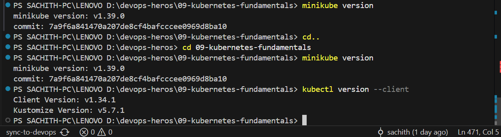
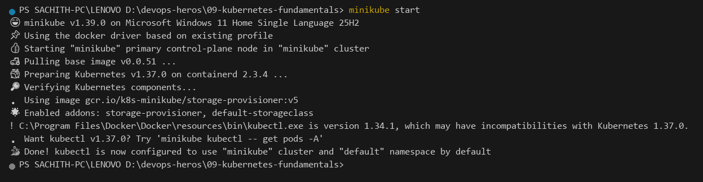
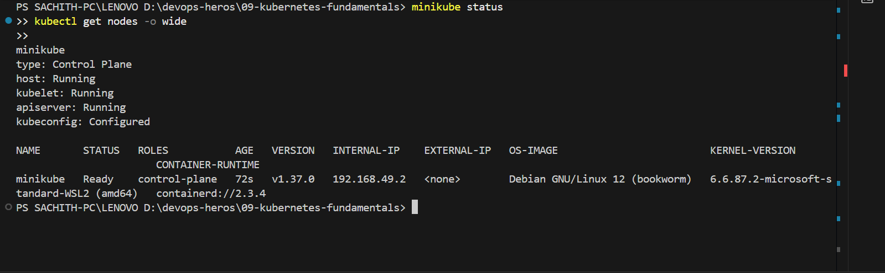
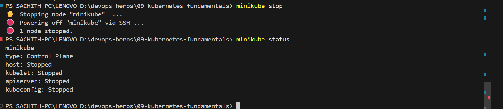

# Session 9: Kubernetes Fundamentals & Cluster Architecture

**Author:** Sachith  
**Course:** DevOps & Cloud  
**Session:** 09 - Kubernetes Fundamentals  
**Repository:** devops-heros / 09-kubernetes-fundamentals  

---

## Task 1: Minikube & CLI Installation Verification

Verify that Minikube and the Kubernetes CLI (`kubectl`) are successfully installed on the local system.

**Commands:**
```bash
minikube version
kubectl version --client
```

**Output:**
```text
minikube version: v1.39.0
commit: 7a9f6a841470a207de8cf4bafcccee0969d8ba10

Client Version: v1.34.1
Kustomize Version: v5.7.1
```

**Screenshot:**


---

## Task 2: Starting the Minikube Kubernetes Cluster

Initialize the local single-node Kubernetes cluster using the containerized Docker runtime environment.

**Command:**
```bash
minikube start
```

**Output:**
```text
😄  minikube v1.39.0 on Microsoft Windows 11 Home Single Language 25H2
📌  Using the docker driver based on existing profile
👍  Starting "minikube" primary control-plane node in "minikube" cluster
🚜  Pulling base image v0.0.51 ...
🐳  Preparing Kubernetes v1.37.0 on containerd 2.3.4 ...
🔎  Verifying Kubernetes components...
    ▪ Using image gcr.io/k8s-minikube/storage-provisioner:v5
🌟  Enabled addons: storage-provisioner, default-storageclass

⚠️  C:\Program Files\Docker\Docker\resources\bin\kubectl.exe is version 1.34.1,
    which may have incompatibilities with Kubernetes 1.37.0.
    ▪ Want kubectl v1.37.0? Try 'minikube kubectl -- get pods -A'
🏄  Done! kubectl is now configured to use "minikube" cluster and "default" namespace by default
```

**Screenshot:**


---

## Task 3: Verifying Cluster Status & Node Health

Inspect the status of the local cluster control plane, kubelet, API server, and verify the node is in `Ready` state.

**Commands:**
```bash
minikube status
kubectl get nodes -o wide
```

**Output:**
```text
minikube
type: Control Plane
host: Running
kubelet: Running
apiserver: Running
kubeconfig: Configured

NAME       STATUS   ROLES           AGE   VERSION   INTERNAL-IP    EXTERNAL-IP   OS-IMAGE                         KERNEL-VERSION                     CONTAINER-RUNTIME
minikube   Ready    control-plane   67s   v1.37.0   192.168.49.2   <none>        Debian GNU/Linux 12 (bookworm)   6.6.87.2-microsoft-standard-WSL2   containerd://2.3.4
```

**Screenshot:**


---

## Task 4: Stopping the Minikube Cluster

Gracefully power down the Minikube cluster VM/container to release system resources.

**Command:**
```bash
minikube stop
minikube status
```

**Output:**
```text
✋  Stopping node "minikube" ...
🛑  Powering off "minikube" via SSH ...
🛑  1 node stopped.

minikube
type: Control Plane
host: Stopped
kubelet: Stopped
apiserver: Stopped
kubeconfig: Configured
```

**Screenshot:**


---

## Task 5: Kubernetes Cluster Architecture & Component Analysis

A Kubernetes cluster follows a master-worker architecture consisting of a **Control Plane** (managing state and orchestration) and **Worker Nodes** (executing application workloads).

```text
+-------------------------------------------------------------------------------+
|                               CONTROL PLANE (MASTER)                          |
|                                                                               |
|   +-------------------+       +--------------------+       +--------------+   |
|   |       etcd        |<----->|  kube-apiserver    |<----->|kube-scheduler|   |
|   | (State Database)  |       |    (Front Door)    |       +--------------+   |
|   +-------------------+       +---------+----------+                          |
|                                         |                                     |
|                                         v                                     |
|                             +------------------------+                        |
|                             | kube-controller-manager|                        |
|                             +------------------------+                        |
+-----------------------------------------+-------------------------------------+
                                          |
                        +-----------------+-----------------+
                        |                                   |
                        v                                   v
+------------------------------------+ +------------------------------------+
|          WORKER NODE 1             | |          WORKER NODE 2             |
|                                    | |                                    |
|   +------------+  +------------+   | |   +------------+  +------------+   |
|   |  kubelet   |  | kube-proxy |   | |   |  kubelet   |  | kube-proxy |   |
|   +-----+------+  +-----+------+   | |   +-----+------+  +-----+------+   |
|         |               |          | |         |               |          |
|         v               v          | |         v               v          |
|   +----------------------------+   | |   +----------------------------+   |
|   | CRI (containerd runtime)   |   | |   | CRI (containerd runtime)   |   |
|   +----------------------------+   | |   +----------------------------+   |
|         |                          | |         |                          |
|         v                          | |         v                          |
|   +------------+  +------------+   | |   +------------+  +------------+   |
|   |   Pod 1    |  |   Pod 2    |   | |   |   Pod 3    |  |   Pod 4    |   |
|   | [Container]|  | [Container]|   | |   | [Container]|  | [Container]|   |
|   +------------+  +------------+   | |   +------------+  +------------+   |
+------------------------------------+ +------------------------------------+
```

### 1. Control Plane (Master Node) Components

- **`kube-apiserver` (The Front Door)**:
  - Acts as the central administrative hub and exposes the Kubernetes REST API.
  - Every component (internal controllers, `kubelet`, or external `kubectl` users) interacts exclusively through the API server.
  - Validates and configures data for the api objects which include pods, services, replicationcontrollers, and others.

- **`etcd` (The Cluster Brain & State Store)**:
  - Consistent, highly-available, distributed key-value store.
  - Persists the entire cluster configuration, specifications, secrets, and real-time state.
  - Direct access to `etcd` is strictly restricted to `kube-apiserver` for security and consistency.

- **`kube-scheduler` (The Placement Engine)**:
  - Watches for unscheduled pods and selects the most optimal worker node to run them.
  - Considers resource requirements (CPU/RAM limits and requests), hardware/software constraints, affinity/anti-affinity specifications, data locality, and taints/tolerations.

- **`kube-controller-manager` (The Reconciliation Loop)**:
  - Runs continuous control loops comparing **Current State == Desired State**.
  - Sub-controllers include:
    - *Node Controller*: Tracks node availability and responds when nodes fail.
    - *ReplicaSet Controller*: Guarantees the declared number of pod replicas are running.
    - *Endpoints Controller*: Populates EndpointSlice objects to join Services and Pods.

---

### 2. Worker Node (Data Plane) Components

- **`kubelet` (The Node Captain)**:
  - An agent running on every worker node in the cluster.
  - Communicates directly with `kube-apiserver` to receive `PodSpecs` and ensures the containers described in those PodSpecs are running and healthy.
  - Interacts with the local Container Runtime via CRI.

- **`kube-proxy` (The Network Router)**:
  - Network proxy running on each node that maintains network routing rules (using `iptables` or `IPVS`).
  - Implements the Kubernetes Service abstraction, forwarding traffic to the correct backend pods across nodes.

- **`Container Runtime Interface (CRI)`**:
  - The underlying container engine responsible for pulling images, running containers, and managing lifecycle (e.g., `containerd` or `CRI-O`).

- **`Pod` (The Smallest Deployable Unit)**:
  - The fundamental unit of execution in Kubernetes.
  - Encapsulates one or more closely coupled containers sharing the same Linux network namespace (same IP address, localhost communication) and storage volumes.