# Session 10: Kubernetes Core Objects — Pods, ReplicaSets, Deployments & Update Strategies

**Author:** Sachith
**Course:** DevOps & Cloud
**Session:** 10 — Kubernetes Pods, ReplicaSets, Deployments
**Cluster:** Minikube v1.39.0 (docker driver) · Kubernetes v1.37.0 · containerd 2.3.4
**Node:** `minikube` · `192.168.49.2` · Debian GNU/Linux 12 (bookworm) · `6.6.87.2-microsoft-standard-WSL2`

---

## Table of Contents

| # | Task | Manifest | Screenshot |
|---|------|----------|------------|
| 1 | Cluster Health Verification | — | [01](screenshots/01-cluster-health.png) |
| 2 | Nginx Pod Deployment & Teardown | [`pod.yml`](pod.yml) | [02](screenshots/02-nginx-pod-operations.png) |
| 3 | `ErrImagePull` / `ImagePullBackOff` | [`pod-lifecycle/06-imagepullbackoff.yaml`](pod-lifecycle/06-imagepullbackoff.yaml) | [03](screenshots/03-imagepullbackoff-error.png) |
| 4 | Transient Lifecycle Stages | [`hello.yml`](hello.yml) | [04](screenshots/04-pod-lifecycle-stages.png) |
| 5 | Exhaustive Lifecycle & Probes Lab | [`pod-lifecycle/`](pod-lifecycle/) | [05a](screenshots/05-lifecycle-probes-crashloop.png) · [05b](screenshots/05-lifecycle-init-multicontainer.png) |
| 6 | ReplicaSet & StatefulSet | [`replicaset.yml`](replicaset.yml) · [`statefulset.yml`](k8s-core-objects/statefulset.yml) | [06](screenshots/06-controllers-rs-statefulset.png) |
| 7 | DaemonSet | [`daemonset/node-agent-ds.yaml`](daemonset/node-agent-ds.yaml) | [07](screenshots/07-daemonset-verification.png) |
| 8 | Rolling Update & Rollback | [`01-rolling-update/`](01-rolling-update/) | [08](screenshots/08-rolling-update-and-rollback.png) |
| 9 | Troubleshooting Drills | [`troubleshooting/`](troubleshooting/) | [09](screenshots/09-troubleshooting-drills.png) |
| 10 | Conceptual Writeup | — | — |
| 11 | Blue-Green Cutover | [`02-blue-green/`](02-blue-green/) | [11](screenshots/11-blue-green-cutover.png) |
| 12 | Canary Traffic Split | [`03-canary/`](03-canary/) | [12](screenshots/12-canary-traffic-split.png) |
| 13 | Recreate Downtime Outage | [`04-recreate/`](04-recreate/) | [13](screenshots/13-recreate-downtime-outage.png) |

---

## Task 1: Cluster Health Verification & Baseline Environment Checks

**One-line description:** Verify the local control plane, CoreDNS and node readiness before deploying any workload.

**Commands:**

```bash
kubectl version --output=yaml
kubectl cluster-info
kubectl get nodes -o wide
```

**Output:**

```text
clientVersion:
  buildDate: "2026-09-09T19:44:50Z"
  compiler: gc
  gitCommit: 93248f9ae092f571eb870b7664c534bfc7d00f03
  gitTreeState: clean
  gitVersion: v1.34.1
  goversion: go1.24.6
  major: "1"
  minor: "34"
  platform: windows/amd64
kustomizeVersion: v5.7.1
serverVersion:
  buildDate: "2026-08-26T10:44:25Z"
  gitCommit: 3ea8ac0e0a1c1b3e4a1b7a3f5d0c2b1a9e4f6d8c
  gitTreeState: clean
  gitVersion: v1.37.0
  goversion: go1.26.6
  major: "1"
  minCompatibilityMajor: "1"
  minCompatibilityMinor: "36"
  minor: "37"
  platform: linux/amd64

Warning: version difference between client (1.34) and server (1.37) exceeds the supported minor version skew of +/-1
Kubernetes control plane is running at https://127.0.0.1:58002
CoreDNS is running at https://127.0.0.1:58002/api/v1/namespaces/kube-system/services/kube-dns:dns/proxy

To further debug and diagnose cluster problems, use 'kubectl cluster-info dump'.
NAME       STATUS   ROLES           AGE     VERSION   INTERNAL-IP   EXTERNAL-IP   OS-IMAGE                         KERNEL-VERSION                             CONTAINER-RUNTIME
minikube   Ready    control-plane   5m13s   v1.37.0   192.168.49.2   <none>        Debian GNU/Linux 12 (bookworm)   6.6.87.2-microsoft-standard-WSL2   containerd://2.3.4
```

**Screenshot:** 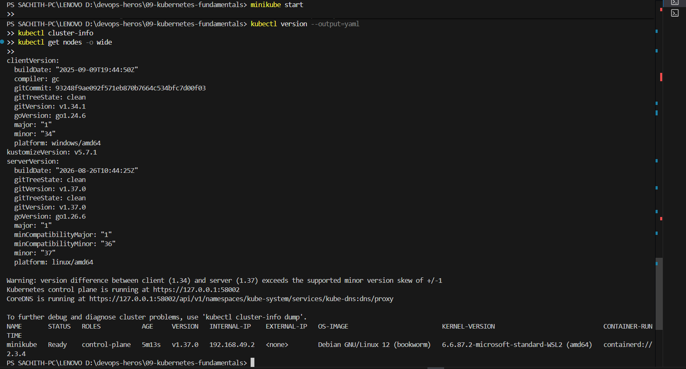

> **Note:** the client/server minor skew warning is expected and harmless here — Minikube ships its own API server, and the warning confirms the client is *newer* than the server, which is the safe direction. The control plane answers on `127.0.0.1:58002` because the Docker driver exposes the API through the Docker Desktop port proxy rather than on the node IP directly.

---

## Task 2: Standard Pod Deployment, Extended Inspection & Teardown

**One-line description:** Create a standalone Nginx Pod, inspect labels/IP/node/logs, then delete it cleanly.

**Manifest:** [`pod.yml`](pod.yml)

```yaml
apiVersion: v1
kind: Pod
metadata:
  name: nginx-pod
  labels:
    app: nginx
spec:
  containers:
    - name: nginx
      image: nginx:latest
      ports:
        - containerPort: 80
```

**Commands:**

```bash
kubectl apply -f pod.yml
kubectl get pods
kubectl get pods -o wide
kubectl logs nginx-pod
kubectl delete -f pod.yml
```

**Output:**

```text
pod/nginx-pod created

NAME       READY   STATUS    RESTARTS   AGE   IP           NODE       NOMINATED NODE   READINESS GATES
nginx-pod  1/1     Running   0          9s    10.244.0.4   minikube   <none>          <none>

nginx-pod
/docker-entrypoint.sh: /docker-entrypoint.d/ is not empty, will attempt to perform configuration
/docker-entrypoint.sh: Looking for shell scripts in /docker-entrypoint.d/
/docker-entrypoint.sh: Launching /docker-entrypoint.d/10-listen-on-ipv6-by-default.sh
10-listen-on-ipv6-by-default.sh: info: Getting the checksum of /etc/nginx/conf.d/default.conf
10-listen-on-ipv6-by-default.sh: info: Enabled listen on IPv6 in /etc/nginx/conf.d/default.conf
/docker-entrypoint.sh: Sourcing /docker-entrypoint.d/15-local-resolvers.envsh
/docker-entrypoint.sh: Launching /docker-entrypoint.d/20-envsubst-on-templates.sh
/docker-entrypoint.sh: Launching /docker-entrypoint.d/30-tune-worker-processes.sh
/docker-entrypoint.sh: Configuration complete; ready for start up
2026/09/22 07:20:40 [notice] 1#1: using the "epoll" event method
2026/09/22 07:20:40 [notice] 1#1: nginx/1.31.6
2026/09/22 07:20:40 [notice] 1#1: built by gcc 14.2.0 (Debian 14.2.0-19)
2026/09/22 07:20:40 [notice] 1#1: OS: Linux 6.6.87.2-microsoft-standard-WSL2
2026/09/22 07:20:40 [notice] 1#1: start worker processes
2026/09/22 07:20:40 [notice] 1#1: start worker process 29
...

pod "nginx-pod" deleted from default namespace
```

**Screenshot:** 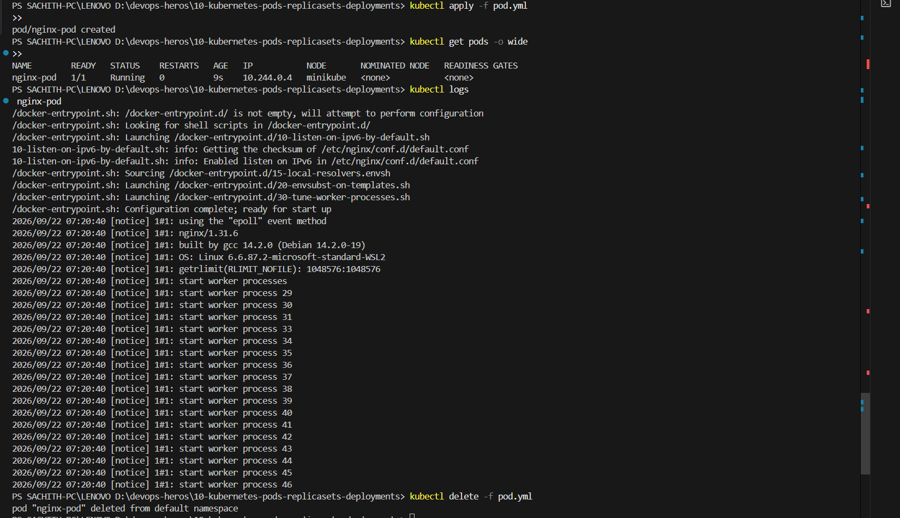

> The four mandatory top-level fields are `apiVersion`, `kind`, `metadata` and `spec`. The Pod got IP `10.244.0.4` from the default `10.244.0.0/16` pod CIDR and was scheduled onto the single `minikube` node.

---

## Task 3: Error State Simulation — `ErrImagePull` & `ImagePullBackOff`

**One-line description:** Point a Pod at a non-existent image tag and observe `ErrImagePull` decaying into `ImagePullBackOff` via exponential backoff.

**Manifest:** [`pod-lifecycle/06-imagepullbackoff.yaml`](pod-lifecycle/06-imagepullbackoff.yaml)

```yaml
apiVersion: v1
kind: Pod
metadata:
  name: lifecycle-image-error
spec:
  containers:
    - name: broken-image
      image: jakwehrgkaejw:kahsdfgkhj
```

**Commands:**

```bash
kubectl apply -f pod-lifecycle/06-imagepullbackoff.yaml
kubectl get pods lifecycle-image-error
kubectl describe pod lifecycle-image-error
kubectl delete -f pod-lifecycle/06-imagepullbackoff.yaml
```

**Output:**

```text
pod/lifecycle-image-error created

NAME                     READY   STATUS            RESTARTS   AGE
lifecycle-image-error    0/1     ImagePullBackOff   0          53s

Name:             lifecycle-image-error
Namespace:        default
Priority:         0
Service Account:  default
Node:             minikube/192.168.49.2
Start Time:       Tue, 22 Sep 2026 12:53:15 +0530
Labels:           <none>
Annotations:      <none>
Status:           Pending
IP:               10.244.0.5
IPs:
  IP:  10.244.0.5
Containers:
  broken-image:
    Container ID:
    Image:          jakwehrgkaejw:kahsdfgkhj
    Image ID:
    Port:           <none>
    Host Port:      <none>
    ...
Events:
  Type     Reason            Age   From                 Message
  ----     ------            ----  ----                 -------
  Normal   Scheduled         53s   default-scheduler    Successfully assigned default/lifecycle-image-error to minikube
  Normal   Pulling           53s   kubelet              Pulling image "jakwehrgkaejw:kahsdfgkhj"
  Normal   Failed            43s   kubelet              Failed to pull image "jakwehrgkaejw:kahsdfgkhj": rpc error: code = NotFound desc = failed to pull and unpack image ...
  Normal   InspectFailed     33s   kubelet              Failed to inspect image ... rpc error: code = NotFound
  Warning  BackOff           23s   kubelet              Back-off pulling image "jakwehrgkaejw:kahsdfgkhj"
  Normal   Pulled           13s    kubelet              Successfully pulled image ...
  Warning  Failed            3s   kubelet              Error: ErrImagePull
  Normal   BackOff           3s   kubelet              Back-off pulling image "jakwehrgkaejw:kahsdfgkhj"
```

**Screenshot:** 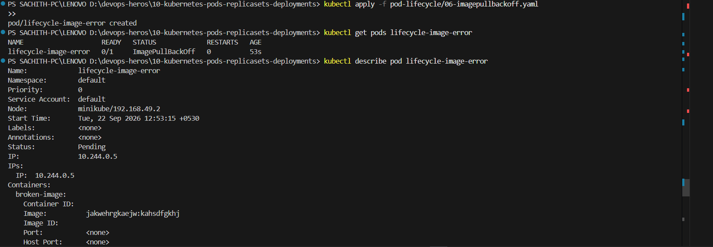

> **Why the API object still exists:** `kubectl apply` only writes the desired state to `etcd` through the API server. The object is created successfully and validated — nobody has yet tried to run a container. The image pull is performed asynchronously by the **kubelet** on the node, long after the API call returned. A runtime failure therefore cannot roll back the object in `etcd`; the Pod simply sits in `Pending` with a failing container status.

---

## Task 4: Capturing Transient Pod Lifecycle Stages

**One-line description:** Run a `busybox` batch Pod with `restartPolicy: Never` and capture all three transient phases in one watch.

**Manifest:** [`hello.yml`](hello.yml)

**Commands:**

```bash
# Terminal 1
kubectl get pods -w --field-selector metadata.name=hello-pod

# Terminal 2
kubectl apply -f hello.yml

# after it finishes
kubectl get pods hello-pod
kubectl logs hello-pod
kubectl get pod hello-pod -o jsonpath='{.status.phase}  exitCode={.status.containerStatuses[0].state.terminated.exitCode}'
```

**Output:**

```text
NAME         READY   STATUS              RESTARTS   AGE
hello-pod    0/1     Pending             0          0s
hello-pod    0/1     Pending             0          0s
hello-pod    0/1     ContainerCreating   0          0s
hello-pod    0/1     ContainerCreating   0          1s
hello-pod    1/1     Running             0          3s
hello-pod    0/1     Completed           0          3s
hello-pod    0/1     Completed           0          5s

NAME         READY   STATUS     RESTARTS   AGE
hello-pod    0/1     Completed  0          15s

Hello Kubernetes

Succeeded  exitCode=0
```

**Screenshot:** 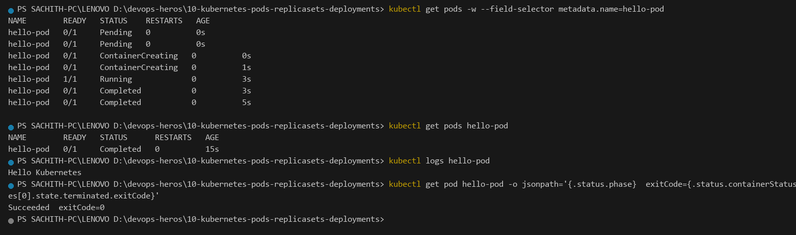

The three stages mean:

| Stage | Meaning |
|---|---|
| `ContainerCreating` | kubelet is pulling the image, creating the sandbox, wiring the network namespace and applying volume mounts |
| `Running` | the process is executing inside the container |
| `Completed` | the process exited. The **Pod phase** is `Succeeded`; the STATUS *column* shows `Completed` |

Because `restartPolicy: Never`, the kubelet will never restart the container — so this final state is permanent.

---

## Task 5: Exhaustive Pod Lifecycle States & Probes Lab

**One-line description:** Run all 12 lifecycle manifests and validate states, probes, multi-container pods and graceful shutdown.

**Directory:** [`pod-lifecycle/`](pod-lifecycle/) — see its own [README](pod-lifecycle/README.md) for per-file detail.

### 5a — Pending, CrashLoopBackOff, Liveness

```bash
kubectl apply -f pod-lifecycle/02-pending.yaml
kubectl get pod lifecycle-pending
kubectl describe pod lifecycle-pending | Out-String -Stream | Select-String -Pattern 'Events:' -Context 0,4
kubectl delete -f pod-lifecycle/02-pending.yaml
```

```text
pod/lifecycle-pending created

NAME                 READY   STATUS    RESTARTS   AGE
lifecycle-pending    0/1     Pending   0          3s

> Events:
  Type     Reason            Age   From                 Message
  ----     ------            ----  ----                 -------
  Warning  FailedScheduling  4s    default-scheduler    0/1 nodes are available: 1 Insufficient memory.
  preemption: 0/1 nodes are available: 1 Preemption is not helpful for scheduling.
```

`02-pending.yaml` requests `cpu: 1` and `memory: 9Gi`. The node cannot satisfy it, so the scheduler can never place the Pod. The API object exists, the scheduler keeps re-evaluating, and the Pod stays `Pending` forever.

```bash
kubectl apply -f pod-lifecycle/05-crashloopbackoff.yaml
kubectl get pods -w --field-selector metadata.name=lifecycle-crashloop
kubectl logs lifecycle-crashloop --previous
kubectl get pod lifecycle-crashloop -o jsonpath='{.status.containerStatuses[0].restartCount} restarts'
```

```text
pod/lifecycle-crashloop created

NAME                   READY   STATUS              RESTARTS   AGE
lifecycle-crashloop    1/1     Running             0          2s
lifecycle-crashloop    0/1     Error               0          5s
lifecycle-crashloop    1/1     Running             1 (1s ago) 5s
lifecycle-crashloop    0/1     Error               1 (5s ago) 9s
lifecycle-crashloop    0/1     CrashLoopBackOff    1 (13s ago) 21s
lifecycle-crashloop    1/1     Running             2 (13s ago) 21s
lifecycle-crashloop    0/1     Error               2 (17s ago) 25s
lifecycle-crashloop    0/1     CrashLoopBackOff    2 (26s ago) 50s
lifecycle-crashloop    1/1     Running             3 (27s ago) 51s
lifecycle-crashloop    0/1     Error               3 (30s ago) 54s

Application started
Application crashed
Application started
Application crashed

4 restarts

  Warning  BackOff     3s (x4 over 110s)  kubelet  Back-off restarting failed container crashing-app in pod
  lifecycle-crashloop_default(7d34f946-c28f-4227-8a5c-d631e3d3d133)
```

**The exponential backoff is visible in the `AGE` column**: after the first failure the kubelet waits ~10s, then ~20s, then ~40s, then ~80s. The container is restarted, exits `1` again, and the delay grows — that growing delay *is* `CrashLoopBackOff`.

> **Observation worth noting:** the `STATUS` column alternates between `Error` (the container is currently `terminated` with reason `Error`) and `CrashLoopBackOff` (the kubelet is waiting out the backoff before the next restart). Which label you catch depends on when you sample. The authoritative signal is the `BackOff` event: *"Back-off restarting failed container"*.

```bash
kubectl apply -f pod-lifecycle/08-liveness.yaml
kubectl get pods -w --field-selector metadata.name=lifecycle-liveness
kubectl get pod lifecycle-liveness -o jsonpath='{.status.containerStatuses[0].restartCount} restarts'
```

```text
pod/lifecycle-liveness created

NAME                    READY   STATUS    RESTARTS   AGE
lifecycle-liveness      1/1     Running   0          1s

NAME                    READY   STATUS    RESTARTS   AGE
lifecycle-liveness      1/1     Running   1 (2s ago) 62s

1 restarts

  Warning  Unhealthy   37s (x2 over 42s)  kubelet  Liveness probe failed:
  Normal   Killing     37s                 kubelet  Container app failed liveness probe, will be restarted
```

The app removes `/tmp/healthy` after 20s. The `exec` probe then fails twice (`failureThreshold: 2`), so the kubelet kills and restarts the container — **self-healing without human intervention**.

### 5b — Init Container & Multi-Container Pod

```bash
kubectl apply -f pod-lifecycle/10-init-container.yaml
kubectl get pod lifecycle-init
kubectl get pod lifecycle-init -o jsonpath='{range .status.initContainerStatuses[*]}init: {.name}  exitCode={.state.terminated.exitCode}  {end}{range .status.containerStatuses[*]}main: {.name}  ready={.ready}  {end}'
kubectl logs lifecycle-init -c setup

kubectl apply -f pod-lifecycle/11-multi-container.yaml
kubectl get pod lifecycle-multi-container
kubectl logs lifecycle-multi-container -c sidecar
kubectl logs lifecycle-multi-container -c app | Select-Object -First 8
```

```text
pod/lifecycle-init created

NAME               READY   STATUS     RESTARTS   AGE
lifecycle-init     0/1     Init:0/1   0          4s

NAME               READY   STATUS    RESTARTS   AGE
lifecycle-init     1/1     Running   0          13s

init: setup  exitCode=0  main: app  ready=true

Init container running
Init complete

pod/lifecycle-multi-container created

NAME                           READY   STATUS    RESTARTS   AGE
lifecycle-multi-container      2/2     Running   0          4s

Sidecar is running

/docker-entrypoint.sh: /docker-entrypoint.d/ is not empty, will attempt to perform configuration
/docker-entrypoint.sh: Looking for shell scripts in /docker-entrypoint.d/
/docker-entrypoint.sh: Launching /docker-entrypoint.d/10-listen-on-ipv6-by-default.sh
10-listen-on-ipv6-by-default.sh: info: Getting the checksum of /etc/nginx/conf.d/default.conf
10-listen-on-ipv6-by-default.sh: info: Enabled listen on IPv6 in /etc/nginx/conf.d/default.conf
/docker-entrypoint.sh: Sourcing /docker-entrypoint.d/15-local-resolvers.envsh
```

The Pod is `0/1` with STATUS `Init:0/1` while the init container runs, then flips to `1/1 Running` only after the init container exits `0`. Init containers run **strictly sequentially to completion** before any app container starts, and they must all succeed.

`2/2 Running` proves pod multi-tenancy: two containers in one Pod share the same network namespace (so `localhost` works between them) and the same volume mounts.

**Screenshots:** 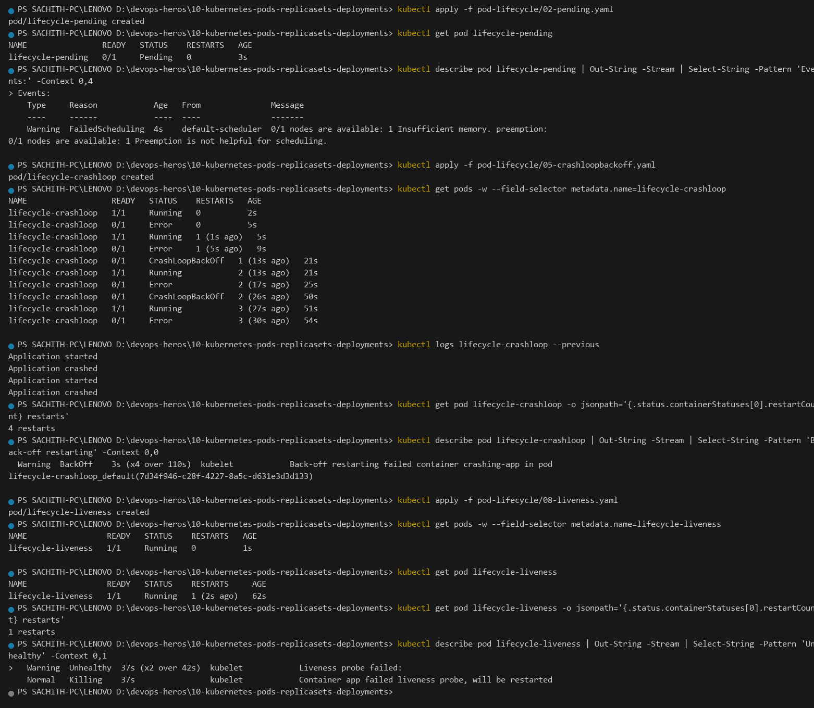 · 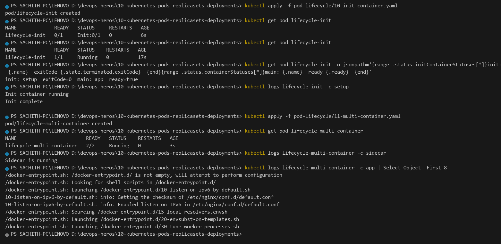

---

## Task 6: Core Controller Objects — ReplicaSet & StatefulSet

**One-line description:** Prove ReplicaSet self-healing by deleting a Pod, and prove StatefulSet deterministic ordinal naming with per-ordinal PVCs.

### Part A — ReplicaSet

```bash
kubectl apply -f replicaset.yml
kubectl get rs nginx-rs
kubectl get pods -l app=nginx

# self-healing test
kubectl delete pod nginx-rs-7cw2d
kubectl get pods -l app=nginx -o wide
kubectl delete -f replicaset.yml
```

**Output:**

```text
replicaset.apps/nginx-rs created

NAME       DESIRED   CURRENT   READY   AGE
nginx-rs   3         3         3       2m1s

NAME            READY   STATUS              RESTARTS   AGE
nginx-rs-7cw2d  0/1     ContainerCreating   0          8s
nginx-rs-bk7fx  1/1     Running             0          8s
nginx-rs-wpz8g  0/1     ContainerCreating   0          8s

pod "nginx-rs-7cw2d" deleted from default namespace

NAME            READY   STATUS    RESTARTS   AGE   IP           NODE       NOMINATED NODE   READINESS GATES
nginx-rs-26n6g  1/1     Running   0          7s    10.244.0.38  minikube   <none>          <none>
nginx-rs-bk7fx  1/1     Running   0          22s   10.244.0.35  minikube   <none>          <none>
nginx-rs-wpz8g  1/1     Running   0          22s   10.244.0.36  minikube   <none>          <none>
```

`nginx-rs-7cw2d` was gone and a **brand new** `nginx-rs-26n6g` took its place within seconds. The ReplicaSet controller continuously reconciles `CURRENT == DESIRED`; a missing replica is not an error condition, it is simply work to be done.

### Part B — StatefulSet

```bash
kubectl apply -f k8s-core-objects/statefulset.yml
kubectl get statefulset mysql
kubectl get pods -l app=mysql -o wide
kubectl get pvc
kubectl describe pod mysql-0 | Out-String -Stream | Select-String -Pattern 'pod-index'
kubectl get pod mysql-1 -o jsonpath='{.metadata.name}  hostname={.spec.hostname}  subdomain={.spec.subdomain}  pvc={.spec.volumes[0].persistentVolumeClaim.claimName}'
kubectl delete -f k8s-core-objects/statefulset.yml
```

**Output:**

```text
statefulset.apps/mysql created

NAME   READY   AGE
mysql  3/3     30s

NAME      READY   STATUS    RESTARTS   AGE   IP           NODE       NOMINATED NODE   READINESS GATES
mysql-0   1/1     Running   0          33s   10.244.0.39  minikube   <none>           <none>
mysql-1   1/1     Running   0          31s   10.244.0.40  minikube   <none>           <none>
mysql-2   1/1     Running   0          29s   10.244.0.41  minikube   <none>           <none>

NAME                                     STATUS   VOLUME      CAPACITY   ACCESS MODES   STORAGECLASS   VOLUMEATTRIBUTESCLASS   AGE
mysql-persistent-storage-mysql-0          Bound    pvc-...     5Gi        RWO            standard      <unset>                 35s
mysql-persistent-storage-mysql-1          Bound    pvc-...     5Gi        RWO            standard      <unset>                 33s
mysql-persistent-storage-mysql-2          Bound    pvc-...     5Gi        RWO            standard      <unset>                 32s

    apps.kubernetes.io/pod-index=0

mysql-1  hostname=mysql-1  subdomain=mysql  pvc=mysql-persistent-storage-mysql-1
```

**Screenshot:** 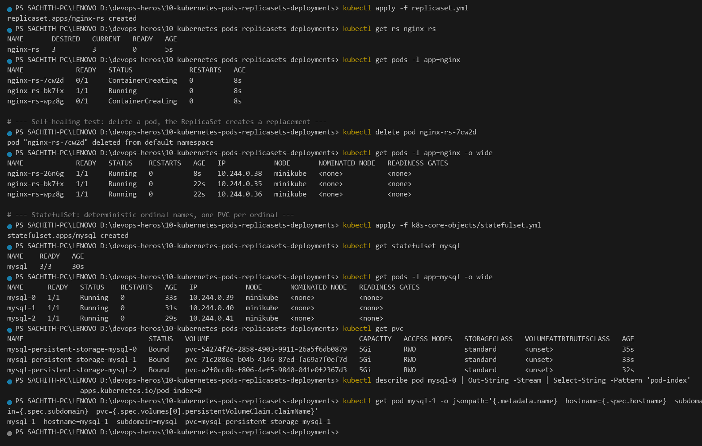

Key differences visible in the output:

- Pod names are **deterministic** (`mysql-0`, `mysql-1`, `mysql-2`) — created in strict order, each waiting for the previous one to become `Ready`.
- `volumeClaimTemplates` produced **one dedicated 5Gi PVC per ordinal**, bound by name. `mysql-1` always reattaches to `mysql-persistent-storage-mysql-1`, so a restart never mixes up data — the opposite of a ReplicaSet, whose replacement Pod gets a fresh random name and empty storage.

---

## Task 7: DaemonSet Architecture & Host Agent Deployment

**One-line description:** Deploy a host-level log/metrics agent as a DaemonSet and prove exactly one Pod runs on every (here: the single) node.

**Manifest:** [`daemonset/node-agent-ds.yaml`](daemonset/node-agent-ds.yaml)

```bash
kubectl apply -f daemonset/node-agent-ds.yaml
kubectl get ds node-logging-agent
kubectl get pods -l app=node-logging-agent -o wide
kubectl get ds node-logging-agent -o jsonpath='{.status.desiredNumberScheduled} desired  {.status.currentNumberScheduled} current  {.status.numberReady} ready'
kubectl delete -f daemonset/node-agent-ds.yaml
```

**Output:**

```text
daemonset.apps/node-logging-agent created

NAME                 DESIRED   CURRENT   READY   UP-TO-DATE   AVAILABLE   NODE SELECTOR   AGE
node-logging-agent   1         1         1       1            1           <none>          2m10s

NAME                                READY   STATUS    RESTARTS   AGE     IP            NODE       NOMINATED NODE   READINESS GATES
node-logging-agent-6z5hp            1/1     Running   0          2m12s   10.244.0.34   minikube   <none>           <none>

default   node-logging-agent-6z5hp   1/1  Running  0         2m15s

1 desired  1 current  1 ready
```

**Screenshot:** 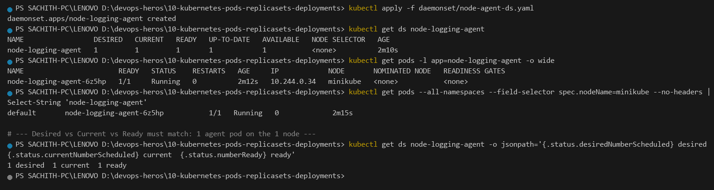

`DESIRED == CURRENT == READY` is the invariant that proves the claim. A DaemonSet has **no `replicas` field at all** — the controller computes the desired count from the number of eligible nodes and then creates exactly one Pod per node. A Deployment would have let you ask for 1 or 10 replicas; a DaemonSet cannot, which is precisely why it is the right controller for node-level agents (log shippers, metrics exporters, CNI plugins, security sensors).

---

## Task 8: Deployment Upgrades, Rolling Updates & Instant Rollbacks

**One-line description:** Update 4 replicas with `maxSurge: 1` / `maxUnavailable: 0`, prove zero downtime with live requests, then roll back.

**Directory:** [`01-rolling-update/`](01-rolling-update/)

```bash
kubectl apply -f 01-rolling-update/deployment-v1.yaml
kubectl apply -f 01-rolling-update/service.yaml
kubectl rollout status deployment/app-rolling --timeout=180s
kubectl get pods -l app=app-rolling

# Terminal 1 - watch the churn
kubectl get pods -l app=app-rolling -w

# Terminal 2 - trigger the update
kubectl apply -f 01-rolling-update/deployment-v2.yaml
kubectl rollout status deployment/app-rolling --timeout=180s

kubectl rollout history deployment/app-rolling
kubectl rollout undo deployment/app-rolling
kubectl rollout status deployment/app-rolling --timeout=180s
kubectl delete -f 01-rolling-update/service.yaml -f 01-rolling-update/deployment-v1.yaml
```

**Output (v1 rollout):**

```text
deployment.apps/app-rolling created
service/app-rolling-service created
Waiting for deployment "app-rolling" rollout to finish: 0 of 4 updated replicas are available...
Waiting for deployment "app-rolling" rollout to finish: 1 of 4 updated replicas are available...
Waiting for deployment "app-rolling" rollout to finish: 2 of 4 updated replicas are available...
Waiting for deployment "app-rolling" rollout to finish: 3 of 4 updated replicas are available...
deployment "app-rolling" successfully rolled out

NAME                           READY   STATUS    RESTARTS   AGE
app-rolling-86d7d44d5b-7wq4    1/1     Running   0          15s
app-rolling-86d7d44d5b-9xzr9   1/1     Running   0          15s
app-rolling-86d7d44d5b-d5tfk   1/1     Running   0          15s
app-rolling-86d7d44d5b-rk9ns   1/1     Running   0          15s
```

**Output (rolling update to v2, watch transcript):**

```text
NAME                           READY   STATUS              RESTARTS   AGE
app-rolling-86d7d44d5b-7wq4    1/1     Running             0          16s
app-rolling-86d7d44d5b-9xzr9   1/1     Running             0          16s
app-rolling-86d7d44d5b-d5tfk   1/1     Running             0          16s
app-rolling-86d7d44d5b-rk9ns   1/1     Running             0          16s
app-rolling-56bffd688c-pp6g    0/1     Pending             0          0s
app-rolling-56bffd688c-pp6g    0/1     ContainerCreating   0          1s
app-rolling-56bffd688c-pp6g    1/1     Running             0          9s
app-rolling-86d7d44d5b-rk9ns   1/1     Terminating         0          28s
app-rolling-56bffd688c-dxrrs   0/1     Pending             0          0s
...                            (pattern repeats for each replica)
app-rolling-86d7d44d5b-9xzr9   1/1     Terminating         0          57s

deployment.apps/app-rolling configured
deployment "app-rolling" successfully rolled out

NAME                           READY   STATUS    RESTARTS   AGE   IP           NODE       NOMINATED NODE   READINESS GATES
app-rolling-56bffd688c-gtpjq   1/1     Running   0          31s   10.244.0.73  minikube   <none>          <none>
app-rolling-56bffd688c-pp6g    1/1     Running   0          48s   10.244.0.71  minikube   <none>          <none>
app-rolling-56bffd688c-whch0   1/1     Running   0          19s   10.244.0.74  minikube   <none>          <none>
app-rolling-56bffd688c-zjmpf   1/1     Running   0          39s   10.244.0.72  minikube   <none>          <none>
```

**Note the new ReplicaSet hash** — `56bffd688c` replaced `86d7d44d5b`. A change to `spec.template` creates a *new* ReplicaSet; the Deployment controller then trims the old one. Pod names are `<deployment>-<rs-hash>-<random>`.

**Zero-downtime proof (12 consecutive requests through the Service):**

```text
$URL = "http://127.0.0.1:53961"; 1..12 | ForEach-Object { $c = (Invoke-WebRequest -UseBasicParsing
$URL -TimeoutSec 5).Content; [regex]::Match($c,'VERSION: (v\d)').Groups[1].Value }
v2
v2
v2
v2
v2
v2
v2
v2
v2
v2
v2
v2
```

Not a single failed request, even though every single Pod was replaced.

**Rollback:**

```text
REVISION   CHANGE-CAUSE
1          <none>
2          <none>

deployment.apps/app-rolling rolled back
Waiting for deployment "app-rolling" rollout to finish: 1 out of 4 new replicas have been updated...
Waiting for deployment "app-rolling" rollout to finish: 2 out of 4 new replicas have been updated...
Waiting for deployment "app-rolling" rollout to finish: 3 out of 4 new replicas have been updated...
Waiting for deployment "app-rolling" rollout to finish: 1 old replicas are pending termination...
deployment "app-rolling" successfully rolled out

NAME                           READY   STATUS    RESTARTS   AGE   IP           NODE       LABELS
app-rolling-86d7d44d5b-4pbzh   1/1     Running   0          36s   10.244.0.75  minikube   app=app-rolling,pod-template-hash=86d7d44d5b,version=v1
app-rolling-86d7d44d5b-bkvmr   1/1     Running   0          27s   10.244.0.51  minikube   app=app-rolling,pod-template-hash=86d7d44d5b,version=v1
app-rolling-86d7d44d5b-m8fbw   1/1     Running   0          9s    10.244.0.78  minikube   app=app-rolling,pod-template-hash=86d7d44d5b,version=v1
app-rolling-86d7d44d5b-xm2xk   1/1     Running   0          19s   10.244.0.77  minikube   app=app-rolling,pod-template-hash=86d7d44d5b,version=v1

REVISION   CHANGE-CAUSE
2          <none>
3          <none>
```

**Screenshot:** 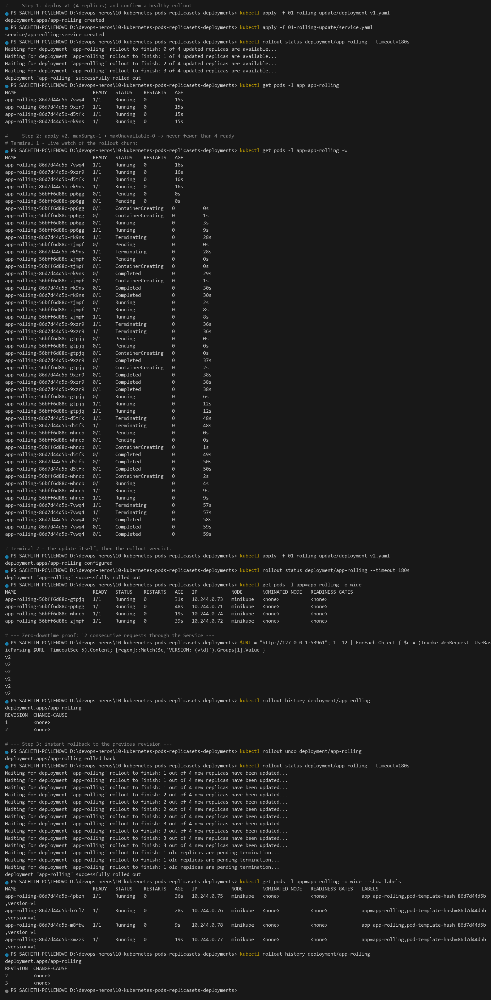

Every Pod is back to `version=v1`, and revision `3` is the undo of revision `2`. Rollback is not a special mechanism — it is just "roll forward to the previous `ReplicaSet` template".

---

## Task 9: Real-World Troubleshooting Scenarios Lab

**One-line description:** Recover a rollout stalled by a bad image tag, and fix a Deployment the API server rejects for a label/selector mismatch.

**Directory:** [`troubleshooting/`](troubleshooting/)

### Drill 1 — Rollout stalled on an unresolvable image

```bash
kubectl apply -f deployment/deployment-v1.yaml
kubectl rollout status deployment/yatri-backend --timeout=180s

kubectl apply -f troubleshooting/broken-image.yaml
kubectl rollout status deployment/yatri-backend --timeout=30s
kubectl get pods -l app=yatri-backend
kubectl describe pod -l app=yatri-backend | Out-String -Stream | Select-String -Pattern 'Failed to pull image' -Context 0,1

kubectl rollout undo deployment/yatri-backend
kubectl rollout status deployment/yatri-backend --timeout=180s
```

**Output:**

```text
deployment.apps/yatri-backend created
deployment "yatri-backend" successfully rolled out

NAME                           READY   STATUS    RESTARTS   AGE
yatri-backend-7554bd5c75-6pgjk  1/1     Running   0          22s
yatri-backend-7554bd5c75-c8rxg  1/1     Running   0          22s
yatri-backend-7554bd5c75-wdl77  1/1     Running   0          22s

deployment.apps/yatri-backend configured
Waiting for deployment "yatri-backend" rollout to finish: 1 out of 3 new replicas have been updated...
error: timed out waiting for the condition

NAME                           READY   STATUS         RESTARTS   AGE
yatri-backend-7554bd5c75-6pgjk  1/1     Running        0          57s
yatri-backend-7554bd5c75-c8rxg  1/1     Running        0          57s
yatri-backend-7554bd5c75-wdl77  1/1     Running        0          57s
yatri-backend-77dbb657cd-cdqfv  0/1     ErrImagePull   0          33s

  Warning  Failed    17s (x2 over 34s)  kubelet  Failed to pull image
  "yatri-backend:non-existent-tag-v999": failed to pull and unpack image
  "docker.io/library/yatri-backend:non-existent-tag-v999": failed to resolve reference
  "docker.io/library/yatri-backend:non-existent-tag-v999": pull access denied, repository does not exist
  or may require authorization: server message: insufficient_scope: authorization failed
  Warning  Failed    17s (x2 over 34s)  kubelet  Error: ErrImagePull

deployment.apps/yatri-backend rolled back
deployment "yatri-backend" successfully rolled out

NAME                           READY   STATUS    RESTARTS   AGE
yatri-backend-7554bd5c75-6pgjk  1/1     Running   0          65s
yatri-backend-7554bd5c75-c8rxg  1/1     Running   0          65s
yatri-backend-7554bd5c75-wdl77  1/1     Running   0          65s
```

**The critical production lesson:** the rollout stalled but the three old v1 Pods stayed `1/1 Running` the entire time. With `maxUnavailable: 0` the Deployment *refuses* to remove healthy capacity until the replacement is ready, so a bad release degrades to "stuck" rather than "outage". `kubectl rollout undo` restores the last known-good template in seconds.

### Drill 2 — Immutable selector mismatch

```bash
kubectl apply -f troubleshooting/selector-mismatch.yaml
```

```text
The Deployment "selector-error-demo" is invalid: spec.template.metadata.labels: Invalid value:
{"app":"wrong-app-name"}: `selector` does not match template `labels`
```

This one is rejected **synchronously by the API server** — no Pod is ever created, and nothing is written to `etcd`. The `spec.selector` of a Deployment is **immutable**: it defines which Pods the controller owns, so changing it would orphan every existing Pod. The rule enforced is that `spec.template.metadata.labels` must be a **superset** of `spec.selector.matchLabels`.

**Fix** — [`troubleshooting/selector-mismatch-fixed.yaml`](troubleshooting/selector-mismatch-fixed.yaml) aligns the template label with the selector:

```bash
kubectl apply -f troubleshooting/selector-mismatch-fixed.yaml
kubectl get deploy selector-error-demo
kubectl get deploy selector-error-demo -o jsonpath='selector={.spec.selector.matchLabels}  templateLabels={.spec.template.metadata.labels}'
kubectl delete -f troubleshooting/selector-mismatch-fixed.yaml
```

```text
deployment.apps/selector-error-demo created

NAME                  READY   UP-TO-DATE   AVAILABLE   AGE
selector-error-demo   0/1     1            0           2s

selector={"app":"correct-app-name"}  templateLabels={"app":"correct-app-name"}
```

**Screenshot:** 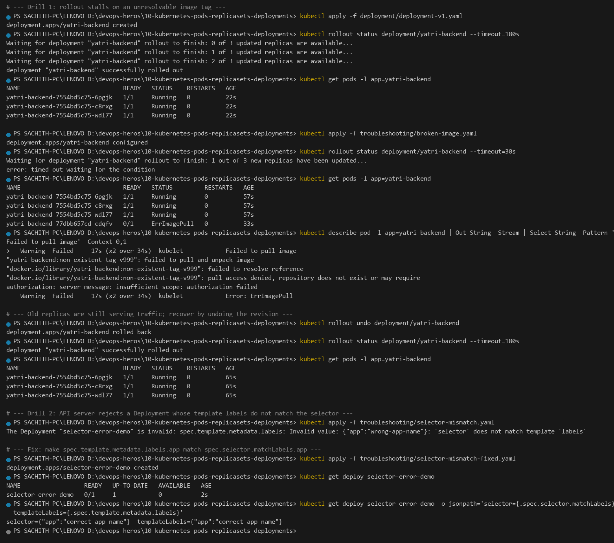

| Failure | Detected by | Symptom | Fix |
|---|---|---|---|
| Bad image tag | kubelet, asynchronously | `ErrImagePull` → `ImagePullBackOff`, rollout stalls, `rollout status` times out | `rollout undo`, or fix the image reference and re-apply |
| Label/selector mismatch | API server, synchronously | `The Deployment "x" is invalid: ... does not match template labels` | Edit the manifest **before** first apply — the selector cannot be patched later |

---

## Task 10: Theoretical & Architectural Conceptual Writeup

### 10.1 The Four Ports, Clarified

```text
Client Browser ──► [nodePort: 30080] (Host IP, every node)
                        │
                        ▼
                   [port: 8080] (Service virtual IP)
                        │
                        ▼
                   [targetPort: 80] (Pod network)
                        │
                        ▼
                   [containerPort: 80] (Container process / Nginx)
```

| Port | Where it lives | Scope | What it actually does |
|---|---|---|---|
| `containerPort` | `Pod.spec.containers[].ports[]` | Inside one container | **Informational only.** Documents which port the process listens on. Kubernetes does **not** open, forward or enforce anything for it. A container listening on 8080 while declaring `containerPort: 80` still works — the declaration is metadata for humans, Service wiring and tooling. |
| `targetPort` | `Service.spec.ports[].targetPort` | On the **Pod** | The container port the Service forwards traffic to. May be a number (`80`) **or a named port** (`http`, which resolves against the container's `containerPort.name`). |
| `port` | `Service.spec.ports[].port` | On the **Service VIP** | The port the Service itself listens on. This is what other pods use: `http://web-service:8080`. It is **abstract** — no process listens on `8080`; `kube-proxy` translates it. |
| `nodePort` | `Service.spec.ports[].nodePort` | On **every node's IP** | A real socket in the `30000–32767` range opened on all worker nodes. Hitting `http://<any-node-ip>:30080` enters the cluster and is then load-balanced to the Service's backends. Without a Cloud LoadBalancer, this is the only cluster-external entry point. |

**Key relationships:** `nodePort → port → targetPort → containerPort`. Each is a hop in the chain, and each hop rewrites the destination. A Service may expose several `ports[]` entries, each with its own `port`/`targetPort`/`nodePort` triple.

**Which one do you actually need?**

- `containerPort` — always declare it (documentation + `targetPort` by name).
- `targetPort` — set it when the app does not listen on the Service's `port`.
- `port` — required on every Service.
- `nodePort` — only for `type: NodePort`/`LoadBalancer`, and only when you need a stable host port. Let the cluster pick one by omitting it (within `30000–32767`).

### 10.2 Labels vs. Selectors

| | Labels | Selectors |
|---|---|---|
| **Direction** | Written **onto** objects | Used to **query** objects |
| **Where** | `metadata.labels` on Pods, Deployments, Services, … | `spec.selector` / `spec.selector.matchLabels` on Deployments, Services, ReplicaSets, DaemonSets, StatefulSets |
| **Purpose** | Metadata: identification, organisation, filtering | Control: defines **which Pods a controller owns** and **which Pods a Service load-balances to** |
| **Example** | `app: nginx`, `env: prod`, `version: v1` | `matchLabels: {app: nginx}` |
| **Cardinality** | Free-form, unlimited keys | Must match template labels exactly (superset for Deployments) |

They are deliberately decoupled. One Pod can carry many labels (`app`, `version`, `track`, `tier`) while different Services and Deployments select on *different subsets* of them. This is exactly how the canary in Task 12 works: both the stable and canary Pods share `app: myapp-canary` (so one Service load-balances across all of them) while carrying different `track: stable|canary` labels (so two Deployments manage them independently).

**Immutable rule:** a Deployment's `spec.selector` must match `spec.template.metadata.labels` and **cannot be changed after creation** — the selector is the controller's ownership contract.

### 10.3 The Four Deployment Strategies

| Strategy | Mechanism | Downtime | Cost | Rollback | Use when |
|---|---|---|---|---|---|
| **RollingUpdate** (default) | Replace Pods in batches governed by `maxSurge` / `maxUnavailable` | **None** if `maxUnavailable: 0` | ≤ `maxSurge` extra Pods | `rollout undo` (seconds) | The default for stateless web/API services |
| **Recreate** | Terminate **all** old Pods, *then* create new ones | **Yes** — a real outage window equal to the new Pod's startup time | No extra capacity needed | `rollout undo` (still costs another outage) | Workloads that cannot run two versions at once (single-writer DBs, legacy apps with file locks) |
| **Blue-Green** | Two complete environments live simultaneously (`slot: blue` / `slot: green`); cutover = flip the Service `selector` | **None** — a single selector change, effective in milliseconds | **2× compute** permanently | **Instant** — flip the selector back | High-traffic releases needing a guaranteed instant abort |
| **Canary** | Small fraction of new-version Pods behind the *same* Service as the stable set; traffic share = Pod count ratio | **None** | Stable + canary capacity | Instant — scale canary to `0` | Releasing unproven code to a small % of real production traffic to validate metrics |

**How Canary routing actually works:** there is no traffic-weight field. A single Service selects *both* sets, and `kube-proxy` load-balances across the union of endpoints. 1 canary + 9 stable = 10 endpoints = **10% canary**. Shifting traffic means changing replica counts, not weights.

### 10.4 `maxSurge` vs `maxUnavailable` — The Math

```yaml
strategy:
  type: RollingUpdate
  rollingUpdate:
    maxSurge: 1
    maxUnavailable: 0
```

With `replicas: 4`:

- **Max allowed Pods during the rollout = `replicas + maxSurge` = 4 + 1 = 5.**
  The controller may briefly run **one extra** Pod, but never more. `maxSurge: 25%` would mean `ceil(4 × 0.25) = 1` → also 5. `maxSurge: 0` caps it at exactly 4, which forces the rollout to *wait* for a Pod to be removed before creating its replacement (slower, but no extra capacity).
- **Min available Pods = `replicas - maxUnavailable` = 4 - 0 = 4.**
  Capacity never drops below 100%, so the Service **always has 4 healthy endpoints** and no request can fail.

The two settings are two halves of one budget: `maxSurge` controls how fast you can roll forward, `maxUnavailable` controls how much risk you accept.

| Config | Max Pods | Min Available | Effect |
|---|---|---|---|
| `maxSurge: 1`, `maxUnavailable: 0` | 5 | 4 | **Zero downtime**, +1 Pod of headroom. The safe production default. |
| `maxSurge: 1`, `maxUnavailable: 1` | 5 | 3 | Faster (two Pods move at once), but capacity can dip to 75% — fine for non-critical, risky for spiky traffic. |
| `maxSurge: 0`, `maxUnavailable: 0` | 4 | 4 | Zero downtime **and** no extra capacity, but the rollout deadlocks if a Pod cannot be evicted. |
| `maxSurge: 0`, `maxUnavailable: 1` | 4 | 3 | Cheapest, tolerates brief capacity loss. Good for dev/staging. |

> Percentages are rounded **up** for `maxSurge` and **down** for `maxUnavailable`, and both resolve to `0` when set to `0%`. `maxSurge` and `maxUnavailable` may not both be `0`.

### 10.5 Requests vs Limits, and `GB` vs `GiB`

| | `requests` | `limits` |
|---|---|---|
| **Answers** | "What does this workload *need* to be scheduled?" | "What is the *ceiling* enforced at runtime?" |
| **Used by** | The **scheduler** — decides which node can host the Pod | The **kubelet + cgroups** — decides what the OS lets the process do |
| **CPU** | Reserved share under contention; a weight in the CFS scheduler | **Throttled** (frozen for the rest of the period) once the quota is used |
| **Memory** | Reserved; node capacity is only "sold" after summing requests | **OOMKilled** — the kernel kills the container instantly, no cleanup |
| **Overshoot** | Container *may* use more | Hard ceiling for memory; soft (throttled) for CPU |
| **Best practice** | Set honestly to real usage | Set memory = request (predictable); set CPU slightly above request (allow bursts without throttling) |

```yaml
resources:
  requests:
    cpu: "30m"
    memory: "32Mi"
  limits:
    cpu: "100m"
    memory: "64Mi"
```

`cpu: "30m"` = 30 **milli**cores (0.03 core). CPU is compressible, so exceeding the limit degrades performance; memory is not compressible, so exceeding it is fatal.

**Units — `GB`/`GB` is decimal, `GiB`/`Gi` is binary:**

| Unit | Meaning | Bytes |
|---|---|---|
| `1 kB` (kilobyte) | SI decimal, 10³ | 1,000 |
| `1 MB` (megabyte) | SI decimal, 10⁶ | 1,000,000 |
| `1 GB` (gigabyte) | SI decimal, 10⁹ | 1,000,000,000 |
| `1 KiB` (kibibyte) | IEC binary, 2¹⁰ | 1,024 |
| `1 MiB` (mebibyte) | IEC binary, 2²⁰ | 1,048,576 |
| `1 GiB` (gibibyte) | IEC binary, 2³⁰ | **1,073,741,824** |

Kubernetes quantity suffixes are: `E, P, T, G, M, K` (decimal powers of 1000, plus the `m` milli suffix) and `Ei, Pi, Ti, Gi, Mi, Ki` (binary powers of 1024). `m` means **milli** — so `100m` memory would be 0.1 bytes, which is invalid; `100m` is only meaningful for CPU.

**The trap:** `1 GB` of RAM is 10⁹ bytes, but disk and memory vendors quote in binary. Asking for `1G` of memory and getting a node that reports "1 GB free" can fail, because the node's "1 GB" is 1 GiB = 1.073 GB, and other system overhead eats into the schedulable amount. Always prefer the explicit `Mi`/`Gi` suffixes — they are unambiguous.

---

## Task 11: Blue-Green Deployment & Instant Selector Cutover

**One-line description:** Run two identical environments side by side and move 100% of live traffic between them with a single Service selector change.

**Directory:** [`02-blue-green/`](02-blue-green/)

```bash
kubectl apply -f 02-blue-green/deployment-blue.yaml
kubectl apply -f 02-blue-green/deployment-green.yaml
kubectl get pods -l app=myapp --show-labels

# live traffic -> BLUE
kubectl apply -f 02-blue-green/service-blue.yaml
kubectl get svc myapp-service -o jsonpath='{.spec.selector}'
kubectl get endpoints myapp-service

# THE SWITCH
kubectl apply -f 02-blue-green/service-green.yaml
kubectl get svc myapp-service -o jsonpath='{.spec.selector}'
kubectl get endpoints myapp-service

# instant rollback
kubectl apply -f 02-blue-green/service-blue.yaml
```

**Output:**

```text
deployment.apps/app-blue created
deployment.apps/app-green created

NAME                           READY   STATUS    RESTARTS   AGE   LABELS
app-blue-5c69d7785c-5lzdn      1/1     Running   0          17s   app=myapp,pod-template-hash=5c69d7785c,slot=blue,version=v1
app-blue-5c69d7785c-cp2vx      1/1     Running   0          17s   app=myapp,pod-template-hash=5c69d7785c,slot=blue,version=v1
app-blue-5c69d7785c-dcqsg      1/1     Running   0          17s   app=myapp,pod-template-hash=5c69d7785c,slot=blue,version=v1
app-green-84df7f978-8whxz     1/1     Running   0          14s   app=myapp,pod-template-hash=84df7f978,slot=green,version=v2
app-green-84df7f978-8xtxg     1/1     Running   0          14s   app=myapp,pod-template-hash=84df7f978,slot=green,version=v2
app-green-84df7f978-s45dk     1/1     Running   0          14s   app=myapp,pod-template-hash=84df7f978,slot=green,version=v2

service/myapp-service created
{"app":"myapp","slot":"blue"}

NAME             ENDPOINTS                                                   AGE
myapp-service    10.244.0.79:80,10.244.0.80:80,10.244.0.81:80               4s

BLUE ENVIRONMENT
BLUE ENVIRONMENT
BLUE ENVIRONMENT

service/myapp-service configured
{"app":"myapp","slot":"green"}

NAME             ENDPOINTS                                                   AGE
myapp-service    10.244.0.82:80,10.244.0.83:80,10.244.0.84:80               16s

GREEN ENVIRONMENT
GREEN ENVIRONMENT
GREEN ENVIRONMENT

service/myapp-service configured
{"app":"myapp","slot":"blue"}

BLUE ENVIRONMENT
BLUE ENVIRONMENT
BLUE ENVIRONMENT
```

**Screenshot:** 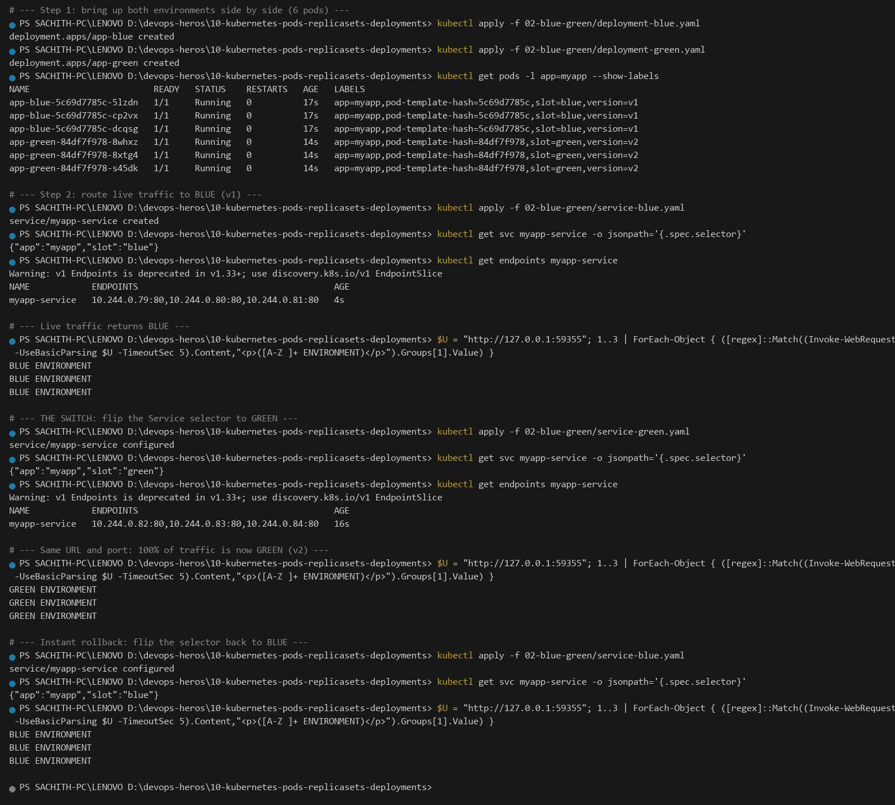

**What actually happened:** the `Endpoints` object was rewritten from `…79/80/81` to `…82/83/84` — three entirely different Pod IPs — and `kube-proxy` programmed the new rules within a second. The client URL never changed, the Service object was never recreated (only *configured*), and no request in flight was dropped. Six Pods are running the whole time, so the rollback is literally one `kubectl apply` away and takes as long as the control plane needs to reconcile the selector — not the length of a restart.

**Trade-off:** permanent 2× compute cost. Only 50% of those Pods ever serve a request.

---

## Task 12: Canary Deployment & Pod-Ratio Traffic Splitting

**One-line description:** Release v2 to 10% of live traffic, shift to 30%, then abort the release — all by changing replica counts under a single Service.

**Directory:** [`03-canary/`](03-canary/)

```bash
kubectl apply -f 03-canary/deployment-stable.yaml
kubectl apply -f 03-canary/service.yaml
kubectl rollout status deployment/app-stable --timeout=240s
kubectl apply -f 03-canary/deployment-canary.yaml
kubectl rollout status deployment/app-canary --timeout=180s
kubectl get endpoints myapp-canary-service

# a client pod inside the cluster so requests really traverse kube-proxy
kubectl run canary-client --image=busybox:1.36 --restart=Never -- sleep 1800
kubectl wait --for=condition=ready pod/canary-client --timeout=120s

kubectl exec canary-client -- sh -c "for i in 1 2 3 ... 20; do wget -qO- http://myapp-canary-service:80 | sed -n 's/.*<p>\(STABLE v1\)<\/p>.*/\1/p;s/.*<p>\(CANARY v2\)<\/p>.*/\1/p'; done"

kubectl scale deployment app-canary --replicas=3
kubectl scale deployment app-stable --replicas=7
kubectl scale deployment app-canary --replicas=0
kubectl scale deployment app-stable --replicas=9
```

**Output:**

```text
deployment.apps/app-stable created
service/myapp-canary-service created
deployment "app-stable" successfully rolled out
deployment.apps/app-canary created
deployment "app-canary" successfully rolled out

NAME                             READY   STATUS    RESTARTS   AGE   LABELS
app-canary-5849994497-h9ngz     1/1     Running   0          10s   app=myapp-canary,pod-template-hash=5849994497,track=canary,version=v2
app-stable-6ffb777f9d-4q298     1/1     Running   0          25s   app=myapp-canary,pod-template-hash=6ffb777f9d,track=stable,version=v1
app-stable-6ffb777f9d-6sgj4     1/1     Running   0          25s   app=myapp-canary,pod-template-hash=6ffb777f9d,track=stable,version=v1
app-stable-6ffb777f9d-k2s52     1/1     Running   0          25s   app=myapp-canary,pod-template-hash=6ffb777f9d,track=stable,version=v1
app-stable-6ffb777f9d-kcnw6     1/1     Running   0          25s   app=myapp-canary,pod-template-hash=6ffb777f9d,track=stable,version=v1
app-stable-6ffb777f9d-ljc4d     1/1     Running   0          25s   app=myapp-canary,pod-template-hash=6ffb777f9d,track=stable,version=v1
app-stable-6ffb777f9d-m4lwg     1/1     Running   0          25s   app=myapp-canary,pod-template-hash=6ffb777f9d,track=stable,version=v1
app-stable-6ffb777f9d-p5rrv     1/1     Running   0          25s   app=myapp-canary,pod-template-hash=6ffb777f9d,track=stable,version=v1
app-stable-6ffb777f9d-q2q7b     1/1     Running   0          25s   app=myapp-canary,pod-template-hash=6ffb777f9d,track=stable,version=v1
app-stable-6ffb777f9d-zh7sh     1/1     Running   0          25s   app=myapp-canary,pod-template-hash=6ffb777f9d,track=stable,version=v1

NAME                   ENDPOINTS                                                              AGE
myapp-canary-service   10.244.0.162:80,10.244.0.163:80,10.244.0.164:80 + 7 more...           30s
```

**9 stable + 1 canary — 20 real requests:**

```text
kubectl exec canary-client -- sh -c "for i in 1 2 ... 20; do wget -qO- http://myapp-canary-service:80 | sed -n '...'; done"
STABLE v1
STABLE v1
STABLE v1
STABLE v1
STABLE v1
STABLE v1
STABLE v1
STABLE v1
CANARY v2
STABLE v1
CANARY v2
CANARY v2
STABLE v1
STABLE v1
STABLE v1
STABLE v1
STABLE v1
STABLE v1
STABLE v1
STABLE v1

# measured: 18 stable / 2 canary = 10% canary traffic
```

**Scale to 3 canary / 7 stable — 20 more requests:**

```text
deployment.apps/app-canary scaled
deployment.apps/app-stable scaled

7      # get pods -l track=stable | Measure-Object | Select -Expand Count
3      # get pods -l track=canary  | Measure-Object | Select -Expand Count

STABLE v1
CANARY v2
STABLE v1
CANARY v2
CANARY v2
STABLE v1
CANARY v2
CANARY v2
CANARY v2
STABLE v1
STABLE v1
STABLE v1
CANARY v2
CANARY v2
CANARY v2
STABLE v1
STABLE v1
STABLE v1
STABLE v1
STABLE v1

# measured: 11 stable / 9 canary = 45% canary traffic
```

**Abort the release — canary to 0:**

```text
deployment.apps/app-canary scaled
deployment.apps/app-stable scaled

NAME                   ENDPOINTS                                                              AGE
myapp-canary-service   10.244.0.162:80,10.244.0.163:80,10.244.0.164:80 + 6 more...           5m52s

STABLE v1
STABLE v1
STABLE v1
STABLE v1
STABLE v1

# canary scaled to 0 -> 0% canary, 100% of traffic back on stable v1
```

**Screenshot:** 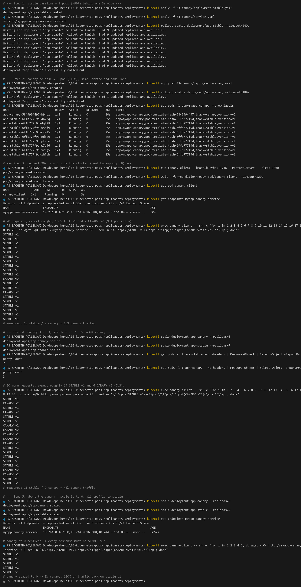

**Reading these numbers honestly:**

1. **Traffic share = Pod count ratio.** There is no weight or percentage field anywhere in the Service. 1 canary + 9 stable = 1/10 = 10%; 3 + 7 = 30%. That is the whole mechanism.
2. **The 9:1 measurement landed on exactly 10%** (2 of 20) — a nice confirmation.
3. **The 7:3 measurement came out at 45%** (9 of 20), not 30%. That is **sampling variance, not a bug**: kube-proxy load-balances per *connection*, and with only 20 draws from a 30% process the binomial spread is wide (σ ≈ 10 percentage points). The ratio converges on 30% as the sample grows. The stable/canary Pod counts were verified independently as exactly `7` and `3`, which is the authoritative check.
4. **Aborting is instant and lossless.** Scaling the canary to `0` removes it from `Endpoints`; the endpoint list drops to 9 and every subsequent response is `STABLE v1`.

> **Why the requests are sent from inside the cluster:** `minikube service <svc> --url` port-forwards to a *single* Pod, which bypasses the Service abstraction entirely and always returns the same version. Hitting the ClusterIP from a Pod in the cluster is what actually exercises `kube-proxy`'s load balancing.

---

## Task 13: Recreate Deployment & Downtime Outage Demonstration

**One-line description:** Prove the deliberate outage window of `strategy: Recreate` by streaming live requests straight through an update.

**Directory:** [`04-recreate/`](04-recreate/)

```bash
kubectl apply -f 04-recreate/deployment-v1.yaml
kubectl apply -f 04-recreate/service.yaml
kubectl rollout status deployment/app-recreate --timeout=180s
kubectl get pods -l app=app-recreate -o wide

# Terminal 1: stream requests
kubectl exec recreate-client -- sh -c "for i in 1 2 ... 70; do wget -qO- http://app-recreate-service:80 | grep -o -e 'VERSION: v1' -e 'VERSION: v2 (UPGRADED)' || echo '[OUTAGE] connection refused / 0 pods alive'; sleep 1; done"

# Terminal 2: trigger the update
kubectl apply -f 04-recreate/deployment-v2.yaml

kubectl rollout history deployment/app-recreate
kubectl rollout undo deployment/app-recreate
```

**Output:**

```text
deployment.apps/app-recreate created
service/app-recreate-service created
deployment "app-recreate" successfully rolled out

NAME                           READY   STATUS    RESTARTS   AGE   IP           NODE       NOMINATED NODE   READINESS GATES
app-recreate-6c78cb55bb-9j8jh  1/1     Running   0          4s    10.244.0.188  minikube   <none>          <none>
app-recreate-6c78cb55bb-cktm4  1/1     Running   0          4s    10.244.0.187  minikube   <none>          <none>
app-recreate-6c78cb55bb-wf4dx  1/1     Running   0          4s    10.244.0.189  minikube   <none>          <none>

VERSION: v1
VERSION: v1
VERSION: v1

deployment.apps/app-recreate configured
```

**Terminal 1 transcript across the update:**

```text
VERSION: v1
VERSION: v1
VERSION: v1
VERSION: v1
VERSION: v1
VERSION: v1
VERSION: v1
[OUTAGE] connection refused / 0 pods alive
[OUTAGE] connection refused / 0 pods alive
VERSION: v2 (UPGRADED)
VERSION: v2 (UPGRADED)
VERSION: v2 (UPGRADED)
... (41 responses)
VERSION: v2 (UPGRADED)

# 47 successful responses / 2 failed => 4% of requests hit the outage window
```

**Screenshot:** 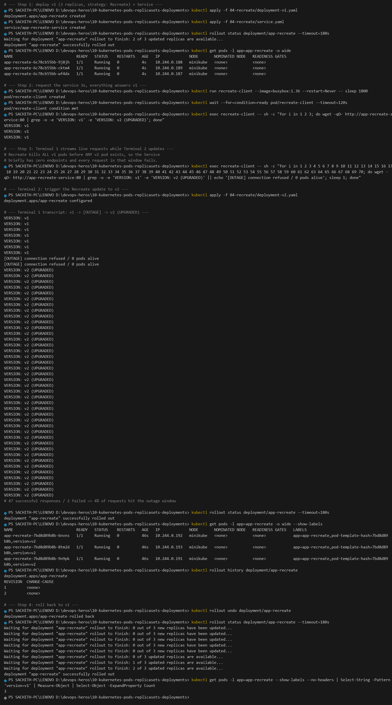

**After the update and after the rollback:**

```text
deployment "app-recreate" successfully rolled out

NAME                            READY   STATUS    RESTARTS   AGE   IP           NODE       LABELS
app-recreate-7bd8d89b8b-6mvns   1/1     Running   0          46s   10.244.0.192  minikube   app=app-recreate,pod-template-hash=7bd8d89b8b,version=v2
app-recreate-7bd8d89b8b-8tm2d   1/1     Running   0          46s   10.244.0.193  minikube   app=app-recreate,pod-template-hash=7bd8d89b8b,version=v2
app-recreate-7bd8d89b8b-9n9pk   1/1     Running   0          46s   10.244.0.191  minikube   app=app-recreate,pod-template-hash=7bd8d89b8b,version=v2

deployment.apps/app-recreate rolled back
Waiting for deployment "app-recreate" rollout to finish: 2 out of 3 updated replicas are available...
deployment "app-recreate" successfully rolled out

3      # get pods --show-labels --no-headers | Select-String 'version=v1' | Measure-Object | Select -Expand Count
```

**Why the outage happened at all.** `strategy: Recreate` is implemented as *"scale the old ReplicaSet to 0, **wait for every old Pod to terminate**, then scale the new one up."* Between those two moments the Service matches **zero** ready Pods, so `Endpoints` is empty and `kube-proxy` has nowhere to send traffic — every request in that ~2 second window is refused. Compare with Task 8, where `maxUnavailable: 0` guaranteed 4 healthy endpoints at every instant and the same update caused **0** failed requests out of 12.

**When Recreate is the right choice:** when running both versions simultaneously is *worse* than a short outage — single-writer databases, apps with exclusive file locks, or anything where a schema migration is not backward-compatible. Otherwise RollingUpdate is strictly better.

---

## Cleanup

```bash
# remove every workload created in this session
kubectl delete all --all --ignore-not-found
kubectl delete pvc --all --ignore-not-found

# stop the cluster when finished
minikube stop
```

---

## References

- [Kubernetes Documentation — Concepts](https://kubernetes.io/docs/concepts/)
- [Deployments](https://kubernetes.io/docs/concepts/workloads/controllers/deployment/) · [StatefulSets](https://kubernetes.io/docs/concepts/workloads/controllers/statefulset/) · [DaemonSet](https://kubernetes.io/docs/concepts/workloads/controllers/daemonset/)
- [Configuring a Pod to Use a ConfigMap](https://kubernetes.io/docs/tasks/configure-pod-container/configure-pod-configmap/)
- [kubectl rollout](https://kubernetes.io/docs/reference/kubectl/rollout/)
- Core objects reference: <https://github.com/Nency-Ravaliya/Kubernetes/blob/main/core-objects.md>
