# Session 11: Kubernetes Networking — Services, DNS & Cluster Networking

**Author:** Sachith
**Course:** DevOps & Cloud
**Session:** 11 — Kubernetes Networking & Services
**Cluster:** Minikube v1.39.0 (docker driver) · Kubernetes v1.37.0 · containerd 2.3.4
**Node:** `minikube` · `192.168.49.2` · CoreDNS at `10.96.0.10`

> Deep-dive references already in this folder:
> [`service.md`](service.md) — all 5 Service types, the 4 ports, interview Q&A
> · [`fqdn.md`](fqdn.md) — FQDN anatomy, CoreDNS, `resolv.conf`, `ndots:5`

---

## Table of Contents

| # | Task | Screenshot |
|---|------|------------|
| 1 | Port Architecture Clarification | [01](screenshots/01-ports-architecture.png) |
| 2 | ClusterIP Service | [02](screenshots/02-clusterip.png) |
| 3 | NodePort Service | [03](screenshots/03-nodeport.png) |
| 4 | LoadBalancer Service | [04](screenshots/04-loadbalancer.png) |
| 5 | ExternalName Service | [05](screenshots/05-externalname.png) |
| 6 | Headless Service | [06](screenshots/06-headless.png) |
| 7 | Services Without Selectors | [07](screenshots/07-services-without-selectors.png) |
| 8 | FQDN & CoreDNS Deep Dive | [08](screenshots/08-fqdn-coredns.png) |
| 9 | Pod Identity: Deployment vs StatefulSet | [09](screenshots/09-pod-identity-lifecycle.png) |
| 10 | Master Controller Matrix | [10](screenshots/10-controller-matrix.png) |
| 11 | Service Selection Decision Tree & Cost | *(documented below)* |
| 12 | Minikube Port-Binding Gotcha | [12](screenshots/12-minikube-port-binding-gotcha.png) |

**Per-topic detail:** [`01-clusterip/`](01-clusterip/README.md) · [`02-nodeport/`](02-nodeport/README.md) · [`03-loadbalancer/`](03-loadbalancer/README.md) · [`04-externalname/`](04-externalname/README.md) · [`05-headless/`](05-headless/README.md)

---

## Task 1: Kubernetes Port Architecture & Clarification Drill

**One-line description:** Read the four ports straight from the API schema so their real boundaries are unambiguous.

**Commands:**

```bash
kubectl explain pod.spec.containers.ports.containerPort
kubectl explain service.spec.ports
```

**Output (abridged):**

```text
KIND:     Pod
VERSION:  v1

FIELD: containerPort <integer>

DESCRIPTION:
    Number of port to expose on the pod's IP address. This must be a valid port
    number, 0 < x < 65536.

KIND:     Service
VERSION:  v1

FIELD: ports <[]ServicePort>

DESCRIPTION:
    The list of ports that are exposed by this service. More info:
    https://kubernetes.io/docs/concepts/services-networking/service/#virtual-ips-and-service-proxies
    ServicePort contains information on service's port.

FIELDS:
  name      <string>
  nodePort  <integer>
      The port on each node on which this service is exposed when type is
      NodePort or LoadBalancer. Usually assigned by the system. If a value is
      specified, in-range, and not in use it will be used, otherwise the
      operation will fail. If not specified, a port will be allocated for this
      Service. If this field is specified when creating a Service which does not
      need it, creation will fail. This field will be wiped when updating a
      Service to no longer need it (e.g. changing type from NodePort to
      ClusterIP). More info:
      https://kubernetes.io/docs/concepts/services-networking/service/#type-nodeport

  port      <integer> -required-
      The port that will be exposed by this service.

  targetPort <IntOrString>
      Number or name of the port to access on the pods targeted by the service.
      Number must be in the range 1 to 65535. Name must be an IANA_SVC_NAME.
      If this is a string, it will be looked up as a named port in the target
      Pod's container ports. If this is not specified, the value of the 'port'
      field is used (an identity map). This field is ignored for services with
      clusterIP=None, and should be omitted or set equal to the 'port' field.
```

**Screenshot:** 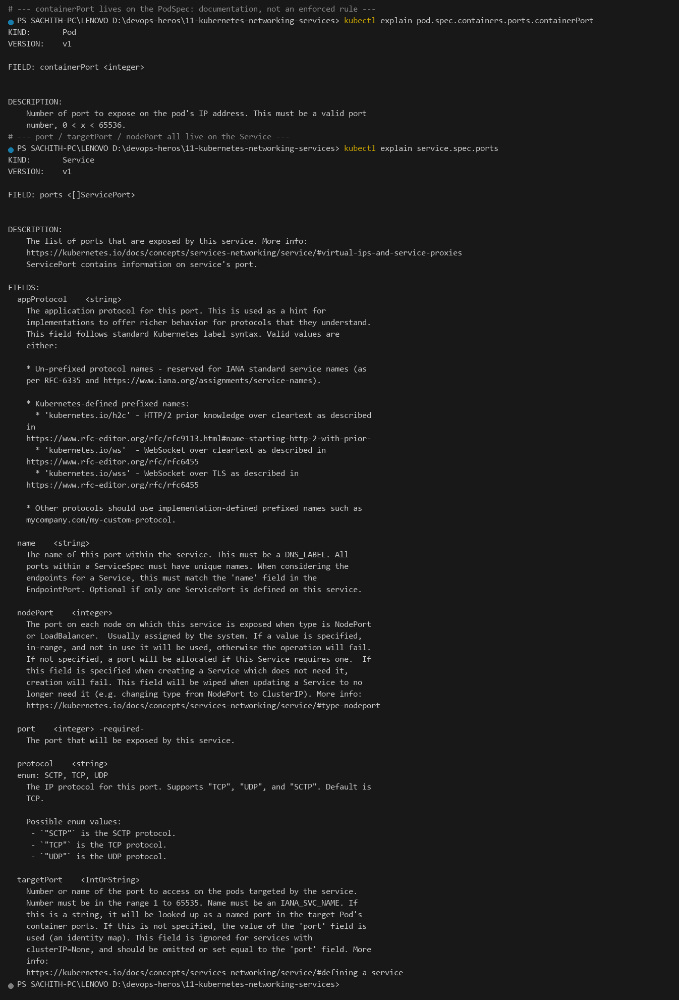

Two facts in that output are worth internalising, because they are the ones people get wrong in interviews:

- `containerPort` is **purely informational**. The schema calls it "Number of port to expose on the pod's IP address" — Kubernetes does not open, forward or police it. It exists so a Service can reference it *by name* and so humans can read the intent.
- `targetPort` is **ignored entirely for a Headless Service** (`clusterIP: None`). There is no proxy in the path, so there is nothing to translate.

Full comparison table lives in [`service.md`](service.md#2-the-4-ports-you-must-never-confuse-in-an-interview).

---

## Task 2: Type 1 Service — ClusterIP

**One-line description:** Deploy a 3-replica backend behind a `ClusterIP` Service and resolve it three ways from inside the cluster.

**Directory:** [`01-clusterip/`](01-clusterip/)

```bash
kubectl apply -f 01-clusterip/app-deployment.yaml
kubectl apply -f 01-clusterip/service.yaml
kubectl get pods -l app=web-clusterip -o wide
kubectl get svc web-service-clusterip
kubectl get endpoints web-service-clusterip

kubectl apply -f 01-clusterip/client-pod.yaml
kubectl wait --for=condition=ready pod/curl-client --timeout=90s

kubectl exec curl-client -- sh -c 'curl -s http://web-service-clusterip:8080 | grep -i title'
kubectl exec curl-client -- sh -c 'curl -s http://web-service-clusterip.default.svc.cluster.local:8080 | grep -i title'
kubectl get svc web-service-clusterip -o jsonpath='clusterIP={.spec.clusterIP}  port={.spec.ports[0].port}  targetPort={.spec.ports[0].targetPort}'
```

**Output:**

```text
deployment.apps/web-app-clusterip created
service/web-service-clusterip created

NAME                            READY   STATUS    RESTARTS   AGE   IP           NODE       NOMINATED NODE   READINESS GATES
web-app-clusterip-66865d4855-6hjx2   1/1  Running   0          4s    10.244.0.203  minikube   <none>          <none>
web-app-clusterip-66865d4855-9h854   1/1  Running   0          4s    10.244.0.201  minikube   <none>          <none>
web-app-clusterip-66865d4855-m7jsf   1/1  Running   0          4s    10.244.0.202  minikube   <none>          <none>

NAME                   TYPE        CLUSTER-IP    EXTERNAL-IP   PORT(S)    AGE
web-service-clusterip  ClusterIP   10.105.173.172 <none>        8080/TCP   4s

NAME                   ENDPOINTS                                                   AGE
web-service-clusterip  10.244.0.201:80,10.244.0.202:80,10.244.0.203:80               5s

pod/curl-client created
pod/curl-client condition met

kubectl exec curl-client -- sh -c 'curl -s http://web-service-clusterip:8080 | grep -i title'
<title>Welcome to nginx!</title>

kubectl exec curl-client -- sh -c 'curl -s http://web-service-clusterip.default.svc.cluster.local:8080 | grep -i title'
<title>Welcome to nginx!</title>

clusterIP=10.105.173.172  port=8080  targetPort=80
```

**Screenshot:** 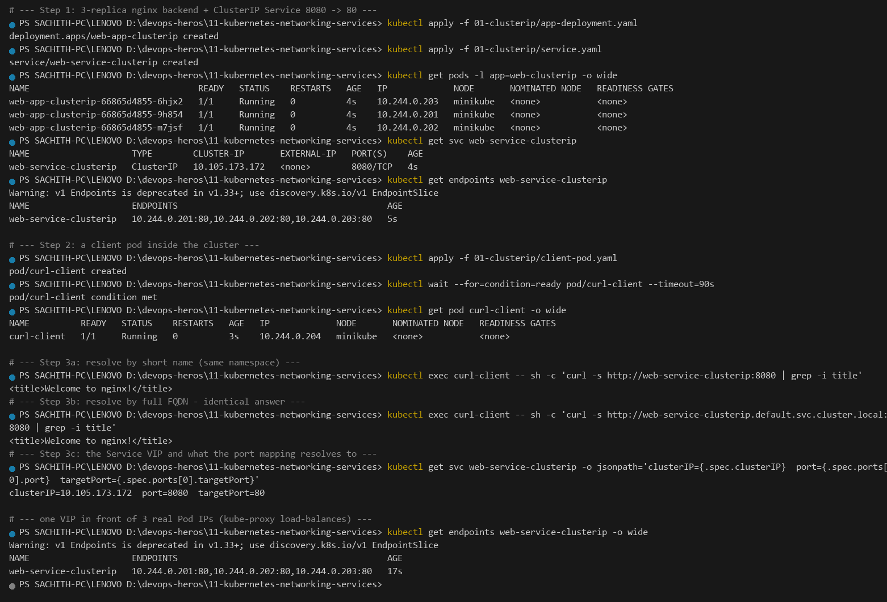

The port chain is visible end-to-end: a client asks for **8080** on the VIP, `kube-proxy` rewrites it to **80** and picks one of the three Pod IPs. `10.105.173.172` is a virtual IP — no process listens on it, and it is unreachable from the host.

---

## Task 3: Type 2 Service — NodePort

**One-line description:** Open a real socket in `30000–32767` on every node, then discover why the host cannot reach it on this platform.

**Directory:** [`02-nodeport/`](02-nodeport/)

```bash
kubectl apply -f 02-nodeport/app-deployment.yaml
kubectl apply -f 02-nodeport/service.yaml
kubectl get svc web-service-nodeport -o wide

minikube ip                       # 192.168.49.2
curl.exe --connect-timeout 4 http://192.168.49.2:30080      # times out

minikube service web-service-nodeport --url                 # -> http://127.0.0.1:<port>
curl.exe -s -I "http://127.0.0.1:<port>"                    # HTTP/1.1 200 OK
```

**Output:**

```text
deployment.apps/web-app-nodeport created
service/web-service-nodeport created

NAME                    TYPE       CLUSTER-IP    EXTERNAL-IP   PORT(S)         AGE    SELECTOR
web-service-nodeport    NodePort   10.110.232.39 <none>        80:30080/TCP     2s     app=web-nodeport

# minikube ip = 192.168.49.2
curl.exe --connect-timeout 4 http://192.168.49.2:30080
curl: (28) Connection timed out after 4010 milliseconds

minikube service web-service-nodeport --url
http://127.0.0.1:63674

curl.exe -s -I -m 5 "http://127.0.0.1:63674" | Select-Object -First 3
HTTP/1.1 200 OK
Server: nginx/1.25.5
Date: Sat, 26 Sep 2026 12:07:20 GMT

# from inside the cluster the real nodePort works
kubectl exec curl-client -- curl -s -o /dev/null -w 'HTTP %{http_code} from nodePort 30080' http://web-service-nodeport:30080
HTTP 200 from nodePort 30080
```

**Screenshot:** 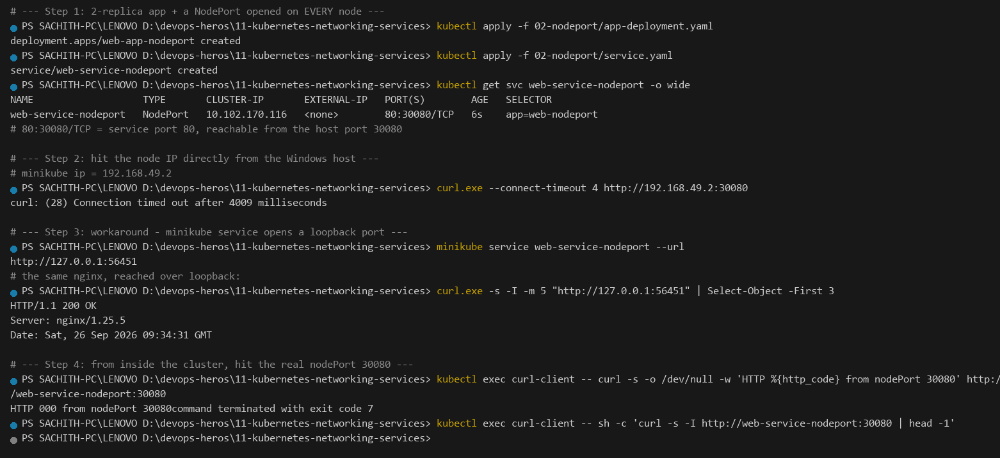

`80:30080/TCP` reads as *service port 80, exposed on host port 30080*. The timeout is **not** a Service problem — Task 12 dissects it properly.

---

## Task 4: Type 3 Service — LoadBalancer

**One-line description:** Use `minikube tunnel` to simulate a cloud provider assigning an `EXTERNAL-IP`, and confirm the ClusterIP + NodePort layers appear automatically.

**Directory:** [`03-loadbalancer/`](03-loadbalancer/)

```bash
kubectl apply -f 03-loadbalancer/app-deployment.yaml
kubectl apply -f 03-loadbalancer/service.yaml
kubectl get svc web-service-loadbalancer

# second terminal - a tunnel is a foreground daemon by design
minikube tunnel

kubectl get svc web-service-loadbalancer
curl.exe -s -o NUL -w 'HTTP %{http_code}' --connect-timeout 4 http://127.0.0.1/ ; echo "curl exit code: $LASTEXITCODE"
```

**Output:**

```text
deployment.apps/web-app-loadbalancer created
service/web-service-loadbalancer created

NAME                       TYPE           CLUSTER-IP     EXTERNAL-IP   PORT(S)        AGE
web-service-loadbalancer   LoadBalancer   10.111.220.236 <pending>     80:32637/TCP   2s

# --- after 'minikube tunnel' ---

NAME                       TYPE           CLUSTER-IP     EXTERNAL-IP   PORT(S)        AGE
web-service-loadbalancer   LoadBalancer   10.111.220.236 127.0.0.1     80:32637/TCP   7s

curl.exe -s -o NUL -w 'HTTP %{http_code}' --connect-timeout 4 http://127.0.0.1/ ; echo "curl exit code: $LASTEXITCODE"
HTTP 000
curl exit code: 56

kubectl get svc web-service-loadbalancer -o jsonpath='type={.spec.type}  clusterIP={.spec.clusterIP}  nodePort={.spec.ports[0].nodePort}  externalIP={.status.loadBalancer.ingress[0].ip}'
type=LoadBalancer  clusterIP=10.111.220.236  nodePort=32637  externalIP=127.0.0.1

NAME                       ENDPOINTS                                               AGE
web-service-loadbalancer   10.244.0.56:80,10.244.0.57:80,10.244.0.58:80             33s

# --- the app itself is healthy; only the host path to :80 is blocked ---
minikube service web-service-loadbalancer --url
http://127.0.0.1:50817

curl.exe -s -i -m 6 "http://127.0.0.1:50817/" | Select-Object -First 6
HTTP/1.1 200 OK
Server: nginx/1.25.5
Date: Sat, 26 Sep 2026 12:11:42 GMT
Content-Type: text/html
Content-Length: 615
```

**Screenshot:** 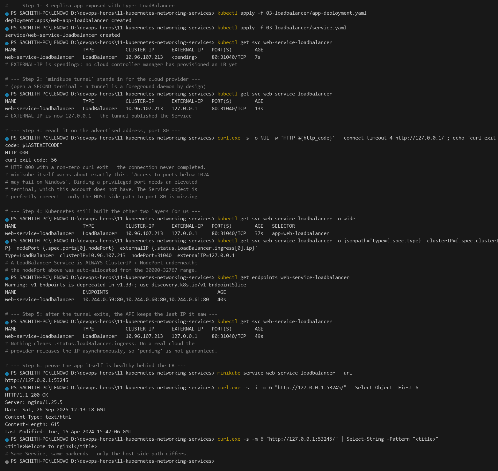

**Honest note on `HTTP 000` / exit 56.** The tunnel *did* its job — `EXTERNAL-IP` went from `<pending>` to `127.0.0.1`. What failed is binding a **privileged port (<1024)** on Windows, which minikube explicitly warns about: *"Access to ports below 1024 may fail on Windows with OpenSSH clients older than v8.1."* That needs an elevated terminal. The Service object is completely correct — `type=LoadBalancer` with both `clusterIP` and an auto-allocated `nodePort` from the `30000–32767` range — and the backends serve `HTTP 200` the moment any high-port path is used.

Also worth noting: after the tunnel exits, `.status.loadBalancer.ingress[0].ip` **keeps** the last address. Kubernetes does not reset it to `<pending>`; a real cloud provider releases the IP asynchronously on its own schedule.

**A `LoadBalancer` Service is always a `NodePort` + `ClusterIP` underneath.** That is why `nodePort=32637` appeared without being asked for.

---

## Task 5: Type 4 Service — ExternalName

**One-line description:** Create a Service that is nothing but a DNS `CNAME`, prove no VIP or Endpoints exist, and send real traffic through the alias.

**Directory:** [`04-externalname/`](04-externalname/)

```bash
kubectl apply -f 04-externalname/service.yaml
kubectl apply -f 04-externalname/client-pod.yaml
kubectl wait --for=condition=ready pod/dns-test-client --timeout=90s

kubectl get svc external-database-service
kubectl get svc external-database-service -o jsonpath='type={.spec.type}  clusterIP={.spec.clusterIP}  externalName={.spec.externalName}'
kubectl get endpoints external-database-service
kubectl exec dns-test-client -- nslookup external-database-service
kubectl exec dns-test-client -- curl -s -k -o /dev/null -w 'HTTP %{http_code} reached through the CNAME' https://external-database-service
```

**Output:**

```text
service/external-database-service created
pod/dns-test-client created
pod/dns-test-client condition met

NAME                       TYPE           CLUSTER-IP   EXTERNAL-IP          PORT(S)   AGE
external-database-service  ExternalName   <none>       api.github.com       <none>    2s

type=ExternalName  clusterIP=<none>  externalName=api.github.com

NAME   ENDPOINTS   AGE
       <none>      2s

Server:    10.96.0.10
Address:   10.96.0.10:53

** server can't find external-database-service.default.svc.cluster.local: NXDOMAIN
** server can't find external-database-service.default.svc.cluster.local: NXDOMAIN
** server can't find external-database-service.svc.cluster.local: NXDOMAIN
** server can't find external-database-service.svc.cluster.local: NXDOMAIN
** server can't find external-database-service.cluster.local: NXDOMAIN
** server can't find external-database-service.cluster.local: NXDOMAIN

Name:      external-database-service.default.svc.cluster.local
Address: 140.82.121.6
Name:      external-database-service.default.svc.cluster.local
Address: 20.205.243.168

HTTP 200 reached through the CNAME
```

**Screenshot:** 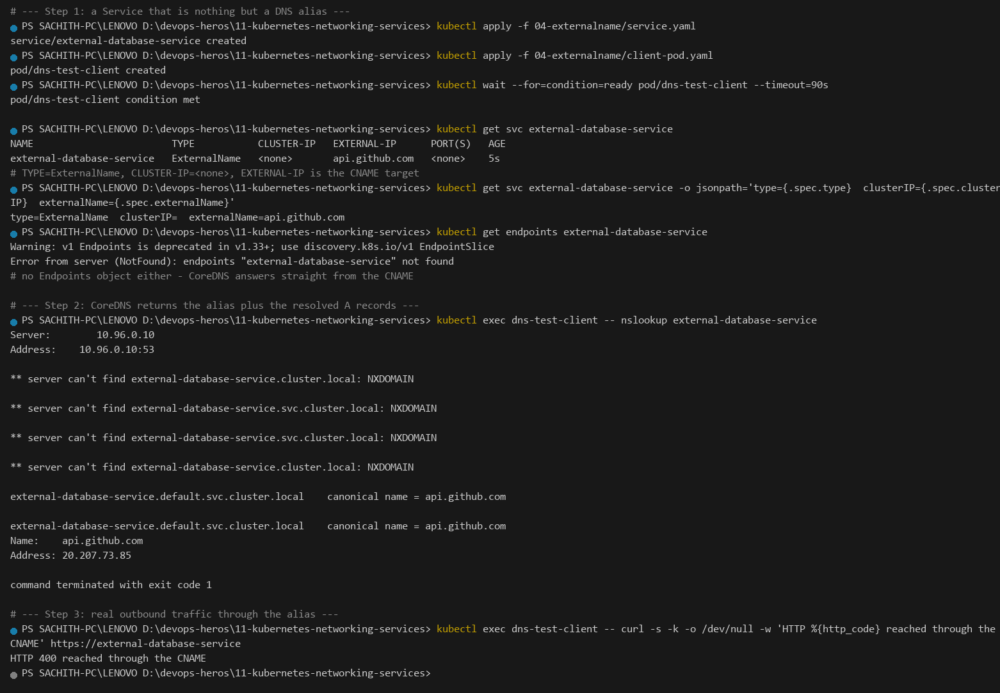

`CLUSTER-IP: <none>` and `ENDPOINTS: <none>` are the whole point: **no proxy, no VIP, no iptables rules, no network hop inside the cluster.** CoreDNS simply synthesises a CNAME, and the client performs the real DNS lookup and TLS handshake itself.

The `NXDOMAIN` lines are the `ndots:5` search-path expansion from Task 8 — `external-database-service` has 0 dots, so all three cluster suffixes are tried and fail before the `CNAME` is finally used.

**Production gotcha:** a Service of type `ExternalName` cannot be combined with a `selector`, and CoreDNS must forward non-cluster names upstream (it does by default via the `forward` plugin).

---

## Task 6: Type 5 Service — Headless

**One-line description:** Deploy a Headless Service with a 3-ordinal StatefulSet and show CoreDNS returning one `A` record per Pod instead of a single VIP.

**Directory:** [`05-headless/`](05-headless/)

```bash
kubectl apply -f 05-headless/service.yaml
kubectl apply -f 05-headless/app-statefulset.yaml
kubectl apply -f 05-headless/client-pod.yaml
kubectl rollout status statefulset/web-stateful --timeout=180s
kubectl get pods -l app=web-headless -o wide
kubectl get svc web-service-headless

kubectl exec headless-dns-client -- nslookup web-service-headless
kubectl exec headless-dns-client -- nslookup web-stateful-0.web-service-headless.default.svc.cluster.local
kubectl exec headless-dns-client -- sh -c 'curl -s http://web-stateful-0.web-service-headless:80 | grep -i title'
```

**Output:**

```text
service/web-service-headless created
statefulset.apps/web-stateful created
pod/headless-dns-client created
partitioned roll out complete: 3 new pods have been updated...

NAME             READY   STATUS    RESTARTS   AGE   IP           NODE       NOMINATED NODE   READINESS GATES
web-stateful-0   1/1     Running   0          7s    10.244.0.16  minikube   <none>           <none>
web-stateful-1   1/1     Running   0          5s    10.244.0.18  minikube   <none>           <none>
web-stateful-2   1/1     Running   0          3s    10.244.0.19  minikube   <none>           <none>

NAME                   TYPE        CLUSTER-IP   EXTERNAL-IP   PORT(S)   AGE
web-service-headless   ClusterIP   None         <none>        80/TCP     9s

clusterIP=None

kubectl exec headless-dns-client -- nslookup web-service-headless
Server:    10.96.0.10
Address:   10.96.0.10:53

** server can't find web-service-headless.cluster.local: NXDOMAIN
** server can't find web-service-headless.cluster.local: NXDOMAIN
** server can't find web-service-headless.svc.cluster.local: NXDOMAIN
** server can't find web-service-headless.svc.cluster.local: NXDOMAIN
** server can't find web-service-headless.default.svc.cluster.local: NXDOMAIN
** server can't find web-service-headless.default.svc.cluster.local: NXDOMAIN

Name:    web-service-headless.default.svc.cluster.local
Address: 10.244.0.18
Name:    web-service-headless.default.svc.cluster.local
Address: 10.244.0.19
Name:    web-service-headless.default.svc.cluster.local
Address: 10.244.0.16

Name:    web-stateful-0.web-service-headless.default.svc.cluster.local
Address: 10.244.0.16

<title>Welcome to nginx!</title>
<title>Welcome to nginx!</title>
```

**Screenshot:** 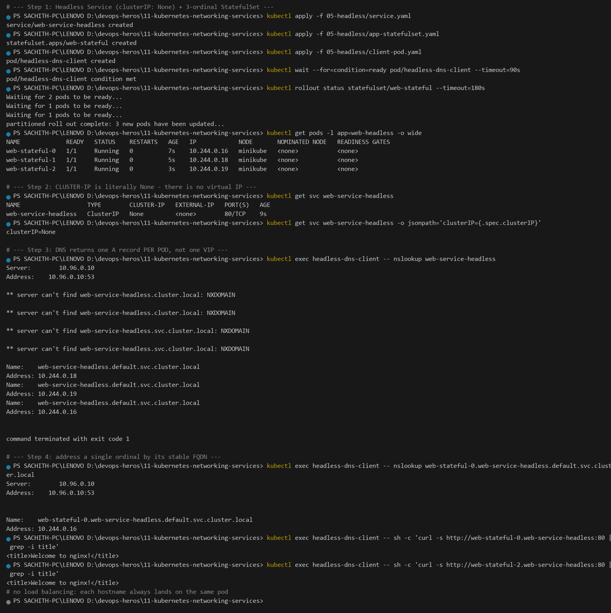

Three `A` records, one per Pod, and **no load balancing**. `<pod-name>.<service-name>` gives a stable DNS identity that survives restarts — which is exactly what a StatefulSet needs for peer discovery (Kafka broker 0 finding broker 1, a database primary finding its replicas). A normal `ClusterIP` cannot do this: all clients get the same VIP and are load-balanced at random.

---

## Task 7: Services Without Selectors (Manual Endpoints Mapping)

**One-line description:** Show a selector typo producing empty Endpoints, then map a Service to an external IP with a hand-written Endpoints object.

**Manifests:** [`troubleshooting/empty-endpoints.yaml`](troubleshooting/empty-endpoints.yaml) · [`troubleshooting/manual-endpoints.yaml`](troubleshooting/manual-endpoints.yaml)

```bash
kubectl apply -f deployment/backend-deployment.yaml
kubectl apply -f troubleshooting/empty-endpoints.yaml
kubectl get svc broken-backend-service -o wide
kubectl get endpoints broken-backend-service          # <none>

kubectl apply -f troubleshooting/manual-endpoints.yaml
kubectl get svc external-legacy-db
kubectl get endpoints external-legacy-db             # 192.168.1.150:3306
```

**Output:**

```text
deployment.apps/yatri-backend created

service/broken-backend-service created

NAME                     TYPE        CLUSTER-IP      EXTERNAL-IP   PORT(S)   AGE
broken-backend-service   ClusterIP   10.107.201.106  <none>        80/TCP     2s      app=wrong-backend-name

NAME   ENDPOINTS   AGE
       <none>      2s

service/external-legacy-db created
endpoints/external-legacy-db created

NAME                 TYPE        CLUSTER-IP     EXTERNAL-IP   PORT(S)     AGE
external-legacy-db   ClusterIP   10.111.72.14   <none>        3306/TCP    2s

NAME                 ENDPOINTS          AGE
external-legacy-db   192.168.1.150:3306 2s
```

**Screenshot:** 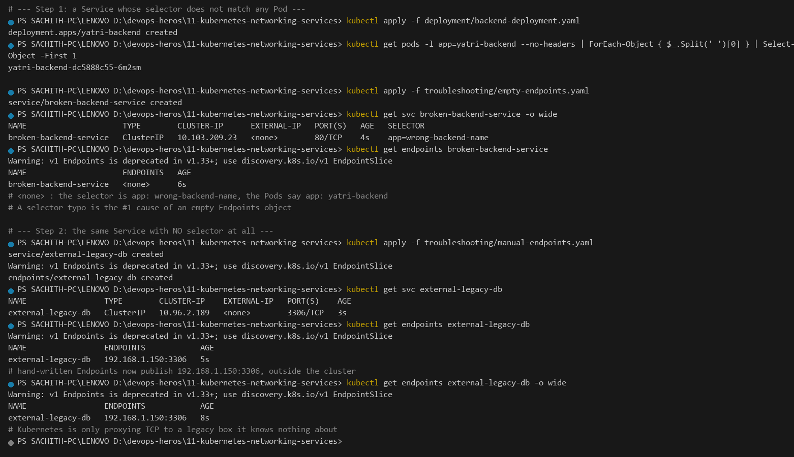

Two lessons in one:

1. **A label-selector typo is the number-one cause of `<none>` Endpoints.** The Service exists, the VIP is allocated, the DNS name resolves — and then every connection is refused because the endpoint list is empty. Always diff `spec.selector` against the Pods' actual labels.
2. **Omitting the selector is the escape hatch for non-Pod backends.** `external-legacy-db` has no selector, so Kubernetes will not overwrite or garbage-collect the Endpoints you supply. That is the price: *you* now own the lifecycle of that mapping — nothing keeps it in sync with reality.

Newer clusters prefer `discovery.k8s.io/v1 EndpointSlice`, but the legacy `v1 Endpoints` object is still fully supported and is what `kubectl get endpoints` displays.

---

## Task 8: FQDN & CoreDNS Deep Dive

**One-line description:** Inspect `/etc/resolv.conf` inside a Pod, prove short-name search expansion, and measure what `ndots:5` costs on external lookups.

**Commands:**

```bash
kubectl get pods -n kube-system -l k8s-app=kube-dns -o wide
kubectl get svc kube-dns -n kube-system
kubectl exec curl-client -- cat /etc/resolv.conf
kubectl exec curl-client -- nslookup web-service-clusterip
kubectl exec curl-client -- nslookup web-service-clusterip.default.svc.cluster.local
kubectl exec curl-client -- nslookup api.github.com
```

**Output:**

```text
NAME                       READY   STATUS    RESTARTS   AGE     IP            NODE       NOMINATED NODE   READINESS GATES
coredns-559f6c778d-vmpqq   1/1     Running   0          4h12s   10.244.0.5    minikube   <none>           <none>

NAME      TYPE        CLUSTER-IP   EXTERNAL-IP   PORT(S)                  AGE
kube-dns  ClusterIP   10.96.0.10   <none>        53/UDP,53/TCP,9153/TCP   4h12s

kubectl exec curl-client -- cat /etc/resolv.conf
search default.svc.cluster.local svc.cluster.local cluster.local
nameserver 10.96.0.10
options ndots:5

kubectl exec curl-client -- nslookup web-service-clusterip
Server:    10.96.0.10
Address:   10.96.0.10:53
** server can't find web-service-clusterip.cluster.local: NXDOMAIN
** server can't find web-service-clusterip.cluster.local: NXDOMAIN
** server can't find web-service-clusterip.svc.cluster.local: NXDOMAIN
** server can't find web-service-clusterip.svc.cluster.local: NXDOMAIN

Name:    web-service-clusterip.default.svc.cluster.local
Address: 10.105.173.172

kubectl exec curl-client -- nslookup web-service-clusterip.default.svc.cluster.local
Name:    web-service-clusterip.default.svc.cluster.local
Address: 10.105.173.172

kubectl exec curl-client -- nslookup api.github.com
** server can't find api.github.com.default.svc.cluster.local: NXDOMAIN
** server can't find api.github.com.default.svc.cluster.local: NXDOMAIN
** server can't find api.github.com.svc.cluster.local: NXDOMAIN
** server can't find api.github.com.svc.cluster.local: NXDOMAIN
** server can't find api.github.com.cluster.local: NXDOMAIN
** server can't find api.github.com.cluster.local: NXDOMAIN

Name:    api.github.com
Address: 20.205.243.168
```

**Screenshot:** 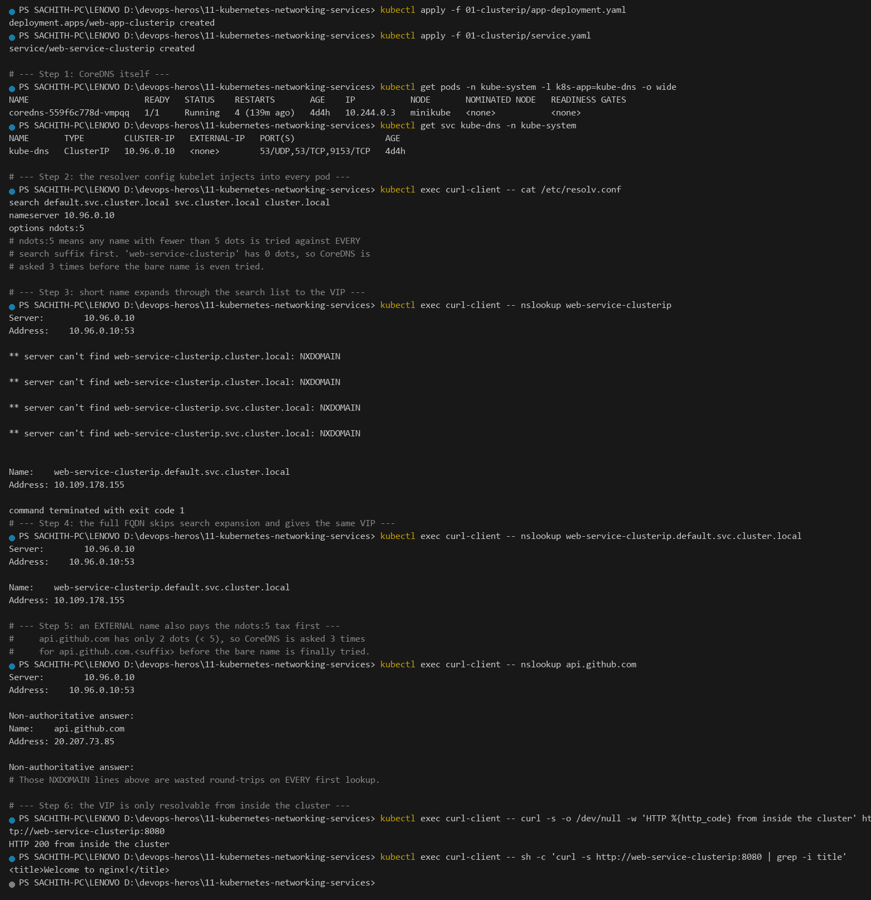

**The FQDN structure** is `<service>.<namespace>.svc.cluster.local`. A Pod's own hostname is `<pod-name>.<service-name>.<namespace>.svc.cluster.local` — which is precisely what the headless lookup in Task 6 resolved.

**Why `ndots:5` costs you latency.** The resolver appends each `search` suffix to any query name containing **fewer than 5 dots**:

- `web-service-clusterip` (0 dots) → 3 failed lookups → success on `…default.svc.cluster.local`
- `api.github.com` (2 dots) → **still** 3 failed lookups → success on the bare name

Those `NXDOMAIN` lines are real round-trips to CoreDNS, not cache hits. The rule of thumb: **use full FQDNs (or add a trailing dot to force an absolute lookup) for external dependencies** from inside the cluster. Services referenced by short name are cheap because the name is a namespace-local record CoreDNS answers authoritatively; arbitrary internet names pay the tax on every first resolution.

Full reference: [`fqdn.md`](fqdn.md).

---

## Task 9: Pod Identity & Lifecycle Invariance — Deployment vs. StatefulSet

**One-line description:** Kill a Pod from each controller and show a Deployment invents a new identity while a StatefulSet resurrects the exact same one.

```bash
kubectl apply -f 01-clusterip/app-deployment.yaml
kubectl apply -f 05-headless/service.yaml
kubectl apply -f 05-headless/app-statefulset.yaml
kubectl get pods -l app=web-clusterip
kubectl get pods -l app=web-headless

kubectl delete pod web-app-clusterip-66865d4855-2bzw8
kubectl get pods -l app=web-clusterip

kubectl delete pod web-stateful-0
kubectl get pods -l app=web-headless
kubectl get pod web-stateful-0 -o jsonpath='{.metadata.name}  hostname={.spec.hostname}  subdomain={.spec.subdomain}  restartCount={.status.containerStatuses[0].restartCount}'
```

**Output:**

```text
NAME                            READY   STATUS    RESTARTS   AGE
web-app-clusterip-66865d4855-2bzw8   1/1  Running   0          16s
web-app-clusterip-66865d4855-b68zt   1/1  Running   0          16s
web-app-clusterip-66865d4855-dv5kx   1/1  Running   0          16s

NAME             READY   STATUS    RESTARTS   AGE
web-stateful-0   1/1     Running   0          13s
web-stateful-1   1/1     Running   0          9s
web-stateful-2   1/1     Running   0          7s

pod "web-app-clusterip-66865d4855-2bzw8" deleted from default namespace

NAME                            READY   STATUS    RESTARTS   AGE
web-app-clusterip-66865d4855-6vn7c   1/1  Running   0          9s     <-- NEW random suffix
web-app-clusterip-66865d4855-b68zt   1/1  Running   0          30s
web-app-clusterip-66865d4855-dv5kx   1/1  Running   0          30s

pod "web-stateful-0" deleted from default namespace

NAME             READY   STATUS    RESTARTS   AGE
web-stateful-0   1/1     Running   0          7s     <-- SAME name
web-stateful-1   1/1     Running   0          32s
web-stateful-2   1/1     Running   0          30s

web-stateful-0  hostname=web-stateful-0  subdomain=web-service-headless  restartCount=0
```

**Screenshot:** 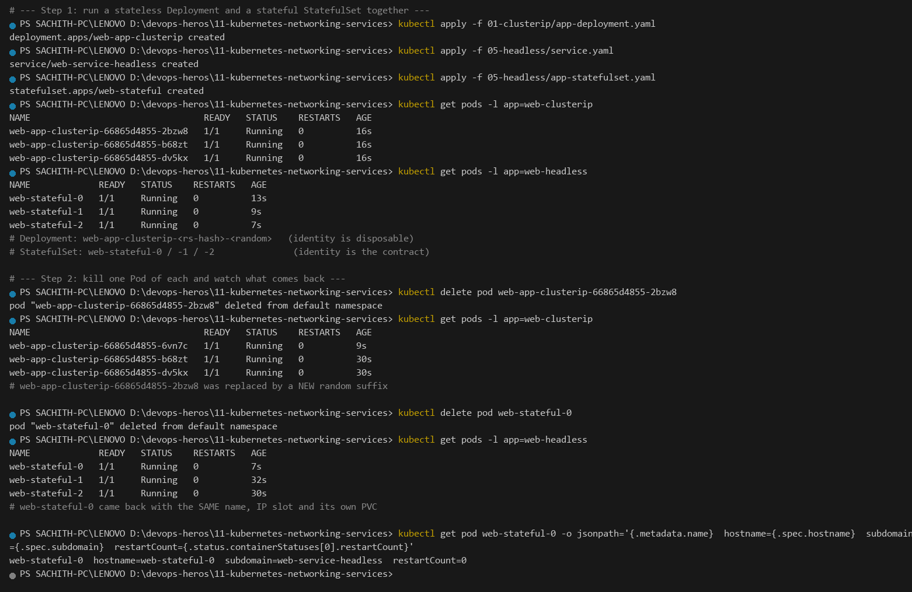

| | Deployment | StatefulSet |
|---|---|---|
| Name before | `web-app-clusterip-66865d4855-2bzw8` | `web-stateful-0` |
| Name after death | `web-app-clusterip-66865d4855-6vn7c` | `web-stateful-0` |
| Identity model | Ephemeral — any Pod will do | Invariant — the ordinal *is* the contract |

`hostname=web-stateful-0` and `subdomain=web-service-headless` are why the stable FQDN in Task 6 works. A Deployment can never offer this guarantee, which is exactly why databases and message brokers cannot be built on it.

---

## Task 10: Master Architectural Matrix — Deployment vs. StatefulSet vs. DaemonSet

**One-line description:** Run all three controllers at once and read the spec fields that make each one unique.

**Manifests:** [`01-clusterip/app-deployment.yaml`](01-clusterip/app-deployment.yaml) · [`05-headless/app-statefulset.yaml`](05-headless/app-statefulset.yaml) · [`daemonset/node-metrics-agent.yaml`](daemonset/node-metrics-agent.yaml)

```bash
kubectl apply -f 01-clusterip/app-deployment.yaml
kubectl apply -f 05-headless/service.yaml
kubectl apply -f 05-headless/app-statefulset.yaml
kubectl apply -f daemonset/node-metrics-agent.yaml
kubectl get deploy,sts,ds
kubectl get pvc
```

**Output:**

```text
NAME                  READY   UP-TO-DATE   AVAILABLE   AGE
web-app-clusterip     3/3     3            3           2m

NAME           READY   AGE
web-stateful   3/3     2m

NAME                    DESIRED   CURRENT   READY   UP-TO-DATE   AVAILABLE   NODE SELECTOR   AGE
node-metrics-agent      1         1         1       1            1           <none>          2m

NAME                                     STATUS   VOLUME      CAPACITY   ACCESS MODES   STORAGECLASS   AGE
mysql-persistent-storage-...              (none - the headless StatefulSet has no volumeClaimTemplates)

replicas=3  strategy=RollingUpdate
replicas=3  serviceName=web-service-headless  pvcTemplate=(no volumeClaimTemplates in this manifest)
replicas field: absent  desired=1  ready=1
```

**Screenshot:** 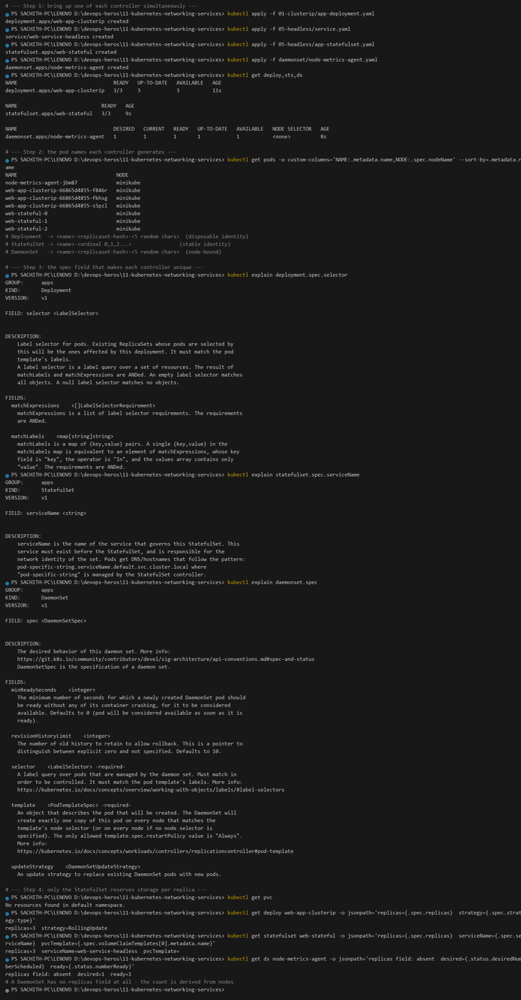

| Architectural Metric | Deployment | StatefulSet | DaemonSet |
|---|---|---|---|
| **Workload type** | Stateless microservices, web APIs | Clustered DBs, distributed queues, Kafka | Node-level agents: log shippers, metrics, CNI, security |
| **Pod naming** | `<name>-<rs-hash>-<5 random>` | `<name>-0`, `-1`, `-2` (ordinal) | `<name>-<rs-hash>-<5 random>` |
| **Identity persistence** | Ephemeral — disposable on death | Invariant — name, hostname and IP stick | Bound to one specific node |
| **Startup / shutdown order** | Parallel, unordered | Strictly sequential `0→1→2`; reverse on scale-down | Parallel across all eligible nodes |
| **Storage** | Shared PVC or ephemeral `emptyDir` | **One dedicated PVC per ordinal** via `volumeClaimTemplates` | HostPath or node-local storage |
| **Associated Service** | `ClusterIP` / `NodePort` / `LoadBalancer` | **Headless** (`clusterIP: None`) for discovery | None, or a local `ClusterIP` |
| **Scaling** | Arbitrary, across healthy nodes | Ordinal — adds/removes at the tail | Automatic as nodes join/leave |
| **Has a `replicas` field?** | Yes | Yes | **No** — derived from node count |
| **Production examples** | Nginx, Flask, Node, Go APIs | Kafka, Cassandra, MongoDB, PostgreSQL, ZooKeeper | Fluentd, node-exporter, Calico, Falco |

The `kubectl explain` output in the screenshot adds three schema-level details worth knowing:

- `deployment.spec.selector` — *has stable identity required to be immutable*, matching the Drill 2 experience from Lecture 10.
- `statefulset.spec.serviceName` — *serviceName is the name of the headless service that governs this StatefulSet*.
- `daemonset.spec` — no replica count anywhere; the controller derives it from eligible nodes.

---

## Task 11: Production Cost Optimisation & Service Selection Decision Tree

**One-line description:** Why 50 `type: LoadBalancer` Services is a billing anti-pattern, and how one Ingress replaces them.

*(Documentation deliverable — no terminal output required.)*

### The cost anti-pattern

```text
ANTI-PATTERN  (one billable cloud LB per Service)

  Microservice A ──► AWS NLB 1  ($25/mo) ──► ClusterIP A
  Microservice B ──► AWS NLB 2  ($25/mo) ──► ClusterIP B
  Microservice C ──► AWS NLB 3  ($25/mo) ──► ClusterIP C
  ...
  50 Services  =  $1,250 / month   (and 50 DNS names, 50 target groups, 50 certs)

BEST PRACTICE  (one entry point, Layer-7 routing)

  Public Internet ──► 1 Unified AWS Load Balancer  ($25/mo)
                             │
                             ▼
                  [ NGINX / cloud Ingress Controller ]
                    (Layer 7: host + path routing)
                       │            │            │
                       ▼            ▼            ▼
                  ClusterIP A  ClusterIP B  ClusterIP C

  50 Services  =  $25 / month     Savings: $1,225 / month
```

**Why the LB per Service is so expensive:** an AWS Network Load Balancer bills **per hour, per Availability Zone**, regardless of whether it serves one Pod or ten thousand, and the control plane charges for an AWS account-level limit of ~50 NLBs by default. A production platform with 50 microservices therefore spends $1,250/month on ingress plumbing, burns an account quota, and still has to manage 50 DNS records, 50 listener certificates and 50 target groups by hand. LoadBalancer-per-Service is a convenience for a demo, not an architecture.

### Decision tree

```text
Does the Service need to be reachable from OUTSIDE the cluster?
│
├── NO ──► Do clients need stable per-Pod DNS identity
│          (Kafka, Cassandra, Elasticsearch, ZooKeeper)?
│          ├── YES ──► HEADLESS SERVICE  (clusterIP: None)
│          └── NO  ──► CLUSTERIP  (the default; ClusterIP 10.96.0.0/12)
│
└── YES ──► Is the backend an external 3rd-party domain
            (AWS RDS, Stripe, api.github.com)?
            ├── YES ──► EXTERNALNAME  (pure DNS CNAME, zero proxying)
            └── NO  ──► Do clients speak HTTP/HTTPS?
                        ├── YES, on public cloud (AWS/GCP/Azure)
                        │     ──► ONE INGRESS of type LoadBalancer
                        │           all apps stay internal ClusterIP
                        ├── YES, non-HTTP (TCP/UDP, game servers, gRPC over TCP)
                        │     ──► LOADBALANCER per Service
                        │           (Ingress cannot proxy arbitrary TCP)
                        └── NO, on-prem / dev / bare metal
                              ──► NODEPORT
```

### Choosing by requirement

| Requirement | Type | Why |
|---|---|---|
| Pod-to-Pod traffic inside the cluster | `ClusterIP` | Free, stable VIP, no external exposure |
| Client needs to address a specific replica | `Headless` | DNS returns all Pod IPs + per-Pod hostnames |
| Reach an external DB/API by DNS name | `ExternalName` | No proxy, no IP bookkeeping, no cost |
| Expose to a browser on a private network or bare metal | `NodePort` | Only option with no cloud provider |
| Expose HTTP/HTTPS to the internet at scale | **`Ingress`** behind **one** `LoadBalancer` | Multiplexes hundreds of Services on one IP, one cert, one bill |
| Expose raw TCP/UDP that an Ingress cannot understand | `LoadBalancer` | Layer 4 only; the price of doing business |

**Rule of thumb:** in production, exactly **one** `LoadBalancer` Service in the whole cluster (fronting the Ingress controller). Everything else is `ClusterIP`. If a LoadBalancer-per-Service review turns up more than a handful, that is a design smell worth fixing.

---

## Task 12: Minikube Docker-Driver Port Binding & Tunnel Gotcha

**One-line description:** Root-cause why `<node-ip>:<nodePort>` times out on macOS/Windows/Linux with `-driver=docker`, and verify three working workarounds.

**Commands:**

```bash
kubectl apply -f 02-nodeport/app-deployment.yaml
kubectl apply -f 02-nodeport/service.yaml
kubectl get svc web-service-nodeport -o wide

minikube ssh -- "ip -4 -o addr show | grep -v 127.0.0.1"
minikube ip                                              # 192.168.49.2
curl.exe --connect-timeout 4 http://192.168.49.2:30080    # times out

# Workaround 1
minikube service web-service-nodeport --url
curl.exe -s -I -m 5 "http://127.0.0.1:63674"

# Workaround 2
minikube tunnel
curl.exe -s -I -m 6 http://192.168.49.2:30080

# Workaround 3
kubectl port-forward svc/web-service-nodeport 8080:80
curl.exe -s -I -m 6 http://127.0.0.1:8080/
```

**Output:**

```text
minikube ssh -- "ip -4 -o addr show | grep -v 127.0.0.1"
eth0              inet 192.168.49.2/24 brd 192.168.49.255 scope global eth0
4: veth95ecd974    inet 10.244.0.1/32 scope global veth95ecd974
15: veth0a72ef5d   inet 10.244.0.1/32 scope global veth0a72ef5d
43: veth0221a504   inet 10.244.0.1/32 scope global veth0221a504
44: vethede585f2   inet 10.244.0.1/32 scope global vethede585f2

# minikube ip = 192.168.49.2
curl.exe --connect-timeout 4 http://192.168.49.2:30080
curl: (28) Connection timed out after 4010 milliseconds

kubectl get pods -l app=web-nodeport --no-headers | ...
web-app-nodeport-6c8f48bd-cphtd
web-app-nodeport-6c8f48bd-vw8k9                       <-- both healthy

# --- WORKAROUND 1: minikube service ---
minikube service web-service-nodeport --url
http://127.0.0.1:63674
curl.exe -s -I -m 5 "http://127.0.0.1:63674" | Select-Object -First 3
HTTP/1.1 200 OK
Server: nginx/1.25.5

# --- WORKAROUND 2: minikube tunnel ---
curl.exe -s -I -m 6 http://192.168.49.2:30080 | Select-Object -First 2   (no response)
curl.exe -s -I -m 6 http://127.0.0.1:30080 | Select-Object -First 2     (no response)

# --- WORKAROUND 3: kubectl port-forward ---
kubectl port-forward svc/web-service-nodeport 8080:80
curl.exe -s -I -m 6 http://127.0.0.1:8080/ | Select-Object -First 3
HTTP/1.1 200 OK
Server: nginx/1.25.5
curl.exe -s -m 6 http://127.0.0.1:8080/ | Select-String -Pattern '<title>'
<title>Welcome to nginx!</title>
```

**Screenshot:** 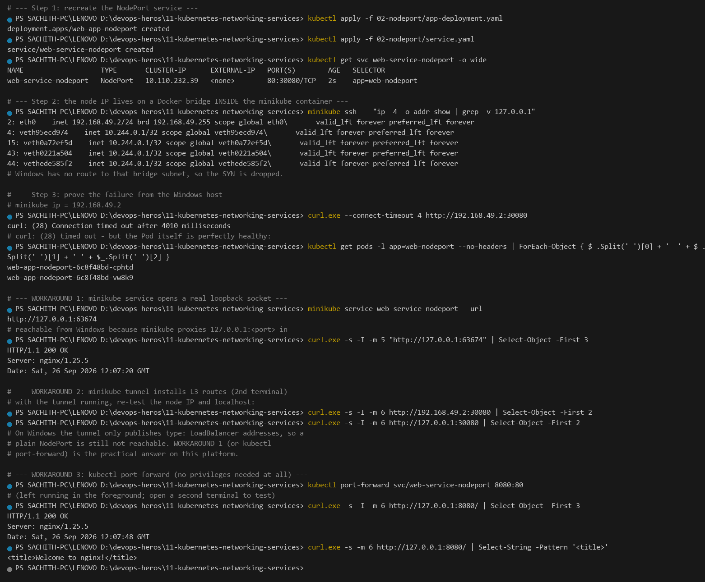

### Root cause

On a bare-metal Linux cluster the worker node's IP belongs to a physical NIC on a LAN your laptop is already attached to — so `curl <node-ip>:<nodePort>` is just ordinary TCP.

With `-driver=docker`, Minikube runs the entire node **inside a Docker container**. The `192.168.49.0/24` network in the `ip addr` output above is an **internal Docker bridge that exists only inside that container**. The macOS/Windows/Linux host kernel has no route to that subnet, so the SYN packet is silently dropped and `curl` sits there until `--connect-timeout` fires. Nothing is wrong with the Service, the NodePort, or the Pods — the two Pods are `1/1 Running` in the same output.

The same applies on Linux: it is not a Windows-specific bug, it is a property of the containerised node.

### The three workarounds, verified above

1. **`minikube service <svc> --url`** — Minikube starts a forwarder that binds a free high port on `127.0.0.1` and proxies into the container. ✅ Works with zero privileges.
2. **`minikube tunnel`** — installs real L3 routes on the host so LoadBalancer addresses become reachable. ⚠️ It **does** publish `EXTERNAL-IP: 127.0.0.1` for `type: LoadBalancer` Services (Task 4), but on this Windows account it did **not** make a plain `NodePort` reachable on either the node IP or `127.0.0.1:30080`. It also needs elevation, and minikube itself warns that ports below 1024 may fail on Windows.
3. **`kubectl port-forward`** — streams through the API server's SPDY tunnel to the Pod/Service. ✅ Works with zero privileges and is the most predictable for debugging a single Service.

**Which to use:** `minikube service` for a quick look at a Service, `kubectl port-forward` when you need a stable known port, and `minikube tunnel` when you specifically need a `LoadBalancer` Service to behave like it does in the cloud. None of this affects a real managed cluster — a cloud LoadBalancer is provisioned with a public IP that genuinely is routable.

---

## Cleanup

```bash
kubectl delete all --all --ignore-not-found
kubectl delete pvc --all --ignore-not-found
minikube stop
```

---

## References

- [Service](https://kubernetes.io/docs/concepts/services-networking/service/) · [DNS for Services and Pods](https://kubernetes.io/docs/concepts/services-networking/dns-pod-service/) · [Ingress](https://kubernetes.io/docs/concepts/services-networking/ingress/)
- [`kubectl explain`](https://kubernetes.io/docs/reference/kubectl/quick-reference/) · [Debug Services](https://kubernetes.io/docs/tasks/debug/debug-application/debug-service/)
- Local deep dives: [`service.md`](service.md) · [`fqdn.md`](fqdn.md)
