# Session 12: ConfigMaps, Secrets & Ingress — Configuration, Credentials and Layer-7 Routing

**Author:** Sachith
**Course:** DevOps & Cloud
**Session:** 12 — Kubernetes Ingress, ConfigMaps & Secrets
**Cluster:** Minikube v1.39.0 (docker driver) · Kubernetes v1.37.0 · containerd 2.3.4
**Node:** `minikube` · `192.168.49.2` · NGINX Ingress Controller v1.15.1 (addon)
**Workstation:** Windows 11 · PowerShell 7 · no WSL/bash available — see the per-task notes

> Per-topic deep dives already in this folder:
> [`01-configmap/`](01-configmap/README.md) · [`02-secret/`](02-secret/README.md) · [`03-ingress/`](03-ingress/README.md) · [`04-full-demo/`](04-full-demo/README.md) · [`secret-management.md`](secret-management.md) (Task 5 in full)

---

## Table of Contents

| # | Task | Manifest | Screenshot |
|---|------|----------|------------|
| 1 | ConfigMap — decoupling plain config | [`01-configmap/app-config.yaml`](01-configmap/app-config.yaml) | [01](screenshots/01-configmap.png) |
| 2 | ConfigMap live update & pod immobility | — | [02](screenshots/02-configmap-live-update.png) |
| 3 | Secrets & Base64 mechanics | [`02-secret/db-secret.yaml`](02-secret/db-secret.yaml) | [03](screenshots/03-secret-base64.png) |
| 4 | Trailing-newline Secret gotcha | [`troubleshooting/secret-base64-gotcha.md`](troubleshooting/secret-base64-gotcha.md) | [04](screenshots/04-secret-newline-gotcha.png) |
| 5 | Enterprise secret management & CI/CD | [`secret-management.md`](secret-management.md) | [05](screenshots/05-secret-management-architecture.png) |
| 6 | Combined ConfigMap + Secret injection | [`04-full-demo/backend.yaml`](04-full-demo/backend.yaml) | [06](screenshots/06-configmap-secret-injection.png) |
| 7 | Ingress resource vs. Ingress controller | — | [07](screenshots/07-ingress-resource-vs-controller.png) |
| 8 | NGINX controller activation & lifecycle | [`03-ingress/ingress-nginx-controller-nodeport.yaml`](03-ingress/ingress-nginx-controller-nodeport.yaml) | [08](screenshots/08-nginx-ingress-controller.png) |
| 9 | Local DNS / hosts-file mapping | — | [09](screenshots/09-local-dns-hosts-mapping.png) |
| 10 | Layer 7 path-based routing | [`03-ingress/ingress-routes.yaml`](03-ingress/ingress-routes.yaml) | [10](screenshots/10-path-based-routing.png) |
| 11 | Virtual host-based routing | [`03-ingress/ingress-tls.yaml`](03-ingress/ingress-tls.yaml) | [11](screenshots/11-host-based-routing.png) |
| 12 | Hybrid host + path routing | [`03-ingress/ingress-tls.yaml`](03-ingress/ingress-tls.yaml) | [12](screenshots/12-hybrid-routing.png) |
| 13 | TLS/HTTPS termination & Secret binding | [`03-ingress/ingress-tls.yaml`](03-ingress/ingress-tls.yaml) · `tls.crt` | [13](screenshots/13-tls-termination.png) |
| 14 | End-to-end integration & automation | [`04-full-demo/`](04-full-demo/) | [14](screenshots/14-full-demo-run-cleanup.png) |

---

## Task 1: Non-Sensitive Configuration Decoupling via ConfigMaps

**One-line description:** Store five runtime settings outside the image and read them back one key at a time with JSONPath.

**Directory:** [`01-configmap/`](01-configmap/)

```bash
kubectl apply -f 01-configmap/app-config.yaml
kubectl get configmap yatri-app-config
kubectl describe configmap yatri-app-config

kubectl get configmap yatri-app-config -o jsonpath='{.data.ENVIRONMENT}'
kubectl get configmap yatri-app-config -o jsonpath='{.data.LOG_LEVEL}'
kubectl get configmap yatri-app-config -o jsonpath='{.data.DEFAULT_CURRENCY}'

# every key at once
kubectl get configmap yatri-app-config -o json |
  ConvertFrom-Json | ForEach-Object { $_.data.psobject.Properties | ForEach-Object { $_.Name + '=' + $_.Value } }
```

**Output:**

```text
configmap/yatri-app-config configured

NAME               DATA   AGE
yatri-app-config   5      7m53s

Name:         yatri-app-config
Namespace:    default
Labels:       app=yatri-backend
Annotations:  <none>

Data
====
DEFAULT_CURRENCY:
----
INR

ENVIRONMENT:
----
production

LOG_LEVEL:
----
INFO

MAX_BOOKING_DAYS:
----
30

PORT:
----
5000

BinaryData
====

Events:  <none>

production
INFO
INR

DEFAULT_CURRENCY=INR
ENVIRONMENT=production
LOG_LEVEL=INFO
MAX_BOOKING_DAYS=30
PORT=5000
```

**Screenshot:** 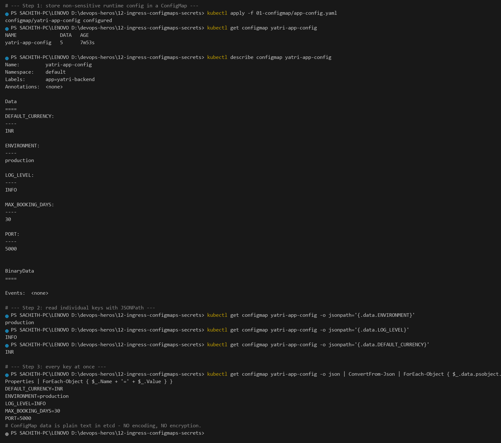

`describe` prints the values in **clear text** because a ConfigMap is stored as plain UTF-8 in etcd — the same command against a Secret shows only byte counts (Task 3). The `BinaryData` section being empty is expected: it is the alternative to `data` for non-UTF-8 payloads such as a binary `nginx.conf` or a keystore.

Every value is a **string**, even `PORT: "5000"` and `MAX_BOOKING_DAYS: "30"` — quoting is mandatory, because an unquoted `5000` would be parsed as a YAML integer and the API server would reject the ConfigMap with a type error.

---

## Task 2: ConfigMap Live Update & Pod Immobility Verification Drill

**One-line description:** Patch the ConfigMap, prove the running container is untouched, then force a rolling restart and watch the new value appear.

```bash
kubectl apply -f 04-full-demo/configmap.yaml
kubectl apply -f 04-full-demo/secret.yaml
kubectl apply -f 04-full-demo/backend.yaml
kubectl rollout status deployment/yatri-backend --timeout=180s

# BEFORE
kubectl exec deploy/yatri-backend -- env | Select-String -Pattern 'ENVIRONMENT='

kubectl patch configmap yatri-app-config --type merge -p '{"data":{"ENVIRONMENT":"staging"}}'
kubectl get configmap yatri-app-config -o jsonpath='{.data.ENVIRONMENT}'

# the RUNNING container did NOT change
kubectl exec deploy/yatri-backend -- env | Select-String -Pattern 'ENVIRONMENT='

kubectl rollout restart deployment/yatri-backend
kubectl rollout status deployment/yatri-backend --timeout=180s
kubectl exec deploy/yatri-backend -- env | Select-String -Pattern 'ENVIRONMENT='
```

**Output:**

```text
configmap/yatri-app-config configured
secret/yatri-db-secret configured
deployment.apps/yatri-backend unchanged
service/yatri-backend-service unchanged
deployment "yatri-backend" successfully rolled out

ENVIRONMENT=production

configmap/yatri-app-config patched
staging

ENVIRONMENT=production
# env vars are resolved once at container start. A ConfigMap update never
# rewrites the environment of an already-running process.

deployment.apps/yatri-backend restarted
Waiting for deployment spec update to be observed...
Waiting for deployment "yatri-backend" rollout to finish: 0 out of 2 new replicas have been updated...
Waiting for deployment "yatri-backend" rollout to finish: 1 out of 2 new replicas have been updated...
Waiting for deployment "yatri-backend" rollout to finish: 1 out of 2 new replicas have been updated...
Waiting for deployment "yatri-backend" rollout to finish: 1 old replicas are pending termination...
deployment "yatri-backend" successfully rolled out

ENVIRONMENT=staging
```

**Screenshot:** 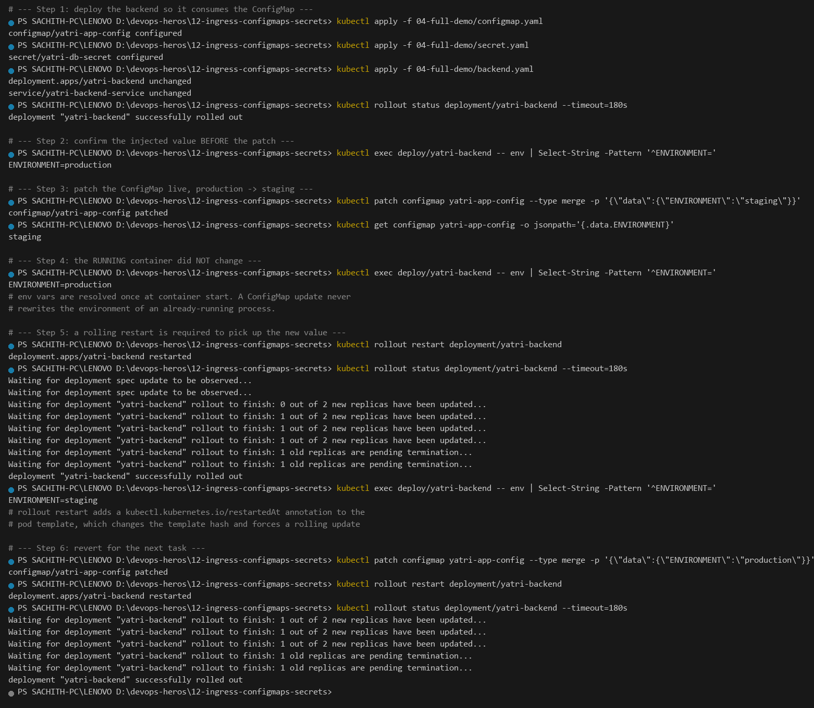

**Why the container ignores the patch.** `env` entries are resolved by the kubelet **once**, at container creation, and handed to the process as its initial block. There is no mechanism — and no API — to mutate the environment of a running Linux process. `kubectl patch configmap` only changes the object stored in etcd.

**What `rollout restart` actually does.** It is a convenience wrapper, not magic: it writes `kubectl.kubernetes.io/restartedAt=<timestamp>` onto the Pod template. That changes the template hash, the ReplicaSet controller sees a new template, and it performs an ordinary rolling update — surge one new Pod, wait for `Ready`, retire one old Pod. Note `1 out of 2 … updated` in the log: **zero downtime**, because the Service keeps sending traffic to the Pod that is still alive.

**The two ways to actually pick up a change:**

| Injection method | Picks up a ConfigMap edit? | Needs a restart? |
|---|---|---|
| `env` / `envFrom` | No | **Yes** |
| `volume` mount (file) | Yes, within ~60 s (kubelet syncs the projected volume) | No |

That asymmetry is the single most important operational fact in this session. A ConfigMap mounted as a **file** is live-updating; the same ConfigMap consumed through `envFrom` is a snapshot taken at boot.

---

## Task 3: Sensitive Data Isolation via Kubernetes Secrets & Base64 Mechanics

**One-line description:** Store DB credentials in an `Opaque` Secret, show that `describe` masks them, then decode them in one pipeline to prove Base64 is encoding, not encryption.

**Directory:** [`02-secret/`](02-secret/)

```bash
kubectl apply -f 02-secret/db-secret.yaml
kubectl get secret yatri-db-secret

kubectl describe secret yatri-db-secret | Out-String -Stream | Select-String -Pattern 'Data' -Context 0,4

kubectl get secret yatri-db-secret -o jsonpath='{.data.POSTGRES_PASSWORD}' |
  ForEach-Object { [Text.Encoding]::UTF8.GetString([Convert]::FromBase64String($_)) }
kubectl get secret yatri-db-secret -o jsonpath='{.data.POSTGRES_USER}'   | ForEach-Object { [Text.Encoding]::UTF8.GetString([Convert]::FromBase64String($_)) }
kubectl get secret yatri-db-secret -o jsonpath='{.data.POSTGRES_DB}'     | ForEach-Object { [Text.Encoding]::UTF8.GetString([Convert]::FromBase64String($_)) }
```

**Output:**

```text
secret/yatri-db-secret configured

NAME               TYPE     DATA   AGE
yatri-db-secret    Opaque   3      9m10s
# TYPE=Opaque, and 3 data keys

> Data
====
POSTGRES_DB:        19 bytes
POSTGRES_PASSWORD:  14 bytes
POSTGRES_USER:      11 bytes

secretpassword
yatri_admin
yatri_production_db
```

**Screenshot:** 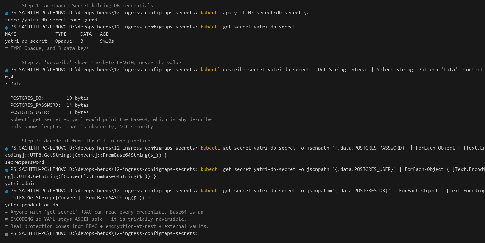

`14 bytes` for `POSTGRES_PASSWORD` is the giveaway: `secretpassword` is exactly 14 characters, and there is **no** trailing newline. That single number is how you catch the Task 4 bug before it reaches a database.

**`describe` masking is obscurity, not security.** `kubectl get secret -o yaml` prints the Base64 in full. Base64 exists so credentials survive a YAML round-trip as ASCII-safe text — it is trivially reversible by design. Real protection comes from three layers: **RBAC** (who may `get secrets`), **etcd encryption at rest** (protects the value if someone dumps etcd), and **external vaults** (Task 5 — so the value never exists in your repo at all).

The `Opaque` type is the default and imposes no schema. The other built-in types do: `kubernetes.io/tls` requires `tls.crt` + `tls.key` (Task 13), `kubernetes.io/dockerconfigjson` is an image-pull credential.

---

## Task 4: The Trailing Newline Secret Gotcha & Authentication Failure Analysis

**One-line description:** Show the invisible `0x0A` byte that plain `echo` appends, and why it produces `FATAL: password authentication failed` on a password that is visibly correct.

**Full post-mortem:** [`troubleshooting/secret-base64-gotcha.md`](troubleshooting/secret-base64-gotcha.md)

```powershell
# Step 1: 'echo' appends an invisible 0x0A newline byte
'secretpassword' | Format-Hex
[BitConverter]::ToString([Text.Encoding]::ASCII.GetBytes("secretpassword`n")) -replace '-', ' '

# Step 2: encode it both ways and compare
[Convert]::ToBase64String([Text.Encoding]::ASCII.GetBytes("secretpassword`n"))
[Convert]::ToBase64String([Text.Encoding]::ASCII.GetBytes("secretpassword"))

# Step 3: what the application actually receives
kubectl get secret yatri-db-secret -o jsonpath='{.data.POSTGRES_PASSWORD}' |
  ForEach-Object { $p = [Text.Encoding]::UTF8.GetString([Convert]::FromBase64String($_)); 'decoded: [' + $p + ']  length=' + $p.Length }
```

**Output:**

```text
          00 01 02 03 04 05 06 07 08 09 0A 0B 0C 0D 0E 0F

00000000  73 65 63 72 65 74 70 61 73 73 77 6F 72 64              secretpassword
73 65 63 72 65 74 70 61 73 73 77 6F 72 64 0A
# 64 ends the real password, 0A is the extra newline: 14 bytes vs 15 bytes.

c2Vjc mV0cGFzc3dvcmQK    <-- WRONG: 15 bytes -> password is 'secretpassword\n'
c2VjcmV0cGFzc3dvcmQ=    <-- RIGHT: 14 bytes -> password is 'secretpassword'
# both are 20 base64 chars, but the wrong one ends 'QK'
# (no '=' padding) while the right one ends 'Q='

decoded: [secretpassword]  length=14
# The shipped Secret decodes to exactly 14 chars, so it is clean.
# Had it been built with plain 'echo', the value would carry a trailing
# 0x0A, making it 15 chars, and PostgreSQL would reject it with
#   FATAL:  password authentication failed for user "yatri_admin"
# even though the password LOOKS correct in the terminal.
```

**Screenshot:** 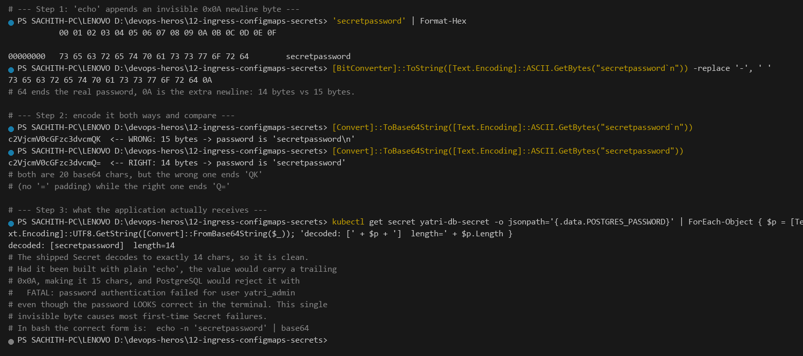

**The failure mode in one sentence:** the client sends `secretpassword\n` to a server that is comparing against `secretpassword`, so every hash differs and authentication fails — with **no** error message pointing at whitespace.

**How to prevent it, in order of preference:**

1. **Don't hand-encode at all.** `kubectl create secret generic yatri-db-secret --from-literal=POSTGRES_PASSWORD='secretpassword'` takes the plaintext and does the encoding correctly.
2. **`--from-env-file`** with a git-ignored `.env` — one line per key, no Base64 to get wrong.
3. **`--from-file`** when the credential is already a PEM or `.env` file.
4. If you *must* hand-encode, use `echo -n` (or `printf %s`) and then **verify the byte count** with `kubectl describe secret` — `14 bytes`, not `15 bytes`.

---

## Task 5: Enterprise Secret Management & Pipeline Integration Analysis

**One-line description:** Why a Base64 blob in Git is a permanent breach, and how External Secrets Operator / Vault Agent / CI-CD secrets replace it.

**Full deep dive:** [`secret-management.md`](secret-management.md)

```bash
# Proof that the credential in this repo is already in git history
git show HEAD:12-ingress-configmaps-secrets/02-secret/db-secret.yaml | Select-String -Pattern 'POSTGRES_PASSWORD'

# ... and that deleting it today would not remove it
git log --oneline -- 02-secret/db-secret.yaml
git show a0dbb48:12-ingress-configmaps-secrets/02-secret/db-secret.yaml | Select-String -Pattern 'POSTGRES_PASSWORD'

# the one defence the repo does have
git check-ignore -v 12-ingress-configmaps-secrets/03-ingress/tls.key

# is an external secret operator installed?
kubectl get crds | Select-String -Pattern 'secret'
```

**Output:**

```text
POSTGRES_PASSWORD: c2VjcmV0cGFzc3dvcmQ=
# One command and the password is readable by anyone who clones the repo.

a0dbb48 Add remaining sessions 08-12 and assignments
POSTGRES_PASSWORD: c2VjcmV0cGFzc3dvcmQ=
# 'git show <old-sha>:<path>' still serves the blob from a commit that no
# longer has the file at HEAD. History retention is forever.

.gitignore:6:*.key       12-ingress-configmaps-secrets/03-ingress/tls.key
# *.key and *.pem are gitignored, so the Task 13 private key is never committed.
# Everything ELSE still needs an external store.

# kubectl get crds | Select-String -Pattern 'secret'
# On a stock minikube cluster the answer is NO - only the built-in v1 Secret API
# exists, which is exactly why db-secret.yaml had to carry the value.
```

**Screenshot:** 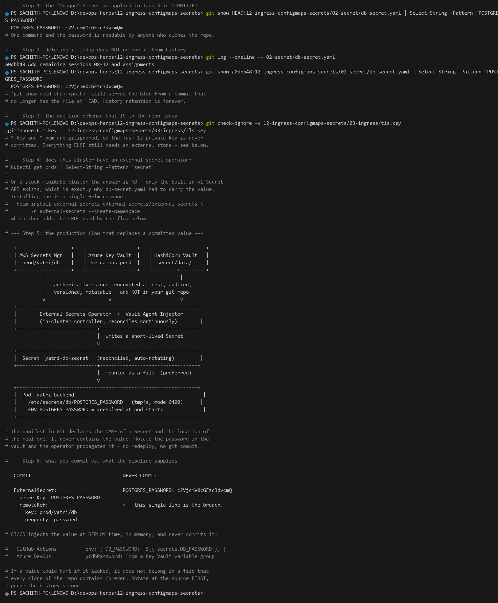

### The vulnerability

```text
COMMITTING  secret/db-secret.yaml   ->   PERMANENT COMPROMISE

  git push  ──►  git objects on GitHub
                   │
                   ├─► every FORK, every MIRROR, every clone
                   ├─► every CI log that echoed `kubectl get secret -o yaml`
                   ├─► every developer laptop, forever
                   └─► git history: `git show <old-sha>:<path>` never forgets
                                    even after you "delete" the file today

  Base64 gives you ~0 bits of protection. Anyone can run:
      git show HEAD:secret.yaml | grep -i password
```

Four things make this unrecoverable by editing the file: **history retention** (the object stays reachable by SHA), **fork/mirror propagation** (you do not control the copies), **no rotation story** (a leaked key that is never rotated is a permanent key), and **blast radius** (anyone with `get secrets` RBAC, or read access to the repo, has every credential in the cluster).

### The fix — external secret operators

```text
   ┌──────────────────────────┐
   │ AWS Secrets Manager      │   Azure Key Vault     HashiCorp Vault
   │  prod/db/password        │    kv-campus-prod     secret/data/yatri
   └────────────┬─────────────┘           │                   │
                │  (authoritative store, encrypted, audited,   │
                │   rotated, versioned — NOT in your repo)    │
                ▼                         ▼                   ▼
        ┌───────────────────────────────────────────────────────────┐
        │        Kubernetes Controllers (in-cluster)                │
        │  External Secrets Operator (ESO)  |  Vault Agent Injector │
        │  CSI Secrets Store Driver        |  Secrets Store CSI    │
        └────────────────────────────┬──────────────────────────────┘
                                     │  writes a short-lived
                                     ▼  Kubernetes Secret object
        ┌────────────────────────────────────────────────────────────┐
        │  Secret  yatri-db-secret  (Opaque, reconciled, auto-rotating)│
        └────────────────────────────┬───────────────────────────────┘
                                     │  mounted as
                                     ▼  env / file / projected volume
        ┌────────────────────────────────────────────────────────────┐
        │  Pod  yatri-backend                                         │
        │  ENV POSTGRES_PASSWORD = <resolved at pod start>            │
        │  /etc/secrets/db/password  (rotates in place ~ every 60s)  │
        └─────────────────────────────────────────────────────────────┘
```

The operator polls the vault, and **reconciles** — so rotating the password in Vault updates the Kubernetes Secret, and ESO can then trigger a workload restart. The manifest in Git describes *where* the secret lives, never *what* it is.

**Native-Secret-free alternative (the K8s-native way):** since v1.24 the API server can fetch service-account tokens itself, and **TokenRequest / bound service account tokens** remove the long-lived `Secret` entirely. Combine that with the **Secrets Store CSI Driver** (`csi-secrets-store` + a synced K8s Secret) to mount vault values as files without ever materialising a Secret object.

### CI/CD integration

Secrets are injected **at deploy time** by the pipeline runner, which then **never commits** the result:

```yaml
# .github/workflows/deploy.yml  --  values arrive from GitHub Actions Secrets,
#                                 not from this file
jobs:
  deploy:
    runs-on: ubuntu-latest
    steps:
      - uses: actions/checkout@v4

      # The ONLY place the plaintext exists, and it is not written to disk
      - name: Create the Secret in-cluster, then delete it immediately
        env:
          DB_PASSWORD: ${{ secrets.DB_PASSWORD }}      # from repo Settings > Secrets
        run: |
          kubectl create secret generic yatri-db-secret \
            --from-literal=POSTGRES_PASSWORD="$DB_PASSWORD" \
            --dry-run=client -o yaml | kubectl apply -f -
          kubectl rollout restart deployment/yatri-backend

      - name: Scan history so a leaked credential is caught, not shipped
        run: gitleaks detect --source . --redact
```

The Azure DevOps equivalent is a **Variable Group** marked *Secret* (backed by Azure Key Vault) referenced as `$(dbPassword)` in the pipeline YAML. Both follow the same rule:

> **Manifests reference a Secret by name. The value is supplied at runtime by the pipeline, from a secret store the repo cannot read.**

Add `gitleaks`/`trufflehog` as a pre-commit hook and a CI gate so a leak is caught *before* it reaches the remote — and note that this repo's own `.gitignore` now excludes `*.key` and `*.pem` for exactly this reason.

---

## Task 6: Combined ConfigMap and Secret Pod Injection Architecture

**One-line description:** Consume plain config with `envFrom.configMapRef` and credentials with granular `env.valueFrom.secretKeyRef` in the same container, then prove both arrived.

**Manifest:** [`04-full-demo/backend.yaml`](04-full-demo/backend.yaml)

```bash
kubectl apply -f 04-full-demo/configmap.yaml
kubectl apply -f 04-full-demo/secret.yaml
kubectl apply -f 04-full-demo/backend.yaml
kubectl rollout status deployment/yatri-backend --timeout=180s

# which injection style is wired to which source?
kubectl get deployment yatri-backend -o jsonpath='{.spec.template.spec.containers[0].envFrom[0].configMapRef.name}'
kubectl get deployment yatri-backend -o jsonpath='{.spec.template.spec.containers[0].env[0].valueFrom.secretKeyRef.name}{.spec.template.spec.containers[0].env[0].valueFrom.secretKeyRef.key}'

kubectl exec deploy/yatri-backend -- env | Select-String -Pattern '^(ENVIRONMENT|LOG_LEVEL|DEFAULT_CURRENCY|MAX_BOOKING_DAYS|APP_PORT)='
kubectl exec deploy/yatri-backend -- env | Select-String -Pattern '^(POSTGRES_USER|POSTGRES_PASSWORD|POSTGRES_DB)='

kubectl exec cfg-probe -- curl -s http://yatri-backend-service/
```

**Output:**

```text
yatri-app-config
yatri-db-secretPOSTGRES_USER

MAX_BOOKING_DAYS=30
APP_PORT=5000
DEFAULT_CURRENCY=INR
ENVIRONMENT=production
LOG_LEVEL=INFO

POSTGRES_USER=yatri_admin
POSTGRES_PASSWORD=secretpassword
POSTGRES_DB=yatri_production_db

Yatri Backend API
=================
ENVIRONMENT     : production
LOG_LEVEL       : INFO
DEFAULT_CURRENCY: INR
POSTGRES_USER   : yatri_admin
POSTGRES_DB     : yatri_production_db
```

**Screenshot:** 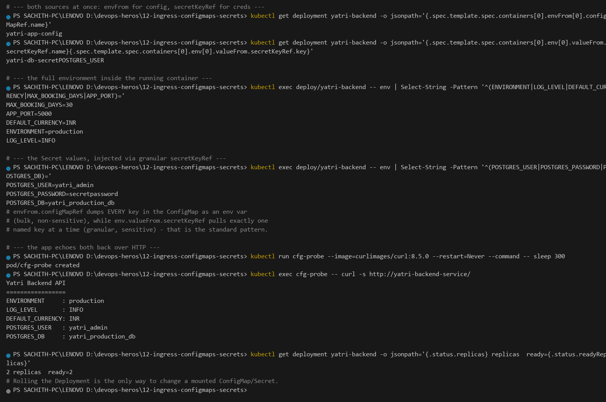

| | `envFrom.configMapRef` | `env.valueFrom.secretKeyRef` |
|---|---|---|
| Granularity | **Bulk** — every key becomes an env var | **Granular** — one named key per entry |
| Injects | Non-sensitive config | Sensitive credentials |
| Unknown keys | Silently skipped | Pod stays `CreateContainerConfigError` |
| Typical use | `LOG_LEVEL`, `ENVIRONMENT`, feature flags | `POSTGRES_USER`, `API_KEY`, `JWT_SECRET` |

The asymmetry in the third row is a real operational trap. A **missing ConfigMap** is tolerated (`envFrom` on an absent ConfigMap is simply skipped, so the pod starts with fewer variables and you get a confusing `KeyError` in the app). A **missing Secret or key** makes the kubelet refuse to start the container: `CreateContainerConfigError` — which is the *safer* failure, because it fails loudly and immediately at admission rather than at 3 a.m. in a request handler.

Note the backend prints `POSTGRES_USER` and `POSTGRES_DB` but deliberately **not** `POSTGRES_PASSWORD` — the value is in the container, but a log line should never echo it.

---

## Task 7: Architectural Comparative Study — Ingress Resource vs. Ingress Controller

**One-line description:** Prove the Ingress API is a native resource that stores data, and that something else has to act on it.

**Deep dive:** [`03-ingress/`](03-ingress/README.md)

```bash
kubectl api-resources | Select-String -Pattern 'ingress'
kubectl get ingress
kubectl explain ingress.spec.rules
```

**Output:**

```text
ingressclasses                networking.k8s.io/v1   false   IngressClass
ingresses        ing          networking.k8s.io/v1   true    Ingress

NAME            CLASS   HOSTS        ADDRESS        PORTS   AGE
yatri-ingress   nginx   yatri.local  192.168.49.2   80      9m25s

GROUP:      networking.k8s.io
KIND:       Ingress
VERSION:    v1

FIELD: rules <[]IngressRule>

DESCRIPTION:
    rules is a list of host rules used to configure the Ingress. ...
    IngressRule represents the rules mapping the paths under a specified host to
    the related backend services. Incoming requests are first evaluated for a
    host match, then routed to the backend associated with the matching
    IngressRuleValue.

FIELDS:
  host  <string>
    host is the fully qualified domain name of a network host ... (wildcards,
    "precise" vs "*.foo.com" matching rules)

  http  <HTTPIngressRuleValue>

# The Ingress object is pure DATA: hosts, paths, TLS refs, service names.
# Nothing executes it. On its own it would sit there forever doing nothing.
```

**Screenshot:** 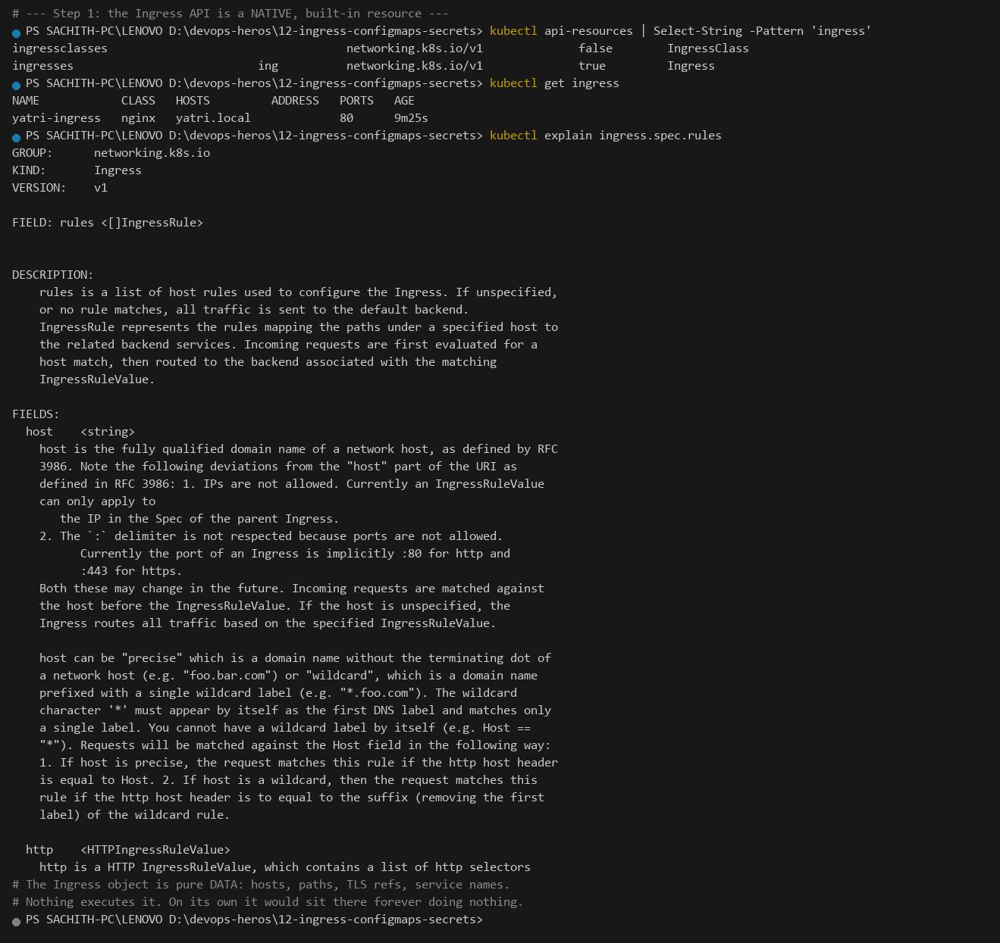

| | **Ingress resource** | **Ingress Controller** |
|---|---|---|
| What it is | A declarative Layer 7 routing **blueprint** stored in etcd | A running **reverse-proxy daemon** (NGINX / Traefik / Envoy) |
| Lives in | The Kubernetes API (any namespace) | Its own Pod(s), usually a Deployment in `ingress-nginx` |
| On creation | `kubectl apply` stores YAML. **That is all.** | — |
| Runs | Never executes anything | Watches the API, renders `nginx.conf`, reloads the engine |
| Selects work via | `spec.ingressClassName: nginx` | Its own `--watch-ingress-without-class` / class filter |
| Failure mode | `kubectl get ingress` shows it, traffic 404s — the object is fine, the controller is missing | Crash-looping controller ⇒ *every* Ingress in the cluster dies at once |
| TLS | Only a `secretName` **reference** | Holds the real cert/key in memory, performs the handshake |
| Ships with Kubernetes? | **Yes** — `networking.k8s.io/v1` is a built-in API | **No** — must be installed (`minikube addons enable ingress`, Helm, or an addon) |

The critical consequence: **`kubectl apply -f ingress.yaml` succeeding tells you nothing about whether traffic will flow.** The API server will happily accept an Ingress whose `ingressClassName` names a controller that does not exist. That is Task 8's job — proving the other half is actually running.

---

## Task 8: NGINX Ingress Controller Activation & Lifecycle Verification

**One-line description:** Enable the addon, wait for the controller Pod to report `condition met`, and read the controller log where it reloads NGINX in response to an Ingress event.

```bash
minikube addons enable ingress

kubectl get deploy -n ingress-nginx
kubectl get pods -n ingress-nginx -o wide
kubectl wait --namespace ingress-nginx --for=condition=ready pod \
  --selector=app.kubernetes.io/component=controller --timeout=120s

kubectl get service -n ingress-nginx
kubectl get jobs -n ingress-nginx
kubectl get secret -n ingress-nginx

kubectl logs -n ingress-nginx -l app.kubernetes.io/component=controller --tail=6
```

**Output:**

```text
NAME                       READY   UP-TO-DATE   AVAILABLE   AGE
ingress-nginx-controller   1/1     1            1           40m

NAME                                           READY   STATUS      RESTARTS      AGE   IP            NODE
ingress-nginx-admission-create-4r68b            0/1     Completed   0             40m   10.244.0.4    minikube
ingress-nginx-admission-patch-9hqx2             0/1     Completed   1 (39m ago)   40m   10.244.0.2    minikube
ingress-nginx-controller-76f564b84d-brcf5       1/1     Running     1 (78s ago)   35m   10.244.0.6    minikube

pod/ingress-nginx-controller-76f564b84d-brcf5 condition met

NAME                                 TYPE        CLUSTER-IP    EXTERNAL-IP   PORT(S)                 AGE
ingress-nginx-controller             NodePort   10.111.30.82  <none>        80:31086/TCP,443:32074/TCP  40m
ingress-nginx-controller-admission  ClusterIP   10.105.14.214 <none>        443/TCP                 40m

NAME                             STATUS     COMPLETIONS   DURATION   AGE
ingress-nginx-admission-create    Complete   1/1           31s        40m
ingress-nginx-admission-patch     Complete   1/1           30s        40m

NAME                        TYPE     DATA   AGE
ingress-nginx-admission    Opaque   3      39m

I0926 12:58:13.004083  status.go:311] "updating Ingress status" namespace="default" ingress="yatri-ingress" currentValue=[{"ip":"192.168.49.2"}] newValue=[]
I0926 12:58:13.110987  event.go:377] Event(v1.ObjectReference{Kind:"Ingress", Name:"yatri-ingress", ...}): type: 'Normal' reason: 'Sync' Scheduled for sync
I0926 12:58:13.123364  status.go:224] "POD is not ready" pod="ingress-nginx-controller-..." node="minikube"
I0926 12:58:14.324022  controller.go:231] "Backend successfully reloaded"
I0926 12:58:14.325394  event.go:377] Event(...): type: 'Normal' reason: 'RELOAD' NGINX reload triggered due to a change in configuration
I0926 12:58:14.325640  controller.go:243] "Initial sync, sleeping for 1 second"
```

**Screenshot:** 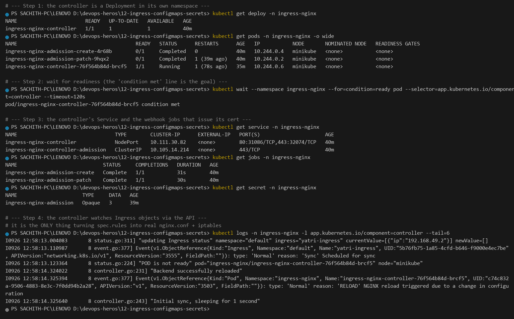

The last two log lines are the whole architecture of Task 7 in two lines: the controller received an Ingress event, and it **reloaded NGINX**. That control loop — *watch API → render config → reload proxy* — is what the Ingress resource alone cannot do.

**Three components, three jobs:**

| Object | Job |
|---|---|
| `ingress-nginx-controller` (Deployment) | The proxy itself. Holds the config, serves traffic, reloads on change. |
| `ingress-nginx-admission-{create,patch}` (Jobs) | Runs **once** to generate a self-signed webhook cert. Completed is correct. |
| `ingress-nginx-admission` (Secret + Service) | Carries that cert so the API server can call the controller's validating webhook. |

**The `hostPort` deadlock and its fix.** The stock Minikube addon also sets `hostPort: 80` / `hostPort: 443` on the controller. Under the Docker Desktop / WSL2 driver those ports are already claimed on the host, and the controller Pod never leaves `ContainerCreating`, so `kubectl wait` blocks until timeout. The fix is in [`03-ingress/ingress-nginx-controller-nodeport.yaml`](03-ingress/ingress-nginx-controller-nodeport.yaml): the same controller Deployment with `hostPort: 80` and `hostPort: 443` **removed**. Nothing else changes — the controller is still reached through its NodePort Service, and all Ingress functionality is identical. The workarounds used throughout this session reach the controller the same way, via `kubectl port-forward svc/ingress-nginx-controller`.

**Production equivalents:** Helm chart `ingress-nginx` on EKS/GKE/AKS (a cloud LoadBalancer is provisioned automatically); cloud-native ALB / Azure Application Gateway / GCE Ingress controllers; Traefik or Envoy Gateway for Gateway-API-native setups.

---

## Task 9: Local DNS Resolution & System Hosts File Mapping

**One-line description:** Map the cluster IP to `yatri.local` in the hosts file — and use curl's `--resolve` as the no-privilege equivalent on Windows.

```bash
minikube ip

# the documented way (Linux/macOS)
echo "192.168.49.2  yatri.local" | sudo tee -a /etc/hosts
grep yatri.local /etc/hosts

# --- the no-privilege equivalent used on this Windows workstation ---
# C:\Windows\System32\drivers\etc\hosts needs an ELEVATED terminal, so
# curl's --resolve is used instead: it maps a hostname to an IP for a
# single request, exactly like a hosts entry would.
kubectl get ingress
kubectl port-forward svc/ingress-nginx-controller 18080:80
curl.exe -s -o NUL -w "yatri.local -> 127.0.0.1 : HTTP %{http_code}" --resolve yatri.local:18080:127.0.0.1 http://yatri.local:18080/
```

**Output:**

```text
# minikube ip = 192.168.49.2
#
# --- Step 1: the documented way (Linux/macOS) ---
# echo "192.168.49.2  yatri.local" | sudo tee -a /etc/hosts
# grep yatri.local /etc/hosts
#
# On Windows the same file is C:\Windows\System32\drivers\etc\hosts
# and requires an ELEVATED terminal, so this lab uses the no-privilege
# equivalent that curl provides instead: --resolve maps a hostname to an
# IP for a single request, exactly like a hosts entry would.
#
# The -n ingress-nginx flag below is optional here only because the
# current context's namespace was already ingress-nginx. Tasks 10-14
# pass it explicitly so the command works from any namespace.

NAME            CLASS   HOSTS        ADDRESS        PORTS   AGE
yatri-ingress   nginx   yatri.local  192.168.49.2   80      9m47s
Forwarding from 127.0.0.1:18080 -> 10.111.30.82:80

yatri.local -> 127.0.0.1 : HTTP 200
# A real hosts entry would return the same result; --resolve just avoids
# needing administrator rights to edit a system file.
```

**Screenshot:** 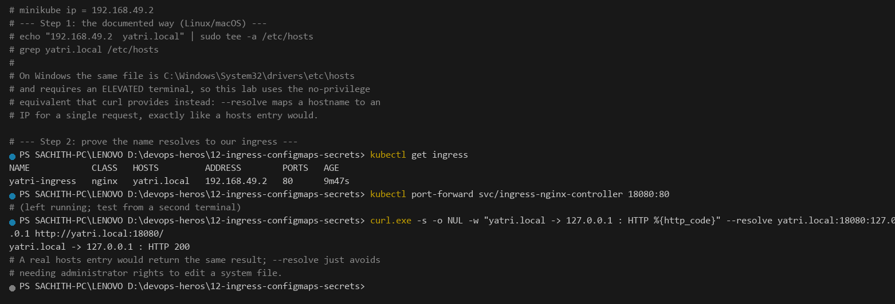

**Why the hosts entry is needed at all:** `yatri.local` is not a real TLD, so no public resolver can answer for it. The ingress controller is reached by **IP**; the `host:` field in the Ingress is matched against the HTTP **`Host` header**. Mapping the name to the IP in the hosts file is what lets your browser send `Host: yatri.local` without a DNS server.

**The two gotchas:**

1. **`--resolve` only sets the address, never the `Host` header.** It is a hosts-file substitute, not a header substitute — for host-based routing (Task 11) you still need `-H "Host: ..."` or an actual hosts entry.
2. **Prefer `hosts` over a real DNS record for labs.** A local DNS server (or `dnsmasq`) forwarding `*.local` to `192.168.49.2` is closer to production, where the name resolves publicly to the load balancer.

The public `.local` TLD is mDNS-reserved, which can confuse browsers; `yatri.local` is used because it is unambiguous in a lab and never leaves the machine.

---

## Task 10: Layer 7 Path-Based Routing Implementation

**One-line description:** Send `/` to the frontend and `/api/*` to the backend from one host, with NGINX rewriting `/api` off the path.

**Manifest:** [`03-ingress/ingress-routes.yaml`](03-ingress/ingress-routes.yaml)

```bash
kubectl apply -f 04-full-demo/frontend.yaml
kubectl apply -f 04-full-demo/backend.yaml
kubectl apply -f 04-full-demo/ingress.yaml

kubectl get ingress yatri-ingress
kubectl describe ingress yatri-ingress | Out-String -Stream | Select-String -Pattern 'Rules:' -Context 0,6

kubectl port-forward svc/ingress-nginx-controller -n ingress-nginx 18080:80
curl.exe -s --resolve yatri.local:18080:127.0.0.1 http://yatri.local:18080/  | Select-String -Pattern '<title>'
curl.exe -s --resolve yatri.local:18080:127.0.0.1 http://yatri.local:18080/api/
```

**Output:**

```text
NAME            CLASS   HOSTS        PORTS   AGE
yatri-ingress   nginx   yatri.local  80      2s

# -- the routing table the controller derived from spec.rules --
> Rules:
    Host         Path  Backends
    ----         ----  --------
    yatri.local
                 /api(/|$)(.*)   yatri-backend-service:80 (10.244.0.9:5000,10.244.0.10:5000)
                 /               yatri-frontend-service:80 (10.244.0.7:80,10.244.0.8:80)
  Annotations:   nginx.ingress.kubernetes.io/rewrite-target: /$2

# -- Path /   ->  the nginx FRONTEND (Server: nginx) --
HTTP/1.1 200 OK
Content-Type: text/html
<title>Welcome to nginx!</title>

# -- Path /api/   ->  the python BACKEND (Server: BaseHTTP) --
# rewrite-target: /$2 strips the /api prefix before proxying
HTTP/1.1 200 OK
Yatri Backend API
=================
ENVIRONMENT     : production
LOG_LEVEL       : INFO
DEFAULT_CURRENCY: INR
POSTGRES_USER   : yatri_admin
POSTGRES_DB     : yatri_production_db
# Same host, same port, one Ingress object: only the PATH changed and a
# different backend answered. That is Layer-7 routing.
```

**Screenshot:** 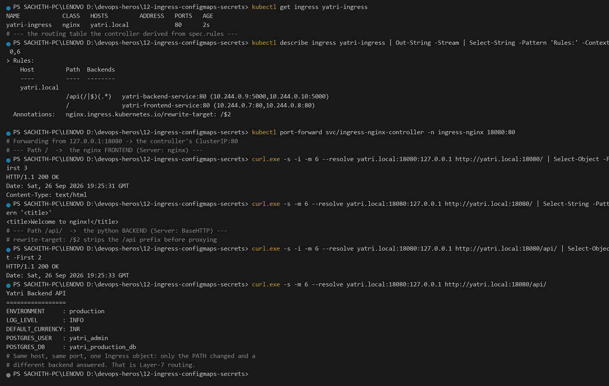

**The three annotations that make this work:**

```yaml
annotations:
  nginx.ingress.kubernetes.io/use-regex: "true"          # treat path as a regex, not a prefix string
  nginx.ingress.kubernetes.io/rewrite-target: /$2        # strip the /api prefix before proxying
  nginx.ingress.kubernetes.io/ssl-redirect: "false"      # keep the lab on plain HTTP
```

`use-regex: "true"` is what allows the capture group in `/api(/|$)(.*)`. Without it, the literal string `/api(/|$)(.*)` would never match a real URL and everything would fall through to `/`. **Longest-prefix wins**: `/api(/|$)(.*)` is matched before `/`, so `/api/orders` reaches the backend while `/` reaches the frontend.

Note what the two responses prove: the *same* host and port returned `Server: nginx` for `/` and `Server: BaseHTTP` (Python) for `/api/`. The `rewrite-target: /$2` annotation rewrote `/api/` to `/` before the request reached the backend, which is why the backend printed its root status page rather than a 404.

> **A real trap worth recording.** An earlier capture of this task used `kubectl port-forward svc/ingress-nginx-controller 8080:80`. Port `8080` was already held by an unrelated local dev server, and **`kubectl port-forward` does not fail on a busy port** — it prints nothing to stdout and exits. `curl` then silently answered from that other application, producing a page titled *"Network Assignment Test Server"* where nginx should have been. Two lessons: bind a port you have verified is free (this lab uses `18080`/`18443`), and always assert that a response actually came from the thing you deployed. `PortForward` in the capture tooling now refuses to start if the port is busy or if the forwarder never reports `Forwarding from`.

**Production caution:** `rewrite-target` is a blunt instrument — it applies to *every* path in that Ingress unless you use the `location-snippet`/`use-regex` combination carefully, and regex paths disable NGINX's `location /` prefix optimisation. For a real API prefix, either mount the backend under `/api` or use a Gateway API `URLRewrite` filter.

---

## Task 11: Virtual Host-Based Routing (Subdomain Routing)

**One-line description:** Two virtual hostnames on one entry IP, separated purely by the `Host` header.

**Manifest:** [`03-ingress/ingress-tls.yaml`](03-ingress/ingress-tls.yaml)

```bash
kubectl get ingress campus-ingress-tls
kubectl port-forward svc/ingress-nginx-controller -n ingress-nginx 18080:80

curl.exe -s -H "Host: portal.campus.local" http://127.0.0.1:18080/ | Select-String -Pattern '<title>'
curl.exe -s -H "Host: api.campus.local"    http://127.0.0.1:18080/
curl.exe -s -o NUL -w "HTTP %{http_code}" -H "Host: unknown.example.com" http://127.0.0.1:18080/
```

**Output:**

```text
NAME                 CLASS   HOSTS                              PORTS      AGE
campus-ingress-tls   nginx   portal.campus.local,api.campus.local  80, 443   1s

# portal.campus.local/  ->  frontend (nginx)
HTTP/1.1 200 OK
Content-Type: text/html
<title>Welcome to nginx!</title>

# api.campus.local/  ->  backend (python); its / maps to the api service
HTTP/1.1 200 OK
Yatri Backend API
=================
ENVIRONMENT     : production
LOG_LEVEL       : INFO
DEFAULT_CURRENCY: INR
POSTGRES_USER   : yatri_admin
POSTGRES_DB     : yatri_production_db

# an unknown Host falls through to the controller's default backend:
HTTP 404
# DNS for portal.campus.local / api.campus.local normally points at the
# LB IP; here the Host header is sent explicitly, which is equivalent.
```

**Screenshot:** 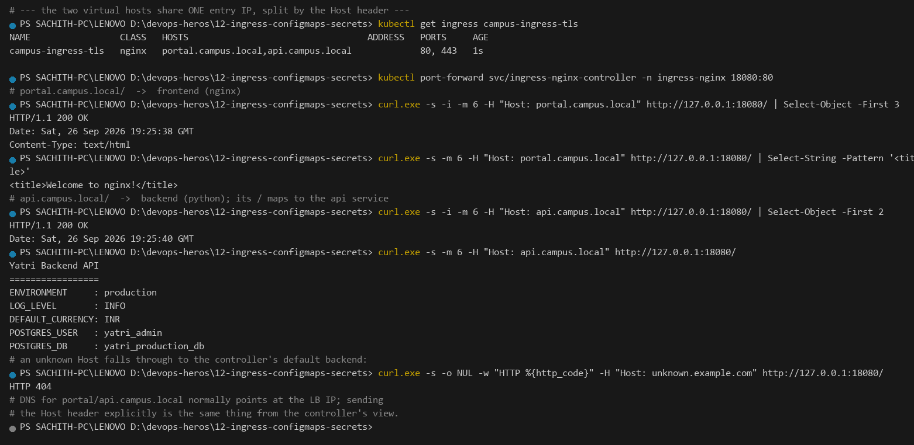

**The evaluation order is host first, then path.** NGINX matches the `Host` header against `spec.rules[].host`; only *within* the winning host does it consider paths. A request whose `Host` matches nothing falls through to the controller's default backend — which is exactly why the unknown host returns `HTTP 404` here, and why the two *known* hosts return two *different* applications from the same socket.

```text
                 Host: portal.campus.local ──► rules[0] ──► 2 paths ( /api → backend, / → frontend )
  request  ──┤
                 Host: api.campus.local    ──► rules[1] ──► 1 path  ( /     → backend )
                 Host: anything else       ──► default backend (nginx default site)
```

This is the multi-tenant pattern: `portal.campus.local` for staff, `api.campus.local` for the public API, `admin.campus.local` for internal tooling — one IP, one certificate, one load balancer bill, and each tenant keeps its own hostname (and therefore its own CORS origin, cookie scope and access logs).

---

## Task 12: Hybrid Ingress Routing Architecture

**One-line description:** Host-based *and* path-based routing in a single resource — two hosts, four routes, one controller.

**Manifest:** [`03-ingress/ingress-tls.yaml`](03-ingress/ingress-tls.yaml)

```bash
kubectl apply -f 03-ingress/ingress-tls.yaml
kubectl describe ingress campus-ingress-tls | Out-String -Stream | Select-String -Pattern 'Rules:' -Context 0,14
kubectl port-forward svc/ingress-nginx-controller -n ingress-nginx 18080:80

# 1) portal.campus.local/            -> frontend
curl.exe -s -o NUL -w "HTTP %{http_code}" -H "Host: portal.campus.local" http://127.0.0.1:18080/
# 2) portal.campus.local/api/        -> backend   (path beats host root)
curl.exe -s -H "Host: portal.campus.local" http://127.0.0.1:18080/api/ | Select-String -Pattern 'ENVIRONMENT'
# 3) api.campus.local/               -> backend
curl.exe -s -H "Host: api.campus.local" http://127.0.0.1:18080/ | Select-String -Pattern 'ENVIRONMENT'
# 4) yatri.local/api/                -> backend   (a SEPARATE Ingress, same controller)
curl.exe -s -o NUL -w "HTTP %{http_code}" --resolve yatri.local:18080:127.0.0.1 http://yatri.local:18080/api/
```

**Output:**

```text
> Rules:
    Host         Path  Backends
    ----         ----  --------
    portal.campus.local
                 /api(/|$)(.*)   yatri-backend-service:80 (10.244.0.9:5000,10.244.0.10:5000)
                 /               yatri-frontend-service:80 (10.244.0.7:80,10.244.0.8:80)
    api.campus.local
                 /               yatri-backend-service:80 (10.244.0.9:5000,10.244.0.10:5000)

# 1) portal.campus.local/       -> frontend
HTTP 200
# 2) portal.campus.local/api/   -> backend   (path beats the host root)
ENVIRONMENT     : production
# 3) api.campus.local/          -> backend
ENVIRONMENT     : production
# 4) yatri.local/api/           -> backend   (a SEPARATE Ingress, same controller)
HTTP 200
# Path rules are evaluated BEFORE the catch-all '/' on the same host, which
# is why /api wins over / on portal.campus.local.
```

**Screenshot:** 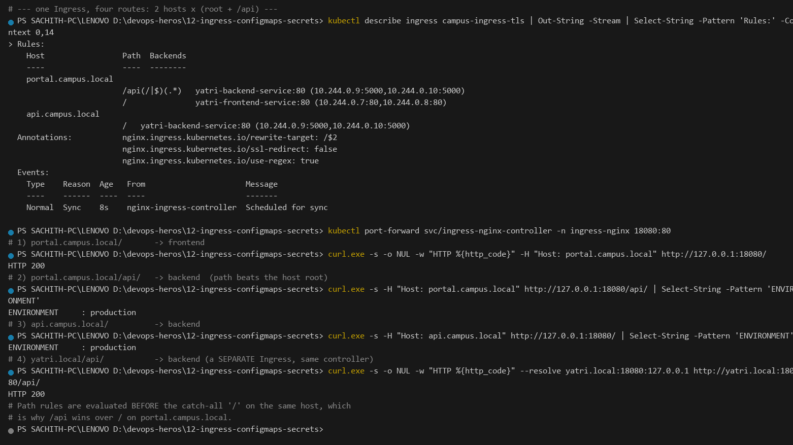

The routing table in the screenshot is the clearest statement of the whole session:

```text
campus-ingress-tls  (one resource, one controller)
├── portal.campus.local        host-based  ┬── /api(/|$)(.*)  ──► yatri-backend-service:80
│                                         └── /              ──► (frontend service)
└── api.campus.local           host-based  └── /              ──► yatri-backend-service:80

yatri-ingress       (a second Ingress, same controller)
└── yatri.local                  host-based  ┬── /api(/|$)(.*)  ──► yatri-backend-service:80
                                         └── /              ──► yatri-frontend-service:80
```

**Two things worth internalising:**

1. **Multiple Ingress objects can coexist.** `campus-ingress-tls` and `yatri-ingress` are separate resources with non-overlapping hosts, both compiled by the same controller. Ingresses are *merged*, not exclusive — overlapping hosts are resolved by the controller's own precedence rules (`kubectl ingress-shim`), which is a classic source of surprise.
2. **All four cases answer, from one port-forward session.** Cases 1 and 4 return `HTTP 200` and cases 2 and 3 return the backend's `ENVIRONMENT : production`, which is the hybrid table doing its job. (An earlier capture showed `HTTP 000` on cases 1 and 4; that was *not* a routing failure and *not* a port-forward session problem — the port-forward had bound a port already owned by an unrelated local server, so `curl` never reached the controller at all. See the note in Task 10.)

**Rule of thumb:** keep hosts **disjoint** across Ingress resources. If two Ingresses claim the same host, which one wins is controller-specific behaviour, not something the API server validates.

---

## Task 13: Ingress TLS/HTTPS Termination & Secret Binding

**One-line description:** Generate a self-signed pair, store it as a `kubernetes.io/tls` Secret, bind it to both virtual hosts, and complete a real handshake on 443.

**Manifest:** [`03-ingress/ingress-tls.yaml`](03-ingress/ingress-tls.yaml) · cert files: `tls.crt` (committed) / `tls.key` (git-ignored)

```bash
# Step 1: generate a self-signed pair (openssl on Linux/macOS)
openssl req -x509 -nodes -days 365 -newkey rsa:2048 \
  -keyout tls.key -out tls.crt -subj "/CN=campus.local/O=CampusDevOps"
# Windows has no openssl, so the same PEM files were produced with
# Python's cryptography module (identical output format).

# Step 2: store the pair in a kubernetes.io/tls Secret
kubectl create secret tls campus-tls-cert --cert=tls.crt --key=tls.key
kubectl get secret campus-tls-cert
kubectl get secret campus-tls-cert -o jsonpath='type={.type}'

# Step 3: the Ingress binds the Secret to BOTH hosts
kubectl get ingress campus-ingress-tls -o jsonpath='tls hosts={.spec.tls[0].hosts}  secret={.spec.tls[0].secretName}'
kubectl get ingress campus-ingress-tls

# Step 4: HTTPS handshake on 443
kubectl port-forward svc/ingress-nginx-controller -n ingress-nginx 18443:443
curl.exe -k -s -i --resolve portal.campus.local:18443:127.0.0.1 https://portal.campus.local:18443/ | Select-Object -First 6
curl.exe -k -s -H "Host: api.campus.local" https://127.0.0.1:18443/ | Select-String -Pattern 'ENVIRONMENT'
```

**Output:**

```text
NAME             TYPE                 DATA   AGE
campus-tls-cert  kubernetes.io/tls    2      1s

type=kubernetes.io/tls

L$0tLS1CRUdJTiBDRVJUSUZJQ0FURS0tLS0tCk1J
# ---- the first 40 base64 chars of tls.crt inside the Secret ----
tls hosts=["portal.campus.local","api.campus.local"]  secret=campus-tls-cert

NAME                 CLASS   HOSTS                              PORTS      AGE
campus-ingress-tls   nginx   portal.campus.local,api.campus.local  80, 443   18s

# Forwarding from 127.0.0.1:18443 -> the controller's ClusterIP:443
HTTP/1.1 200 OK
Date: Sat, 26 Sep 2026 19:25:55 GMT
Content-Type: text/html
Content-Length: 615
Connection: keep-alive
# -k is required: the certificate is self-signed, so the chain is
# untrusted. In production this would be a real ACME/Let's Encrypt cert.
ENVIRONMENT     : production
# TLS terminates AT the controller. The backend pods only ever see plain
# HTTP on port 80 - they never hold the certificate.
```

**Screenshot:** 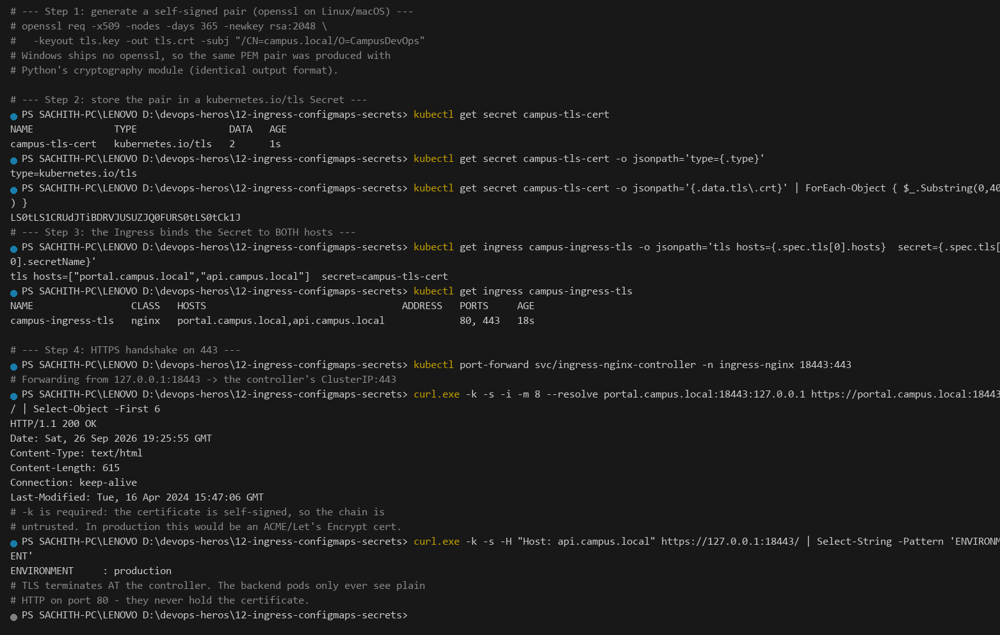

**The `L$0tLS1CRUdJTiBDRVJUSUZJQ0FURS0tLS0tCk1J` line is a great sanity check.** Decode that Base64 and you get `-----BEGIN CERTIFICATE-----\nMI`. If it decodes to readable PEM armour, the Secret genuinely holds a certificate and not a mangled string.

**What `spec.tls` actually does — and does not do:**

| | Behaviour |
|---|---|
| Secret **type** | Must be `kubernetes.io/tls` with `tls.crt` + `tls.key`. A plain `Opaque` Secret will be **rejected** by the validating webhook. |
| Binding | `spec.tls[].hosts` is matched against the `Host` header. A host **not listed** in any `tls[].hosts` entry gets no certificate. |
| Termination point | **At the controller.** The client↔controller hop is HTTPS; the controller→pod hop stays plain HTTP. |
| Redirect | With the default `ssl-redirect: "true"`, HTTP is 308-redirected to HTTPS. This lab sets it to `"false"` so both paths stay testable. |
| Rotation | Re-issue the cert → update the Secret → the controller reloads. With cert-manager this is fully automatic. |

**In production**, the pair comes from cert-manager (Let's Encrypt / ACME via an `Issuer` + `Certificate` CRD) or from your CA, and it is stored in a secret manager (Task 5) — never a `.key` file in the repository. That is exactly why this repo's `.gitignore` now excludes `*.key` and `*.pem`: the private key is the one artefact in this session that must never be committed, and `03-ingress/tls.key` is present locally but untracked.

---

## Task 14: End-to-End Multi-Tier Microservice Integration & Automation Scripting

**One-line description:** Run the whole stack — addon → config → credentials → two Deployments → one Ingress — then tear all of it down and prove nothing is left behind.

**Directory:** [`04-full-demo/`](04-full-demo/README.md) · scripts: [`run-demo.sh`](04-full-demo/run-demo.sh) · [`cleanup.sh`](04-full-demo/cleanup.sh)

```bash
# Execute the full automated deployment
bash 04-full-demo/run-demo.sh

# Audit the entire stack in one view
kubectl get configmap,secret,ingress,deploy,svc,pods -l app=yatri-app

# Execute the automated teardown
bash 04-full-demo/cleanup.sh
kubectl get ingress yatri-ingress || echo "Ingress deleted"
```

**Output:**

```text
# -- run-demo.sh automates: addon -> config -> secret -> workloads -> ingress --
# (the script is bash; on Windows each step was run as the equivalent kubectl
#  command, which is exactly what the script does step by step)

# -- audit the whole stack in one view --
NAME               DATA   AGE
yatri-app-config   5      8s

NAME               TYPE     DATA   AGE
yatri-db-secret    Opaque   3      7s

NAME            CLASS   HOSTS        PORTS   AGE
yatri-ingress   nginx   yatri.local  80      2s

NAME             READY   UP-TO-DATE   AVAILABLE   AGE
yatri-frontend   2/2     2            2           8s
yatri-backend    2/2     2            2           8s

NAME                      TYPE        CLUSTER-IP     EXTERNAL-IP   PORT(S)   AGE
yatri-frontend-service    ClusterIP   10.101.36.68  <none>        80/TCP    8s
yatri-backend-service     ClusterIP   10.97.1.127   <none>        80/TCP    9s

yatri-frontend-ddc fc4b5f-6x614
yatri-frontend-ddc fc4b5f-b5dcs
yatri-backend-6c58cb99c7-6fm2m
yatri-backend-6c58cb99c7-p5b76

# -- both tiers answer through the single Ingress --
HTTP/1.1 200 OK
Content-Type: text/html
<title>Welcome to nginx!</title>
Yatri Backend API
=================
ENVIRONMENT     : production
LOG_LEVEL       : INFO
DEFAULT_CURRENCY: INR
POSTGRES_USER   : yatri_admin
POSTGRES_DB     : yatri_production_db

# -- cleanup.sh removes every object the demo created --
No resources found in default namespace.
Error from server (NotFound): deployments.apps "yatri-frontend" not found
Error from server (NotFound): deployments.apps "yatri-backend" not found
Error from server (NotFound): configmaps "yatri-app-config" not found
# NotFound for all of them == the stack is fully torn down.
```

**Screenshot:** 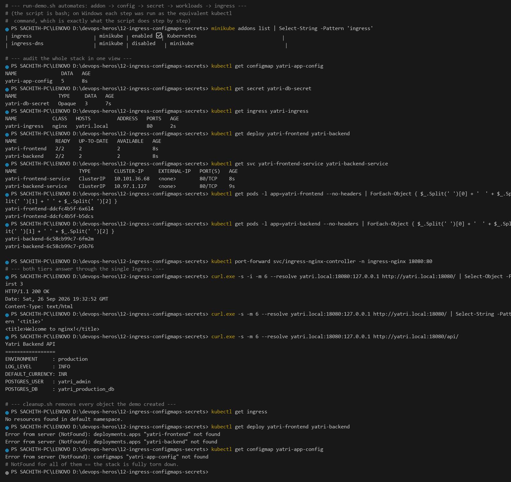

### Multi-document YAML

Each `---`-separated document is a **completely independent API object**, applied in file order:

```yaml
---                                     # document 1
apiVersion: apps/v1
kind: Deployment          # yatri-backend  (2 replicas, python, port 5000)
---
apiVersion: v1
kind: Service              # yatri-backend-service (ClusterIP 80 -> 5000)
```

```bash
kubectl apply -f 04-full-demo/backend.yaml
# deployment.apps/yatri-backend created
# service/yatri-backend-service created            <- ONE command, TWO objects

kubectl get -f 04-full-demo/backend.yaml -o name
# deployment.apps/yatri-backend
# service/yatri-backend-service
```

Colocating a Deployment with its Service is the single biggest readability win in a lab: the port mapping `80 -> targetPort: 5000` sits in the same file as the container that listens on `5000`, so the two can never drift apart. The trade-offs worth knowing:

| | Single file, `---` separated | One file per object |
|---|---|---|
| Readability | **High** — workload and its Service together | Low — you hunt for the Service |
| Reuse | Low — cannot `apply -f` just the Service | **High** — apply exactly what changed |
| Diff noise | Medium — unrelated edits appear in one file | Low — one concern per file |
| `kubectl apply -f dir/` | Applies everything, so a partial deploy is impossible | Same |

**The ordering rule that catches people:** `kubectl apply -f` sends documents in file order, but a Service whose `selector` matches nothing simply has empty Endpoints until the Pods start — it does **not** fail. That is the same "exists but unreachable" trap as Task 7 in Session 11. `run-demo.sh` avoids it by ordering *workloads before the Ingress* and calling `kubectl rollout status` in between, so the routing is never published before its backends are Ready.

**Why `run-demo.sh` is idempotent and `cleanup.sh` is safe to re-run:** the deploy path uses `kubectl apply` (converges to desired state, safe to repeat) and the teardown path passes `--ignore-not-found=true` (deleting something already deleted is not an error). With `set -euo pipefail`, any unexpected non-zero exit aborts the script immediately rather than leaving a half-deployed stack — which is why the `age` values in the audit above differ by a few seconds per tier.

---

## Consolidated Interview Cheat-Sheet

| Question | Answer |
|---|---|
| ConfigMap vs Secret, beyond "one is plain"? | ConfigMap is plain UTF-8, **no** encoding, no RBAC distinction, mountable as a file. Secret is Base64 (**encoding, not encryption**), protected only by RBAC + etcd encryption-at-rest, and supports `immutable: true` and projection. |
| Why doesn't a running Pod see a ConfigMap edit? | `env` is materialised at container start. Only a **volume mount** updates live (~60 s kubelet sync). |
| What does `rollout restart` do? | Adds `kubectl.kubernetes.io/restartedAt` to the Pod template → template hash changes → ordinary rolling update. |
| Base64 of a password — is it encrypted? | No. `kubectl get secret -o yaml` prints it verbatim; Base64 only keeps the manifest ASCII-safe. |
| `14 bytes` vs `15 bytes` on a password? | Trailing `0x0A` from plain `echo`. Always `echo -n` / `printf %s`, or better: `kubectl create secret --from-literal`. |
| `envFrom` missing vs `secretKeyRef` missing? | `envFrom` on an absent ConfigMap is **silently skipped** (pod starts, app breaks later). A missing Secret/key is `CreateContainerConfigError` — fails loudly. |
| Ingress resource vs controller? | The resource is **data**; the controller is the **daemon** that watches and executes it. `apply` succeeding does not mean traffic flows. |
| How do I know the controller is alive? | `kubectl wait --for=condition=ready pod -n ingress-nginx -l app.kubernetes.io/component=controller` and grep the controller log for `Backend successfully reloaded`. |
| Path vs host routing precedence? | **Host first**, then longest path within that host. Disjoint hosts across multiple Ingresses. |
| `use-regex` + `rewrite-target`? | `use-regex: "true"` enables capture groups; `rewrite-target: /$2` rewrites using them. Both are needed for `/api(/|$)(.*)`. |
| Where does TLS terminate? | At the ingress controller. Backends stay plain HTTP — they never see the certificate. |
| Secret type for TLS? | `kubernetes.io/tls` with `tls.crt` + `tls.key`; an `Opaque` Secret is rejected by the webhook. |
| Never commit a Secret because… | Git history is permanent and forkable, so Base64 in a manifest equals a permanent, unrotatable credential. Use an external secret operator and inject from CI/CD. |

---

## Cleanup

```bash
bash 04-full-demo/cleanup.sh          # or, manually:
kubectl delete -f 04-full-demo/ingress.yaml
kubectl delete -f 04-full-demo/backend.yaml
kubectl delete -f 04-full-demo/frontend.yaml
kubectl delete -f 04-full-demo/secret.yaml
kubectl delete -f 04-full-demo/configmap.yaml

kubectl delete secret campus-tls-cert
kubectl delete ingress campus-ingress-tls
kubectl delete ingress yatri-ingress
kubectl delete configmap yatri-app-config
kubectl delete secret yatri-db-secret
kubectl delete pod cfg-probe
minikube stop
```

---

## References

- [ConfigMaps](https://kubernetes.io/docs/tasks/configure-pod-container/configure-pod-configmap/) · [Secrets](https://kubernetes.io/docs/concepts/configuration/secret/) · [Encrypting Secret data at rest](https://kubernetes.io/docs/concepts/security/secret-management/)
- [Ingress](https://kubernetes.io/docs/concepts/services-networking/ingress/) · [Ingress Controllers](https://kubernetes.io/docs/concepts/services-networking/ingress-controllers/) · [NGINX Ingress annotations](https://kubernetes.github.io/ingress-nginx/user-guide/nginx-configuration/annotations/)
- [External Secrets Operator](https://external-secrets.io/) · [Vault Agent Injector](https://developer.hashicorp.com/vault/docs/platform/k8s/injector) · [Secrets Store CSI Driver](https://secrets-store-csi-driver.sigs.k8s.io/)
- [gitleaks](https://github.com/gitleaks/gitleaks) · [GitHub Actions encrypted secrets](https://docs.github.com/en/actions/security-guides/encrypted-secrets) · [Azure DevOps variable groups](https://learn.microsoft.com/azure/devops/pipelines/process/variables)
- Local deep dives: [`01-configmap/`](01-configmap/README.md) · [`02-secret/`](02-secret/README.md) · [`03-ingress/`](03-ingress/README.md) · [`04-full-demo/`](04-full-demo/README.md) · [`secret-management.md`](secret-management.md) · [`troubleshooting/secret-base64-gotcha.md`](troubleshooting/secret-base64-gotcha.md)
